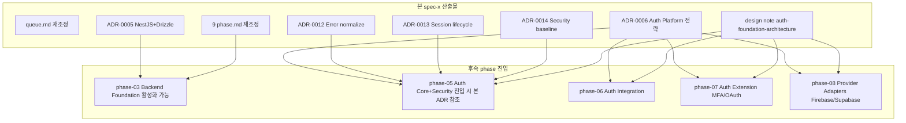

# spec-x-auth-foundation-prep: Auth Foundation 결정 박기 + phase 재조정 (선행 docs)

## 📋 메타

| 항목 | 값 |
|---|---|
| **Spec ID** | `spec-x-auth-foundation-prep` |
| **Phase** | 없음 (Solo Spec — phase-03 진입 *전제* 작업) |
| **Branch** | `spec-x-auth-foundation-prep` |
| **상태** | Planning |
| **타입** | Docs |
| **Integration Test Required** | no |
| **작성일** | 2026-05-18 |
| **소유자** | dennis |

## 📋 배경 및 문제 정의

### 현재 상황

- phase-02 (Shared Primitives) 완료. 4 패키지 + 4 ADR + RCA-001 박힘.
- `phase-03.md` (Backend Primitives)는 **"ADR-0005 / ADR-0006 결정 전까지 블록 상태"** — 두 ADR이 모두 *Deferred*.
- 사용자가 두 차례 자문(1차 / 2차)을 받아 **Auth Foundation 2차안**을 채택 결정 (`Internal Identity Platform` 수준 — "한 앱 한 Provider" + "Consistent Wrapped SDK" 컨벤션).
- 2차안 채택 시 본래 phase-03~06(6 phase)이 **9 phase로 재조정 필요** (옵션 A 채택).
- 2차안 본문은 *대화 내용*에 있을 뿐 *코드/문서로 박혀있지 않음* — phase 진입 시점에 *잊힘 위험* + agent context window 제한.

### 문제점

1. **블로커 해소 필요**: ADR-0005 / ADR-0006이 Deferred 상태에서 phase-03 진입 불가. *결정 본문이 박혀야* sdd phase activate.
2. **결정 응집 보존**: 2차안의 *7개 핵심 결정*(Provider SDK 컨벤션 / Refresh rotation+reuse / MFA 자리 잡기 / Security baseline / Error normalize / Session lifecycle / Multi-app scope)이 *한 PR*에 박혀야 cross-ref 가능.
3. **phase 구조와 ADR의 양방향 의존**: phase 분할은 ADR 결정에 의존하고, ADR 본문은 phase 참조. 분리 PR이면 *dangling reference*.
4. **2차안 자체의 length**: ~600 줄 design doc. ADR 5개에 분할 + design note 1개로 분리하면 *각 ADR이 단일 책임* + 향후 갱신 단위 명확.
5. **memory 충돌**: `project_boilerplate_locked_stack.md`에 *"Prisma+Drizzle 둘 다"* 박혀있으나 2차안은 *Drizzle 단일*. 본 spec-x에서 *Drizzle 단일* 채택 명시 (사용자 명시적 변경 요청 시 정정).

### 해결 방안 (요약)

**단일 spec-x로 박기**:
1. `backlog/queue.md` + 9개 `phase-{03~11}.md` 재조정 (옵션 A 패턴):
   - phase-03 Backend Foundation / phase-04 Frontend Foundation / phase-05 Auth Core+Security / phase-06 Auth Integration / phase-07 Auth Extension / phase-08 Provider Adapters / phase-09 Apps+Admin Tools / phase-10 Ops & Tooling / phase-11 CI/CD
2. **ADR 작성 5건**:
   - **ADR-0005 확정** (Deferred → Accepted): NestJS + Drizzle (memory `project_boilerplate_locked_stack`의 Prisma+Drizzle은 *Drizzle 단일*로 정정 — auth-session 강결합 + 두 ORM 운영 비용 회피)
   - **ADR-0006 확정** (Deferred → Accepted): Auth Platform 전략 (Provider SDK 컨벤션 + Core Surface + Internal Session)
   - **ADR-0012 신규**: Auth error normalize (AuthErrorCode를 `@repo/errors` 도메인 코드로 *흡수* — ADR-0009 flat code 일관)
   - **ADR-0013 신규**: Session lifecycle (Refresh rotation + Reuse detection + JWT EdDSA + JWKS endpoint)
   - **ADR-0014 신규**: Security baseline (CSRF / Rate limit / PKCE / state / argon2 / step-up auth)
3. **design note 신규**: `docs/notes/auth-foundation-architecture.md` (2차안 *전체 본문* 박음 — ADR이 *Decision 위주*인데 비해 design note는 *방향성/플로우/예시 코드*)

## 📊 개념도

## 🎯 요구사항

### Functional Requirements

1. **`backlog/queue.md` 갱신**:
   - 진행 중 Phase 섹션: phase-03 활성화 *대기 상태* 표기 (sdd가 자동 갱신할 부분은 sdd에 위임)
   - Icebox 항목 정리 (phase 분할로 흡수된 항목 표시)
   - 본 spec-x를 spec-x 진행 중 목록에 추가

2. **`backlog/phase-{03~11}.md` 재조정** (옵션 A 패턴):

| Phase | Slug | 핵심 내용 |
|---|---|---|
| phase-03 | Backend Foundation | NestJS + Drizzle + apps/api scaffold + health/config/observability hooks. auth 제외. |
| phase-04 | Frontend Foundation | Vite/Next + apps/web-* scaffold + TanStack Query + ui/sdk 기본. auth 제외. |
| phase-05 | Auth Core + Security | `auth-contracts` 확장 + `auth-errors` 결정(흡수) + `auth-session` 별 패키지 + `auth-jwt` + `auth-security` + password reset / email verify flow. backend 중심. 2차안 §Phase 1+2 통합. |
| phase-06 | Auth Integration | `auth-nestjs` Guards + `auth-react` Provider/hooks + Cookie 전략 + Audit & Events. cross-layer. 2차안 §Phase 3. |
| phase-07 | Auth Extension | `auth-oauth` (PKCE+state) + `auth-mfa` (TOTP) + `auth-passkey` (WebAuthn). 2차안 §Phase 4. |
| phase-08 | Provider Adapters | `auth-firebase` + `auth-supabase` + `auth-testing` (Core Surface 컨벤션의 실증). 2차안 §Phase 5. |
| phase-09 | Apps + Admin Tools | vertical slice (login → protected → logout) + apps/admin or auth-admin 패키지 (session 강제 종료 / role 부여 / audit 조회). 본래 phase-04 흡수 + Admin Tools 추가. |
| phase-10 | Ops & Tooling | docker-compose / generators / service-manifest + auth observability dashboards (brute force / impossible travel / refresh reuse alert). 본래 phase-05. |
| phase-11 | CI/CD | GitHub Actions + changesets + docker publish. 본래 phase-06. |

3. **ADR-0005 본문 작성** (Deferred → Accepted):
   - **Decision**: Framework = **NestJS** / ORM = **Drizzle** (단일)
   - Rationale: Decorator-based DI가 Guards/Decorators 패턴(auth-nestjs)에 자연 적합. Fastify/Hono는 *함수형*이라 auth 통합 추가 작업 필요. Drizzle은 *Auth session storage*(rotation chain + revocation)에 SQL 정밀 제어 우위. Prisma 병행 시 *두 ORM 운영 비용* + *session storage가 Drizzle에 강결합*되면 *Prisma는 dead weight*.
   - Memory 충돌 명시: `project_boilerplate_locked_stack` "Prisma+Drizzle 둘 다"를 *Drizzle 단일*로 정정.
   - Alternatives: Fastify+Drizzle / Hono+Drizzle / NestJS+Prisma / NestJS+raw SQL — 비채택 이유 분석.

4. **ADR-0006 본문 작성** (Deferred → Accepted) — *Auth Platform 전략*:
   - **Decision 1**: "한 앱 한 Provider" — runtime 추상화 ❌
   - **Decision 2**: "Consistent Wrapped SDK" 컨벤션 — Core Surface + Provider별 강점 노출
   - **Decision 3**: AuthResult union (`session` / `mfa_required` / `email_verification_required`) — *처음부터* 인터페이스에 자리
   - **Decision 4**: Identity vs Session 분리 / Authentication vs Authorization 분리
   - **Decision 5**: "Auth Engine 외부 라이브러리, Auth Platform 자체 구축" 원칙
   - Cross-ref: ADR-0012/13/14 → 본 ADR의 *세부 결정*
   - Alternatives: LCD 추상화 (1차안) / Better-auth / Auth.js / Lucia — 비채택 이유

5. **ADR-0012 신규** — *Auth Error Normalize*:
   - **Decision**: `AuthErrorCode` enum을 `@repo/errors`의 도메인 코드로 *흡수* (별 `auth-errors` 패키지 생성 ❌)
   - 11 코드: INVALID_CREDENTIALS / INVALID_TOKEN / TOKEN_EXPIRED / SESSION_REVOKED / USER_NOT_FOUND / EMAIL_ALREADY_EXISTS / EMAIL_NOT_VERIFIED / MFA_REQUIRED / MFA_INVALID_CODE / INSUFFICIENT_PERMISSION / TOO_MANY_ATTEMPTS / ACCOUNT_LOCKED / PROVIDER_ERROR
   - Provider normalize helper: `auth-{provider}` 각 패키지 내부 (`firebase auth/user-not-found → INVALID_CREDENTIALS` 등 — *account enumeration 방지*)
   - ADR-0009 flat code 일관 — `class AuthError extends AppError` 금지. `AppError({ code: "INVALID_CREDENTIALS", ... })` 사용.

6. **ADR-0013 신규** — *Session Lifecycle*:
   - **Access Token**: JWT EdDSA / 5~15min TTL / claims (sub, iat, exp, iss, aud, jti)
   - **Refresh Token**: opaque random 32+ bytes / DB hashed / 14~30일 / rotation chain (`refreshTokenFamily`)
   - **Reuse Detection** (RFC 6819): invalidate된 refresh가 재진입 시 → user의 모든 session revoke + alert
   - **Key Rotation**: 90일 + JWKS endpoint (`/.well-known/jwks.json`)
   - **Session Model**: id / userId / refreshTokenHash / refreshTokenFamily / device / ip / userAgent / geo / createdAt / lastUsedAt / expiresAt / revokedAt / revokedReason
   - **`auth-session` 별 패키지** 결정 (auth-jwt와 *별 책임* — rotation/revocation 로직 응집)

7. **ADR-0014 신규** — *Security Baseline*:
   - **CSRF**: SameSite=Lax cookie + Origin/Referer 검증 (state-changing 요청)
   - **Rate Limiting**: IP+account+progressive backoff (`auth-security` 패키지)
   - **Account Lockout**: N회 실패 시 lockout, 응답 동일 유지 (enumeration 방지)
   - **OAuth**: PKCE 강제 (RFC 9700) + State (cookie-bound) + Nonce (OIDC)
   - **Password Hash**: argon2 (`auth-security`)
   - **Cookie**: httpOnly + Secure + SameSite=Lax + Path=/ — localStorage JWT 금지
   - **Step-up Auth**: 비밀번호/이메일 변경 / 결제 변경 시 재인증 강제

8. **design note 신규** (`docs/notes/auth-foundation-architecture.md`):
   - 2차안 *전체 본문* 박음 (방향성 / 플로우 / 예시 코드)
   - ADR cross-ref (각 결정이 어느 ADR에 박혔는지)
   - 본 design note는 *향후 phase 진입 시 참조 자료* — *결정 자체*는 ADR이 권위

### Non-Functional Requirements

1. **결정 응집 보존**: 5 ADR + design note + 9 phase.md가 *한 PR*에 박혀야 cross-ref 정합.
2. **boilerplate scope 야심 박기**: option A (9 phase) — 2차안 *완전판* 실현.
3. **memory 갱신**: `project_boilerplate_locked_stack` Prisma 제거 (Drizzle 단일).
4. **lat.md 평가는 본 spec-x 외** — Icebox.

## 🚫 Out of Scope

- **prototype 코드** — 본 spec-x는 *순수 docs*. NestJS hello world / Drizzle 연결 등 prototype은 phase-03 첫 spec에서 진행.
- **package.json 갱신** — 신규 패키지(auth-jwt / auth-session 등)는 phase-05 진입 시 scaffold.
- **MFA / Passkey 구체 라이브러리 결정** (`@simplewebauthn` 등) — ADR-0014에 *후보 명시*만, 채택 결정은 phase-07 진입 시.
- **Provider 라이브러리 버전 pin** (firebase-admin / supabase-js) — phase-08 진입 시.
- **OpenAPI / GraphQL contracts 변환** — Phase 4 SDK 또는 후속 spec.
- **TRPCRouter / GraphQL schema** — 결정 안 됨.
- **lat.md Phase 평가** — Icebox 유지.

## 📑 ADR 후보 (Architecture Decision Records)

> 본 SPEC의 결정 중 *장기 자산* 으로 박을 가치 있는 것이 있는가?

- [x] ADR 가치 있는 결정 다수 → **5 ADR** 본문 작성
  - ADR-0005 (확정): NestJS + Drizzle
  - ADR-0006 (확정): Auth Platform 전략 (Provider SDK 컨벤션)
  - ADR-0012 (신규): Auth error normalize
  - ADR-0013 (신규): Session lifecycle
  - ADR-0014 (신규): Security baseline
- [ ] 없음

**근거**:
- 본 spec-x는 *결정 박는* 작업. ADR 작성이 본질.
- design note는 *방향성 + 예시*를 풍부히 — ADR은 *결정의 권위*, design note는 *실행 시 참조*.

## 🔍 Critique 결과 (선택)

미실행. 본 spec-x는 *결정 응집 + docs* 작업이라 critique 시점은 *phase-05 spec 설계*가 더 효과적.

## ✅ Definition of Done

- [ ] `backlog/queue.md` + 9 `phase-{03~11}.md` 재조정
- [ ] ADR-0005 본문 작성 (Deferred → Accepted)
- [ ] ADR-0006 본문 작성 (Deferred → Accepted)
- [ ] ADR-0012 신규 작성
- [ ] ADR-0013 신규 작성
- [ ] ADR-0014 신규 작성
- [ ] `docs/notes/auth-foundation-architecture.md` 신규 작성 (2차안 본문)
- [ ] `pnpm lint` / `pnpm typecheck` / `pnpm test` 그린 (코드 변경 없으나 회귀 0 확인)
- [ ] `walkthrough.md` / `pr_description.md` ship commit
- [ ] `spec-x-auth-foundation-prep` 브랜치 push
- [ ] PR 생성 + 사용자 알림
