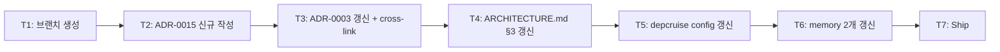

# Implementation Plan: spec-x-governance-reset-package-layout

## 📋 Branch Strategy

- 신규 브랜치: `spec-x-governance-reset-package-layout`
- 시작 지점: `main` (spec-x는 phase-bound 아님 — phase branch 아닌 main에서 분기)
- 첫 task 가 브랜치 생성
- **PR Target**: `main` (spec-x 직접 머지, phase branch 우회)

## 🛑 사용자 검토 필요 (User Review Required)

> [!IMPORTANT]
> - [x] **5 round-trip 논의 후 합의된 결정**: framework adapter 명명/카테고리 룰 (사용자 발화 *"좋아 그러면 지금 바로 진행하면 딜까?"* 시점에 확정).
> - [x] **scope 최소화**: `shared/` 도입 제외, 실제 코드 재구성 별 spec으로 분리.

> [!WARNING]
> - [x] **기존 박힌 패키지가 *임시 위반*** : `@repo/backend-logger-nestjs` 는 본 spec ship 직후 ADR 위반 상태. depcruise 룰에 *임시 예외* 박거나, 후속 spec ship 시점까지 *경고만 출력* 정도로 관리. 룰 박는 spec과 코드 정정 spec을 분리한 결과.
> - [x] **ADR-0003 ↔ ADR-0015 cross-link 일관**: ADR-0003 갱신 시 ADR-0015 참조 박음. 향후 둘 중 하나만 보고 다른 곳 놓치는 일 없도록.

## 🎯 핵심 전략 (Core Strategy)

### 아키텍처 컨텍스트



### 주요 결정

| 컴포넌트 | 전략 | 이유 |
|:---:|:---|:---|
| 카테고리 분류 | `<framework>/<name>` 별 카테고리 (B3) | `backend/` `frontend/` tier 의미 보존 + framework adapter는 implicit tier (NestJS=backend / React=frontend) |
| 명명 어순 | framework-first prefix (`<framework>-<name>`) | 영문법 (adj+noun) + NPM dominant (`@nestjs/config` / `react-query` / `express-session`) |
| `backend-` prefix in pkg name | adapter는 *생략* (`@repo/nestjs-logger`) / pure는 *유지* (`@repo/backend-logger`) | adapter는 framework가 tier 함의. pure는 tier 명시 필요 (framework agnostic이라 어디 붙을지 모름) |
| 의존 방향 | `<framework>/<X>` → `<tier>/<X>` 단방향 | 어댑터가 pure 의존. 역방향이면 pure가 framework에 묶임 (정의 위반) |
| `shared/` 도입 | 본 spec 제외 | scope 최소화. 별 spec-x 추후 검토 |
| 기존 박힌 `backend-logger-nestjs` | 후속 spec에서 정정 | 본 spec은 *룰만*. 정정은 별 spec (코드 변경) |
| depcruise 임시 예외 | 후속 spec ship 까지 *유예* / 경고만 | rule violation은 박되 *임시* 표시 |
| ADR 분리 | ADR-0015 신규 + ADR-0003 갱신 | ADR-0003은 *기존 룰 절*, ADR-0015는 *framework adapter 신규 결정* — 책임 분리 |

### 📑 ADR 후보

- [x] **ADR 가치 있는 결정 있음** → `framework-adapter-naming-and-layout` (type: **convention**)
- [ ] 없음

## 📂 Proposed Changes

### `docs/adr/0015-framework-adapter-naming-and-layout.md` (신규)

```markdown
# ADR-015: Framework Adapter Naming & Layout

* 상태: 채택됨
* 날짜: 2026-05-19
* 스코프: framework adapter 패키지 (NestJS / React / Fastify / Vue ...)

# 배경
- ADR-0003: 5 카테고리 (config/shared/backend/frontend/testing)
- spec-03-01 / spec-03-02 진행 중 platform-agnostic 위반 발견 (memory feedback_platform_agnostic_packages)
- 어댑터 패키지 위치/명명 룰 부재 — 본 ADR로 박음

# 결정
{표: 카테고리 / 명명 / 의존 방향 / 미래 확장}

# 검토한 대안
- A: backend/<name>-<framework> suffix → 영문법 어색, NPM 비표준
- B1: backend/<framework>-<name> prefix + backend- 카테고리 유지 → `@repo/backend-nestjs-logger` 장황
- B2: backend/<framework>-<name> prefix + 어댑터만 backend- 생략 → dir-pkg 불일치
- B3 (채택): <framework>/<name> 별 카테고리 → NPM 표준 + dir-pkg 일관

# 재검토 기준
- adapter끼리 의존이 빈번해짐
- framework 종속 dep이 2개 이상인 패키지 등장
- shared/ 도입 결정 시 본 ADR도 재검토
```

### `docs/adr/0003-package-layout-and-naming.md` (수정)

- §2 (폴더 레이아웃) 카테고리에 framework adapter 카테고리 추가:
  ```
  packages/
    config/
    shared/
    backend/
    frontend/
    nestjs/         # NestJS framework adapter (implicit backend tier)
    react/          # React framework adapter (implicit frontend tier, 미래)
    testing/
  ```
- §4 직후 신규 §4-bis "Framework adapter naming" 절 추가
- §6 (카테고리 배치 규칙) 에 *framework adapter는 framework 카테고리 사용* 룰 추가
- 끝에 *관련 문서*에 ADR-0015 cross-link

### `ARCHITECTURE.md` (수정)

- §3 디렉토리 트리 새 카테고리 반영
- §3.2 depcruise 룰 도식 갱신 (`<framework>/* → <tier>/*` 단방향 룰 추가)
- 본 SPEC에서 *기존 backend-logger-nestjs는 임시 위반* 라는 각주

### `packages/config/depcruise-config/base.cjs` (수정)

- `forbidden` 룰에 추가:
  - `name: "no-pure-on-framework"` — pure (`backend/*` `frontend/*`) 가 framework (`nestjs/*` `react/*`) 의존 금지
  - `name: "no-cross-framework-tier"` — `nestjs/*` 가 `frontend/*` 의존 금지 / `react/*` 가 `backend/*` 의존 금지
- 기존 `backend-logger-nestjs` 위반은 *임시 allowList* 박지 않음 (위반 *드러내는* 게 후속 spec 진입 motivation)

### memory 갱신 (2개)

- `project_boilerplate_package_layout.md`: 새 카테고리 명문화 (`nestjs/` `react/` 등)
- `feedback_platform_agnostic_packages.md`: naming 룰 추가 (`<framework>-<name>` prefix 패턴, `<pkg>-<framework>` suffix 금지)

## 🧪 검증 계획 (Verification Plan)

### 단위 테스트

본 spec은 *문서/룰만* 박음 → 단위 테스트 불필요.

### 검증 명령

```bash
# 1. ADR 파일 존재 + 마크다운 형식 정상
ls docs/adr/0015-*.md
pnpm exec markdownlint docs/adr/ 2>&1 || true  # 룰 미설정이면 skip

# 2. depcruise 룰 syntax 정상 (현재 코드는 위반 1건 — backend-logger-nestjs)
pnpm exec depcruise --config packages/config/depcruise-config/base.cjs packages/
# 기대: 1 violation (backend-logger-nestjs → backend-logger) — 임시 인정

# 3. memory 인덱스 갱신 확인
cat /Users/dennis/.claude/projects/.../memory/MEMORY.md | grep -E "package_layout|platform_agnostic"
```

### 수동 검증 시나리오

1. ADR-0015 작성 후 사용자 review — 결정/대안/재검토 기준 명확한지.
2. ADR-0003 갱신 후 *기존 룰* (5 카테고리 + flat import + `*-config` suffix) 깨지지 않은지.
3. depcruise 규칙 syntax 정상인지 + 위반 1건 (backend-logger-nestjs) 만 발생하는지 — 의도된 임시 위반.

## 🔁 Rollback Plan

- 본 spec은 *문서 + 설정* 변경만 — 코드 영향 0
- ADR / memory / depcruise config revert 시 즉시 이전 상태 복원 가능
- 단 후속 spec (재구성 spec) 이 본 룰 의존 — 본 spec revert 시 후속 spec도 함께 revert 권장

## 📦 Deliverables 체크

- [ ] task.md 작성 (다음 단계)
- [ ] 사용자 Plan Accept
- [ ] (실행 후) ADR-0015 + ADR-0003 갱신 + ARCHITECTURE.md + memory 2개 + depcruise config
- [ ] (실행 후) walkthrough / pr_description ship
- [ ] (실행 후) 후속 spec 진입 가이드 명시 (재구성 spec)
