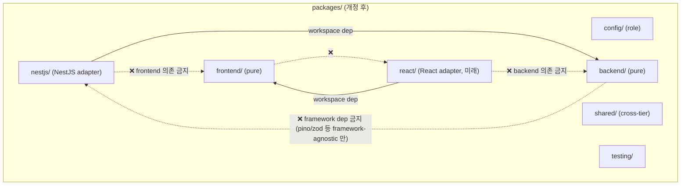

# spec-x-governance-reset-package-layout: Framework Adapter 카테고리 + Naming 룰 박기

## 📋 메타

| 항목 | 값 |
|---|---|
| **Spec ID** | `spec-x-governance-reset-package-layout` |
| **Phase** | `phase-x` (governance, phase-bound 아님 — phase-03 진행 중에도 진입 가능) |
| **Branch** | `spec-x-governance-reset-package-layout` |
| **상태** | Planning |
| **타입** | Refactor (governance — 룰 박기, 코드 변경 0) |
| **Integration Test Required** | no |
| **작성일** | 2026-05-19 |
| **소유자** | dennis |

## 📋 배경 및 문제 정의

### 현재 상황

- ADR-0003 (package layout): 5 카테고리 (`config` / `shared` / `backend` / `frontend` / `testing`).
- spec-03-02 진행 중 사용자 review에서 *platform-agnostic 원칙* 발견 → `packages/backend/logger-nestjs/` 어댑터 패키지 신설 (PR #10 머지).
- 같은 결함이 spec-03-01 `BackendSettingsModule` 에도 존재 — phase-03 안에서 정정 예정.
- *어댑터 패키지 명명/위치*에 대한 룰 부재 → spec-03-02에서 `<pkg>-nestjs` suffix 채택. 이후 사용자 *"nestjs-logger 이렇게 가는게 좀 더 낫지 않을까?"* 제기 → **영문법 + NPM 컨벤션 (`@nestjs/config` / `react-query` / `express-session`) 모두 framework-first prefix가 dominant** 확인. 현재 박힌 suffix는 컨벤션 위반.

### 문제점

1. **명명 컨벤션 부재**: framework adapter 패키지가 늘어날 텐데 (NestJS 외 Fastify/Hono/React 등 미래 대비) 컨벤션 없으면 spec마다 ad-hoc 결정 — 일관성 없음.
2. **suffix 패턴 영문법 위반**: `logger-nestjs` (명사 + 형용사 역어순). `nestjs-logger` (형용사 + 명사) 가 자연 영어 + NPM 표준.
3. **카테고리 분류 모호**: `nestjs/logger` 어댑터를 `backend/` 안에 둘지 / 별 카테고리 (`nestjs/`) 에 둘지 명확한 가이드 없음.
4. **sunk cost trap**: 이미 박힌 `backend-logger-nestjs` 유지 시 *향후 모든 framework adapter*가 같은 어색한 패턴 답습 → boilerplate가 *괴물*로 변함 (사용자 발화).

### 해결 방안 (요약)

ADR-0003 갱신 + ADR-0015 신규 작성으로 **framework adapter 카테고리/명명 룰** 명문화. 코드는 본 spec scope 밖 (별 spec-03-XX에서 적용).

**룰 요약**:
- `packages/<framework>/<name>` 카테고리 신규 (예: `packages/nestjs/<name>`, `packages/react/<name>`).
- pkg name = `@repo/<framework>-<name>` (영문법 + NPM dominant 패턴).
- framework 카테고리는 *implicit tier* (NestJS = backend / React = frontend).
- pure tier 카테고리 (`backend/` `frontend/`) 는 framework dep 0 (platform-agnostic 원칙 + memory `feedback_platform_agnostic_packages`).
- 어댑터 의존 방향: `<framework>/<X>` → `<tier>/<X>` (단방향, depcruise 룰).

## 📊 개념도

## 🎯 요구사항

### Functional Requirements

1. **ADR-0015 신규 작성** (`docs/adr/0015-framework-adapter-naming-and-layout.md`):
   - 결정: framework adapter는 `packages/<framework>/<name>` 카테고리 + `@repo/<framework>-<name>` 명명
   - 영문법 + NPM 컨벤션 근거
   - 의존 방향 룰 (어댑터 → pure, 역방향 금지)
   - 검토한 대안 (suffix vs prefix / 별 카테고리 vs backend 안 prefix / shared 도입 등)
   - 재검토 기준

2. **ADR-0003 갱신** (`docs/adr/0003-package-layout-and-naming.md`):
   - "카테고리" 절에 framework adapter 카테고리 추가 (`nestjs/` `react/` 등)
   - 명명 규칙 표 추가
   - ADR-0015 cross-link

3. **ARCHITECTURE.md 갱신**:
   - §3 (디렉토리 트리) 새 카테고리 반영
   - depcruise 룰 도식 추가

4. **memory 갱신**:
   - `project_boilerplate_package_layout` — 새 카테고리 명문화
   - `feedback_platform_agnostic_packages` — naming 규칙 추가 (`<framework>-<name>` 패턴)

5. **depcruise config 갱신** (`packages/config/depcruise-config/base.cjs`):
   - 새 카테고리 룰 박음: `<framework>/*` → `<tier>/*` 만 허용, 역방향 금지
   - `<framework>/*` 끼리 의존은 case-by-case (현재 허용)

### Non-Functional Requirements

1. **코드 변경 0**: 본 spec은 *룰만* 박음. 실제 코드 재구성 (디렉토리 이동 / pkg name 변경) 은 별 spec-03-XX (재구성) 에서.
2. **기존 박힌 패키지는 *임시 위반* 으로 인정**: `@repo/backend-logger-nestjs` 는 본 spec ship 후 *위반 상태* (의도된, 후속 spec에서 정정 예정). depcruise 룰은 본 spec에서 박되, *과도기 위반*은 후속 spec ship 시 해소.
3. **재검토 기준 명확화**: 본 룰 적용 시 어색한 케이스 발견 시 ADR-0015 재검토 (예: `nestjs/<X>` 어댑터끼리 의존 / framework dep이 *두 개 이상인* 경우).

## 🚫 Out of Scope

- **실제 코드 재구성**: `packages/backend/logger-nestjs/` → `packages/nestjs/logger/` 이동, pkg name 변경, imports 갱신 → 별 spec (spec-03-XX-nestjs-adapter-relocation 또는 유사).
- **spec-03-01 backend-settings 정정**: 같은 후속 spec에서 통합 처리.
- **`shared/` 디렉토리 재구성**: 현 `packages/utils` `packages/errors` 등을 `packages/shared/*` 로 이동 → 본 spec scope 밖 (별 spec-x 또는 미루기).
- **frontend framework adapter (`react/` 등) 실제 패키지 생성**: 본 spec은 *룰만*. React adapter는 phase-04+에서 필요 시.
- **monorepo scope rename (`@repo/*` → 다른 scope)**: ADR-0003 §1 결정 유지.

## 📑 ADR 후보

- [x] **ADR 가치 있는 결정 있음** → 후보 한 줄 요약: `framework-adapter-naming-and-layout` (type: convention)
- [ ] 없음

## 🔍 Critique 결과

미실행. 사용자와 5회 round-trip 논의 후 합의 (B3 옵션 채택, 슬러그/카테고리/naming 모두 확정).

## ✅ Definition of Done

- [ ] ADR-0015 신규 작성
- [ ] ADR-0003 갱신 (cross-link + 카테고리 추가)
- [ ] ARCHITECTURE.md §3 갱신
- [ ] memory 2개 갱신 (`project_boilerplate_package_layout` + `feedback_platform_agnostic_packages`)
- [ ] depcruise config 갱신
- [ ] `walkthrough.md` 와 `pr_description.md` 작성 및 ship commit
- [ ] `spec-x-governance-reset-package-layout` 브랜치 push 완료
- [ ] PR 생성 (base = `main` — spec-x는 phase-bound 아님, 직접 main으로)
- [ ] 사용자 검토 요청 알림 완료
