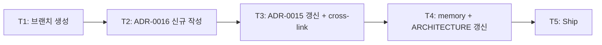

# Implementation Plan: spec-x-nestjs-adapter-standard-module

## 📋 Branch Strategy

- 신규 브랜치: `spec-x-nestjs-adapter-standard-module`
- 시작 지점: `main`
- 첫 task 가 브랜치 생성
- **PR Target**: `main` (spec-x — phase-bound 아님)

## 🛑 사용자 검토 필요 (User Review Required)

> [!IMPORTANT]
> - [x] **리뷰어 절충안 채택**: core (`packages/backend/*`) framework-agnostic 유지 / adapter (`packages/nestjs/*`) 표준 `@Module` class 채택.
> - [x] **scope 최소화**: 본 spec 은 *룰만*. 5 어댑터 코드 재구성은 *별 spec* (phase-03 안).
> - [x] **ultra-thin 예외 규정** 명시: token-only / 단순 wrap (lifecycle 없음) 은 객체 리터럴 허용.

> [!WARNING]
> - [x] **5 어댑터 *임시 위반*** (ADR-0016 ship 후): 재구성 spec 진입 전까지 위반 상태. depcruise 룰은 박지 않음 (위반 *드러내는* 게 후속 spec motivation).
> - [x] **ADR-0015 vs ADR-0016 책임 분리**: ADR-0015 = 카테고리/명명, ADR-0016 = 모듈 구현 패턴. ADR-0015 갱신 시 *cross-link만* — 결정 자체 변경 0.

## 🎯 핵심 전략 (Core Strategy)

### 아키텍처 컨텍스트



### 주요 결정

| 컴포넌트 | 전략 | 이유 |
|:---:|:---|:---|
| 어댑터 모듈 패턴 | 표준 `@Module` decorator class | NestJS 표준 + onboarding ↑ + lifecycle 자연 + ecosystem 친화 |
| 예외 조건 | ultra-thin adapter (token-only / 단순 wrap / lifecycle 없음) | "강제" 가 아니라 "권장" — pragmatic governance |
| core 패키지 | framework-agnostic 유지 (변경 0) | ADR-0015 원칙 그대로 |
| symbol injection token | 유지 (사용자 코드 영향 0) | 객체 리터럴 ↔ class 전환 시 token export 변경 없음 |
| lifecycle hook 박는 방식 | class 자체에 `implements OnModuleDestroy` | 우회 class (`DatabaseShutdownService` 등) 제거 |
| ADR 분리 | ADR-0015 (카테고리/명명) + ADR-0016 (모듈 패턴) | 책임 분리 — 미래 변경 영향 최소 |
| memory 갱신 | `feedback_platform_agnostic_packages` 만 (adapter 내부 framework 친화 OK) | core 패키지 룰은 그대로 |
| 재구성 spec scope | 본 spec 분리 (작업 단위 명확) | 룰 박는 spec 과 코드 변경 spec 분리 (spec-x-governance-reset 답습) |

### 📑 ADR 후보

- [x] **ADR 가치 있는 결정 있음** → `nestjs-adapter-standard-module-pattern` (type: convention)

## 📂 Proposed Changes

### `docs/adr/0016-nestjs-adapter-standard-module-pattern.md` (신규)

핵심 절:
- Context (ADR-0015 5회 반복 후 reviewer 의견 + 우리 monorepo 가 NestJS-locked 인 점)
- Decision (표준 `@Module` class + ultra-thin 예외)
- 검토한 대안 (4: 객체 리터럴 강제 / @Module 강제 / 둘 다 허용 / 절충안)
- Consequences (장점: onboarding / lifecycle / ecosystem 친화 / 단점: decorator 의존 / framework dep 명시)
- Revisit Triggers (NestJS major upgrade / 다른 framework adapter 추가 / decorator spec 변화)

### `docs/adr/0015-framework-adapter-naming-and-layout.md` (수정)

- 상단 IMPORTANT note: "module 구현 패턴은 ADR-0016 으로 격리 (2026-05-19 갱신)"
- §4-bis "Framework adapter naming" — 명명 룰 그대로 + 끝에 "모듈 구현 패턴은 [ADR-0016] 참조" 박음
- 관련 문서에 ADR-0016 cross-link

### `memory/feedback_platform_agnostic_packages.md` (수정, git 외부)

- "core 패키지 (`packages/backend/*`) 는 framework-agnostic" — 그대로 강조
- "어댑터 패키지 (`packages/nestjs/*`) *내부 구현* 은 framework 친화 허용 (ADR-0016)" — 신규 절 추가

### `ARCHITECTURE.md §3.2` (수정, 선택)

- framework adapter 룰 절 끝에 한 줄 추가: *"adapter 내부 module 패턴은 ADR-0016 답습 — 표준 `@Module` class"*

## 🧪 검증 계획 (Verification Plan)

### 자동 테스트

본 spec 은 *문서/룰만* — 단위 test 0. 검증:

```bash
# ADR 파일 존재 + 마크다운 정상
ls docs/adr/0016-*.md
# depcruise 룰 syntax (변경 없음 — 0 violations 기대)
pnpm exec depcruise --config packages/config/depcruise-config/base.cjs packages/
```

### 수동 검증

1. ADR-0016 작성 — 결정 / 검토한 대안 / 재검토 기준 명확.
2. ADR-0015 cross-link — 두 ADR 양방향 일관.
3. memory 갱신 — `feedback_platform_agnostic_packages` 가 *core vs adapter* 구분 명시.
4. 5 어댑터 코드 — *변경 0* 확인 (재구성은 별 spec).

## 🔁 Rollback Plan

- ADR / memory revert 시 즉시 이전 상태 복원.
- 후속 재구성 spec 이 본 ADR 의존 → 본 spec revert 시 재구성 spec 도 함께 revert 권장.

## 📦 Deliverables 체크

- [ ] task.md 작성 (다음 단계)
- [ ] 사용자 Plan Accept
- [ ] (실행 후) ADR-0016 신규 + ADR-0015 갱신 + memory + ARCHITECTURE
- [ ] (실행 후) walkthrough / pr_description ship
- [ ] (실행 후) 후속 재구성 spec 진입 가이드 명시
