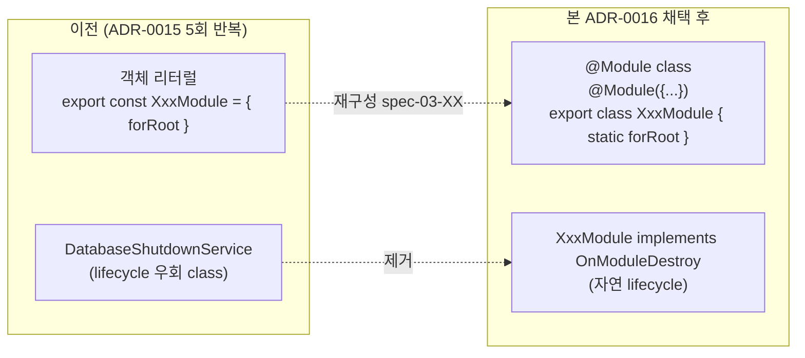

# spec-x-nestjs-adapter-standard-module: 어댑터 패키지에 표준 `@Module` class 패턴 채택

## 📋 메타

| 항목 | 값 |
|---|---|
| **Spec ID** | `spec-x-nestjs-adapter-standard-module` |
| **Phase** | `phase-x` (governance — phase-bound 아님) |
| **Branch** | `spec-x-nestjs-adapter-standard-module` |
| **PR Target** | `main` (spec-x 직접 머지) |
| **상태** | Planning |
| **타입** | Refactor (governance — 문서/룰만, 코드 0 변경) |
| **Integration Test Required** | no |
| **작성일** | 2026-05-19 |
| **소유자** | dennis |

## 📋 배경 및 문제 정의

### 현재 상황

ADR-0015 (PR #11) 로 *framework adapter 카테고리/명명* 컨벤션 박힘:
- `packages/<framework>/<name>` 카테고리 + `@repo/<framework>-<name>` prefix
- 의존 방향: 어댑터 → pure 단방향

5 어댑터 패키지 (spec-03-02~05) 가 모두 *"객체 리터럴 DynamicModule + symbol injection token"* 패턴 답습:

| 패키지 | 패턴 |
|---|---|
| `@repo/nestjs-settings` | `export const BackendSettingsModule = { forRoot(...) {...} }` |
| `@repo/nestjs-logger` | `export const BackendLoggerModule = { forRoot(...) {...} }` |
| `@repo/nestjs-http-client` | `export const HttpClientModule = { forRoot(...) {...} }` |
| `@repo/nestjs-database` | `export const DatabaseModule = { ... }` + `DatabaseShutdownService` 우회 class |

내부 리뷰어 의견 (5회 반복 후 review):

> 객체 리터럴은 *허용 가능한 최적화* 이지만 *조직 표준으로 강제* 할 정도는 아니다.
> *기본 권장: `@Module` class / 허용 예외: ultra-thin wrapper* 가 건강한 governance.

### 문제점

1. **"runtime dep 0" 의 환상**: 어댑터 패키지가 *어차피* `@nestjs/common` 을 `dependencies` 에 박음. type-only import 의 *실 가치 거의 없음* — bundle 안 들어가도 install/maintain 비용은 동일.
2. **Lifecycle hook 우회 복잡**: `DatabaseShutdownService` 같은 별 class + `useFactory` 박는 *우회 패턴*. 표준 `@Module` class + `OnModuleDestroy` 면 *자연*.
3. **Onboarding 비용 ↑**: `@Module` decorator class 는 *NestJS 표준* — 새 dev *즉시 이해*. 객체 리터럴은 *우리 자체 컨벤션* → ADR/docs 없이 *"왜?"* 질문.
4. **NestJS ecosystem 친화성 ↓**: `DiscoveryService` / `Reflector` / CQRS / lifecycle / interceptor auto-registration 등 *class metadata 기반*. 객체 리터럴 패턴은 *벽*.
5. **AI/copilot 부정확**: 표준 패턴은 *AI가 잘 만듦*. 우리 컨벤션은 *매번 환기* 필요.
6. **우리는 사실상 NestJS monorepo**: ADR-0005 NestJS locked + `apps/{api, admin, worker}` 전부 NestJS. Fastify/Hono 어댑터 *현실적 필요 없음* → 객체 리터럴 *over-engineering*.

### 해결 방안 (요약)

**ADR-0016 신규 + ADR-0015 갱신 + memory 갱신** — 어댑터 패키지에서 **표준 `@Module` decorator class 패턴 채택**.

**핵심 분기 (ADR-0015 와 일관)**:
- **core 패키지** (`packages/backend/*`) — framework-agnostic 유지 (ADR-0015 §4-bis 그대로)
- **어댑터 패키지** (`packages/nestjs/*`) — **표준 `@Module` class + NestJS lifecycle 자연** (ADR-0016 신규)

**예외 규정**: *ultra-thin adapter* (단순 token export + 인스턴스 wrap, lifecycle 없음) 는 객체 리터럴 허용. *기본은 `@Module` class*.

## 📊 개념도

## 🎯 요구사항

### Functional Requirements

1. **ADR-0016 신규** (`docs/adr/0016-nestjs-adapter-standard-module-pattern.md`):
   - 상태 / 날짜 / 스코프
   - 배경: ADR-0015 5회 반복 후 reviewer 의견 + 내부 재고
   - 결정: 표준 `@Module` class 채택 + ultra-thin 예외
   - 검토한 대안 (객체 리터럴 강제 / 표준 @Module 강제 / 둘 다 허용 — 채택 (조건부))
   - 결과 (장점/단점)
   - 재검토 기준
   - 관련 문서 (ADR-0015 + memory)

2. **ADR-0015 갱신** (`docs/adr/0015-framework-adapter-naming-and-layout.md`):
   - "module 구현 패턴" 절을 ADR-0016 으로 격리 명시
   - cross-link 박음
   - "이전 객체 리터럴 패턴은 *역사적 결정* — 후속 재구성 spec 으로 표준화 예정" 각주

3. **memory 갱신**:
   - `feedback_platform_agnostic_packages` — adapter 패키지 *내부 패턴* 은 framework 친화 허용 명문화 (core 패키지는 여전히 agnostic)

4. **ARCHITECTURE.md 갱신** (선택):
   - §3.2 framework adapter 룰 절에 *"adapter 내부 패턴은 ADR-0016 답습"* 한 줄 추가

### Non-Functional Requirements

1. **코드 변경 0**: 본 spec 은 *룰만*. 실제 어댑터 5개 재구성은 *별 spec* (spec-03-06 또는 별 spec-03-XX).
2. **기존 5 어댑터 *임시 위반*** 인정: ADR-0016 ship 후 5 어댑터는 *위반 상태* (의도된, 후속 spec 에서 해소).
3. **소요**: spec-x-governance-reset-package-layout 보다 *훨씬 작음* — ADR 1 신규 + ADR 1 갱신.

## 🚫 Out of Scope

- **실제 어댑터 재구성** — `@Module` class 로 5개 다시 박는 작업. 별 spec (spec-03-XX).
- **`apps/api` scaffold 의 Repository 패턴 예제** — spec-03-07.
- **NestJS lifecycle 외 기능 활용** (DiscoveryService / Reflector / CQRS) — 필요 시점에 별 spec.

## 📑 ADR 후보

- [x] **ADR 가치 있는 결정 있음** → 후보: `nestjs-adapter-standard-module-pattern` (type: convention)

## ✅ Definition of Done

- [ ] ADR-0016 신규 작성
- [ ] ADR-0015 갱신 (cross-link + module 패턴 절 격리)
- [ ] memory `feedback_platform_agnostic_packages` 갱신
- [ ] ARCHITECTURE.md §3.2 갱신 (선택)
- [ ] `walkthrough.md` / `pr_description.md` ship commit
- [ ] PR 생성 (base = `main`)
- [ ] 사용자 알림
- [ ] **후속 spec 명시**: 5 어댑터 재구성 — 본 PR 머지 후 phase-03 안에서 진입
