# Implementation Plan: spec-x-roadmap-migration

## 📋 Branch Strategy

- 신규 브랜치: `spec-x-roadmap-migration` (브랜치 이름 = spec 디렉토리 이름, `feature/` prefix 없음)
- 시작 지점: `main`
- 첫 task가 브랜치 생성을 수행

## 🛑 사용자 검토 필요 (User Review Required)

> 본 Plan을 Accept하기 전에 사용자가 확인할 항목.

> [!IMPORTANT]
> - [ ] **Phase 1 활성화 동의**: 본 spec 종료 시 `sdd phase activate phase-01` 실행되어 `state.json`이 `phase-01` active 상태가 된다. Spec ship 후 자연스럽게 phase-01 첫 spec 작성으로 이어진다. (대안: 활성화 생략 → 사용자가 별도 시점에 직접 활성화)
> - [ ] **§4.3 Resolved decisions의 ADR 위임**: ROADMAP의 15줄 표를 phase-N.md에 복제하지 않고 ADR 링크만 남기는 DRY 전략. 확정된 결정 빠른 조회는 ADR로만 가능해진다.
> - [ ] **차별화 포인트 (§3) 분산 배치**: 9개 항목을 별도 표로 모으지 않고 관련 phase의 성공 기준/스펙 행/본문에 흩는다. "차별화 한눈 뷰"는 사라진다 — phase 별 컨텍스트가 더 중요하다는 판단.

> [!WARNING]
> - [ ] **ROADMAP.md 삭제는 비가역**: 본 spec PR이 merge되면 git에는 남지만 작업트리에서는 사라진다. 본문 회수 필요 시 `git show <commit>:ROADMAP.md`.
> - [ ] **외부 참조 갱신 누락 위험**: 갱신 대상 7개 위치 외에 다른 곳에서 ROADMAP을 가리키면 dead link 발생. Task에서 `grep -rn "ROADMAP" --include="*.md"` 재확인 단계 포함.
> - [ ] **`sdd phase activate`가 sdd version dependent**: 명령 실패 시 fallback 으로 `state.json` 직접 편집 금지 — 즉시 stop & 사용자 보고.

## 🎯 핵심 전략 (Core Strategy)

### 아키텍처 컨텍스트

```mermaid
flowchart TB
    subgraph "Task 분해"
        T1[T1: 브랜치 생성<br/>spec-x-roadmap-migration]
        T2[T2: backlog/phase-01.md<br/>모노레포 골격]
        T3[T3: backlog/phase-02.md<br/>shared primitives]
        T4[T4: backlog/phase-03.md<br/>backend]
        T5[T5: backlog/phase-04.md<br/>apps]
        T6[T6: backlog/phase-05.md<br/>운영/도구]
        T7[T7: backlog/phase-06.md<br/>CI/CD]
        T8[T8: backlog/queue.md<br/>Icebox + 대기 Phase + sdd phase activate phase-01]
        T9[T9: 외부 참조 7건 갱신<br/>README/ARCHITECTURE/ADR-0005/ADR-0007]
        T10[T10: ROADMAP.md 삭제]
        T11[T11: Ship walkthrough/pr_description]
    end
    T1 --> T2 --> T3 --> T4 --> T5 --> T6 --> T7 --> T8 --> T9 --> T10 --> T11
```



### 주요 결정

| 컴포넌트 | 전략 | 이유 |
|:---:|:---|:---|
| **Phase 본문 분배** | Phase 1개당 파일 1개, 본문은 ROADMAP의 §2 Phase X 섹션을 1:1 옮김 | constitution §6.3 — `backlog/phase-{N}.md`는 phase당 단일 파일 |
| **§4.2 Pending 위치** | `queue.md` Icebox | constitution §3.4 — Icebox = "실행 불가, 결정 대기" 정확히 일치 |
| **§4.3 Resolved 위치** | 각 phase-N.md "연관 ADR" 필드 (링크만) | DRY — ADR이 SoT이며 본문 복제는 stale 위험 |
| **§3 차별화 포인트 위치** | 관련 phase의 성공 기준 / 본문 / SPEC 표 행 — 분산 | "차별화 한눈 뷰"보다 "phase 컨텍스트"가 작업 시 더 유용 |
| **§5 참고 자산 위치** | 관련 phase 본문에 inline ("참고" 또는 "선행 자산") | phase별 컨텍스트로 자연스럽게 흡수됨 |
| **Phase 1 활성화** | `sdd phase activate phase-01` 본 spec 내 task로 포함 | ROADMAP 기준 Phase 1이 "진행 중" — 활성 상태 보존 |
| **commit 분할** | One Task = One Commit, 총 11 commit (브랜치 생성 제외 시 10 commit) | constitution §8 |

### 📑 ADR 후보

> 위 결정 중 *장기 자산* 으로 박을 가치 있는 것이 있는가?

- [ ] ADR 가치 있는 결정 있음
- [x] 없음 — 단순 자산 재배치.

## 📂 Proposed Changes

### backlog/ (신규)

#### [NEW] `backlog/phase-01.md` — 모노레포 골격

- ROADMAP §2 Phase 1 본문(Root files / config 6종 / Acceptance 7개 / 스텁 패키지 / Note)을 phase template에 매핑.
- 메타: 상태 = `In Progress`, Base Branch = 없음.
- 성공 기준 = ROADMAP의 Acceptance 7개 그대로.
- SPEC 표 마커: 빈 상태 (sdd 관리).
- SPEC 행 아래 요점 섹션은 작업 단위로 분해 — 예시:
  - `spec-01-01 — root-files`: package.json/pnpm-workspace.yaml/turbo.json/.gitignore/.editorconfig/.nvmrc/lefthook.yml/changesets config/README
  - `spec-01-02 — config-typescript`
  - `spec-01-03 — config-biome`
  - `spec-01-04 — config-vitest`
  - `spec-01-05 — config-tsup`
  - `spec-01-06 — config-knip`
  - `spec-01-07 — config-depcruise`
  - `spec-01-08 — stub-shared-utils` (acceptance 7건 검증용)
- 연관 ADR: 0001/0002/0003/0004
- 현재 진행 상태 노트: d3894b4 / 2e3469c 커밋에 일부 반영됨을 메타 또는 본문 노트로 명시.

#### [NEW] `backlog/phase-02.md` — shared primitives

- ROADMAP §2 Phase 2 본문 매핑.
- SPEC 요점 섹션:
  - `spec-02-01 — shared-utils`
  - `spec-02-02 — shared-errors`
  - `spec-02-03 — shared-validation`
  - `spec-02-04 — shared-contracts`
  - `spec-02-05 — shared-auth-contracts`
- 성공 기준: FE/BE 양측에서 import 가능 검증.
- 의존성: phase-01 완료.
- 연관 ADR: 0003 (auth-contracts split), 0006 (auth schema).
- 위험: lat.md 도입 평가 항목(§3의 "lat.md Phase 2 평가")을 본문 노트로 포함.

#### [NEW] `backlog/phase-03.md` — backend

- ROADMAP §2 Phase 3 본문 매핑.
- 상태 = `Planning` (블로커 명시).
- **선행 결정 (블로커)**:
  - ADR-0005 spike 실행 → backend framework + ORM 결정
  - ADR-0006 auth 결정 (ADR-0005와 동시)
  - `docs/conventions/backend-module-layout.md` 작성
- SPEC 요점: settings / logger / http-client / auth / cache / queue / database-prisma / database-drizzle / security / observability — 10개 패키지.
- 연관 ADR: 0005, 0006.
- 위험: ADR-0005 spike 결과에 따라 SPEC 분할/순서 재조정 가능.

#### [NEW] `backlog/phase-04.md` — apps

- ROADMAP §2 Phase 4 본문 매핑.
- SPEC 요점: apps/api / apps/worker / packages/frontend/ui / packages/frontend/sdk / packages/frontend/auth / apps/web-next / apps/web-vite / apps/admin / apps/edge-api.
- 성공 기준 = ROADMAP의 "vertical-slice acceptance"(FE 폼 → API → Postgres → JWT → protected route → logout).
- 의존성: phase-02 + phase-03.
- 연관 ADR: 0003, 0005, 0006.

#### [NEW] `backlog/phase-05.md` — 운영 / 도구

- ROADMAP §2 Phase 5 + §3 차별화 포인트의 "예정(Phase 5)" 항목 흡수.
- SPEC 요점: tooling/docker / tooling/generators / tooling/scripts(service-manifest / startup-report / typed-config-graph).
- 의존성: phase-04 일부 (apps가 있어야 manifest 의미 있음).

#### [NEW] `backlog/phase-06.md` — CI / CD

- ROADMAP §2 Phase 6 본문 매핑.
- SPEC 요점: GitHub Actions / changesets release / docker publish / k8s manifest 예제.
- 의존성: phase-04 + phase-05.

#### [NEW] `backlog/queue.md`

- `.harness-kit/agent/templates/queue.md` 기반.
- `active` 마커: 빈 상태 (Task 8에서 `sdd phase activate phase-01`로 채움).
- `specx` 마커: 빈 상태 (`sdd specx new`로 본 spec이 이미 등록되어 있어야 정상 — ship 시점에 자동).
- `done` 마커: 빈 상태.
- **Icebox 섹션** (수기, ROADMAP §4.2 항목 9개):
  ```
  - [ ] apps/admin 별도 앱 vs apps/web-vite route 결정
  - [ ] tailwind를 packages/frontend/ui에만 둘지 각 앱에도 설치할지
  - [ ] Drizzle/Prisma 마이그레이션 공통 wrapper(pnpm db:migrate) turbo task 통일 여부
  - [ ] Integration test orchestration: testcontainers vs docker-compose snapshot
  - [ ] Hono apps/edge-api scope: 같은 /api 모방 / 다른 엔드포인트 / Cloudflare Workers 전용
  - [ ] commit-time hook 명령 set (Biome only / + typecheck / + affected test)
  - [ ] 보안 linter (semgrep / socket.dev) 추가 여부 — ADR 후보
  - [ ] lat.md Phase 2 도입 평가
  - [ ] ARCHITECTURE.md 본체 재작성 (Phase 3 직전, ADR-0005 결정 후)
  ```
- **대기 Phase 섹션** (수기):
  ```
  - phase-02 — shared primitives
  - phase-03 — backend (ADR-0005/0006 결정 후)
  - phase-04 — apps
  - phase-05 — 운영 / 도구
  - phase-06 — CI / CD
  ```

### 외부 참조 (수정)

#### [MODIFY] `README.md` (line 13)

```
- 자세한 상태는 [ROADMAP.md](./ROADMAP.md) 참조
+ 자세한 상태는 [backlog/queue.md](./backlog/queue.md) 참조
```

#### [MODIFY] `ARCHITECTURE.md` (line 14)

```
- * [`ROADMAP.md`](./ROADMAP.md) — Phase, 비전, open question
+ * [`backlog/queue.md`](./backlog/queue.md) — Phase 대시보드, Icebox
```

#### [MODIFY] `ARCHITECTURE.md` (line 174)

```
- (분리 여부는 ROADMAP §4.2)
+ (분리 여부는 backlog/queue.md Icebox)
```

#### [MODIFY] `docs/adr/0007-polyglot-strategy.md` (line 16)

```
- * 현재 스코프는 Node/TS 전용 (ROADMAP의 Phase 1–6)
+ * 현재 스코프는 Node/TS 전용 (`backlog/phase-01.md` ~ `backlog/phase-06.md`)
```

#### [MODIFY] `docs/adr/0007-polyglot-strategy.md` (line 184)

```
- * [ROADMAP.md](../../ROADMAP.md) — Python 작업은 아직 어떤 Phase에도 없음
+ * [backlog/queue.md](../../backlog/queue.md) — Python 작업은 아직 어떤 Phase에도 없음
```

#### [MODIFY] `docs/adr/0005-backend-framework-and-orm-strategy.md` (line 5)

```
- * 결정 기한: 첫 packages/backend/* 패키지 스캐폴딩 이전 (ROADMAP의 Phase 3)
+ * 결정 기한: 첫 packages/backend/* 패키지 스캐폴딩 이전 (`backlog/phase-03.md`)
```

#### [MODIFY] `docs/adr/0005-backend-framework-and-orm-strategy.md` (line 43)

```
- | 최종 결정 트리거 | 첫 packages/backend/* 패키지 스캐폴딩 직전 (ROADMAP Phase 3) |
+ | 최종 결정 트리거 | 첫 packages/backend/* 패키지 스캐폴딩 직전 (`backlog/phase-03.md`) |
```

#### [DELETE] `ROADMAP.md`

- 위 모든 변경 적용 후 `git rm ROADMAP.md`.
- 내용은 backlog/phase-{N}.md + queue.md + ADR 참조로 분산 보존.

## 🧪 검증 계획 (Verification Plan)

### 단위 테스트

본 spec은 docs-only. 별도 단위 테스트 추가 없음. 다만 기존 테스트 그린 유지 확인:

```bash
pnpm install     # lockfile 변경 없음 확인
pnpm lint        # turbo run lint
pnpm typecheck   # turbo run typecheck
pnpm test        # turbo run test (Vitest)
```

### 통합 테스트

해당 없음 (Integration Test Required = no).

### 수동 검증 시나리오

1. `bash .harness-kit/bin/sdd status` — Active Phase = `phase-01`, Active Spec = `spec-x-roadmap-migration` (또는 ship 후 `없음`) 표시 확인.
2. `bash .harness-kit/bin/sdd phase show phase-01` — phase-01.md 메타 + SPEC 표 출력 확인.
3. `bash .harness-kit/bin/sdd queue` — queue.md 대시보드 출력 확인 (active = phase-01, specx = spec-x-roadmap-migration, Icebox 9 항목, 대기 Phase 5 항목).
4. `grep -rn "ROADMAP" --include="*.md" .` 실행 — `node_modules` / `.git` 제외하고 결과 0건 확인 (또는 의도적으로 남긴 참조만 검출).
5. `ls ROADMAP.md` — `No such file or directory` 확인.
6. README.md / ARCHITECTURE.md 링크 클릭 시 404 없는지 수동 확인.

## 🔁 Rollback Plan

- **부분 롤백** (단일 task 단위): 해당 task의 commit을 revert.
- **전체 롤백** (PR merge 후 문제 발견): `git revert <merge-commit>` — phase-N.md / queue.md 생성과 ROADMAP.md 삭제 모두 되돌림. 단, `state.json`의 phase-01 active 상태는 별도로 `sdd phase done phase-01` 또는 state.json 수기 복원 필요.
- **데이터 영향**: 코드 변경 없음 → 빌드/런타임 영향 0. 단 sdd state 캐시는 명시적 복원 필요.

## 📦 Deliverables 체크

- [ ] task.md 작성 (다음 단계)
- [ ] 사용자 Plan Accept 받음
- [ ] (실행 후) 모든 task 완료
- [ ] (실행 후) walkthrough.md / pr_description.md ship
