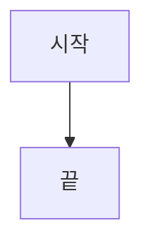

# CONVENTIONS — service-foundry 지식베이스 규약

> 이 문서는 `docs/` Obsidian vault 의 **작성 계약**이다. 모든 노트(사람·sub-agent 작성 포함)는 이 규약을 따른다.
> 상위 패턴 출처: `../design-vault` 의 검증된 Obsidian 지식베이스 구조.

## 1. Vault 레이아웃

```
docs/
├─ index.md          # 단일 카탈로그/MOC — 모든 노트를 1줄씩 등재 (SSOT)
├─ CONVENTIONS.md    # 이 문서
├─ glossary.md       # 약어/용어 사전 + authoritative 링크
├─ log.md            # append-only 변경 로그 (최신 우선)
├─ reference/        # "무엇인가" — 계약·표면 (전수)
│  ├─ architecture.md
│  ├─ packages/<category>-<pkg>.md
│  ├─ apps/<app>.md
│  └─ stack.md
├─ adr/              # "왜 그렇게 정했나" — 기존 결정 (이동 금지, index 에서 링크)
└─ explainers/       # "어떻게 동작하나" — 기술 메커니즘·학습 (핵심 우선)
   ├─ auth/  backend/  frontend/  platform/
```

> **디렉토리별 README 금지** — 카탈로그는 오직 `index.md` 하나. (drift 방지, design-vault 원칙)

## 2. 3층 모델 (어디에 무엇을 쓰나)

| 층 | 질문 | 위치 | 성격 |
|---|---|---|---|
| **reference** | 무엇인가 | `reference/` | 책임·공개 API·의존. 표면. 패키지/앱 전수. |
| **decision** | 왜 정했나 | `adr/` (기존 재활용) | 선택·트레이드오프·대안. |
| **explainer** | 어떻게 동작하나 | `explainers/` | 내부 메커니즘·흐름·원리. mermaid + 학습 Q&A. |

판단 기준: "이건 어떻게 동작/왜 이렇게 행동하나" → **explainer**. "이 패키지가 무엇을 노출하나" → **reference**. "왜 이 기술을 골랐나" → **adr**.

## 2.5 문서 위치 / SSOT (루트 ↔ docs/)

> **원칙: 주제별 정본(SSOT)은 한 곳.** 나머지 문서는 본문을 복제하지 말고 wikilink/상대링크로 정본을 가리킨다. 같은 주제를 루트와 `docs/` 양쪽에 쓰지 않는다.

| 주제 | 정본(SSOT) | 비고 |
|---|---|---|
| 진입점 / Quickstart | `README.md` (루트) | 현관 — `docs/index.md` 로 안내만 |
| 에이전트 운영 규약 | `CLAUDE.md` (루트) | harness-kit import |
| **시스템 구조** (레이어·패키지·의존그래프) | `docs/reference/architecture.md` | 정본. 루트 `ARCHITECTURE.md` 에 **구조를 중복 서술 금지** — 링크만 |
| **엔지니어링 원칙** (TS-first·"설치 버전=SoT"·초기 셋업) | `ARCHITECTURE.md` (루트) §0 | ADR-0002/0004 가 참조하는 정본. 구조(§1~)는 두지 않음 |
| 문서 카탈로그(MOC) | `docs/index.md` | 모든 노트 1줄 등재 |
| 문서 규약 | `docs/CONVENTIONS.md` | 이 문서 |
| 패키지/앱 표면 | `docs/reference/**` | 전수 |
| 의존성 도입 근거 | `docs/reference/stack.md` | |
| 결정(왜) | `docs/adr/**` | 이동 금지, 링크만 |
| 동작 메커니즘 | `docs/explainers/**` | |
| 디자인 언어 | `docs/design/**` | |
| 용어/약어 | `docs/glossary.md` | |
| 변경 로그 | `docs/log.md` | append-only |

**규칙**
- 새 문서는 위 표의 정본 위치에만 만든다. 루트에는 README·CLAUDE·(pointer)ARCHITECTURE 외 신규 산문 문서를 두지 않는다.
- **백로그·목표·로드맵은 docs/ 가 아니다** → `backlog/` (queue.md/phase-*.md). architecture/reference 에 "할 일"을 섞지 않는다.
- 카운트(ADR 개수 등)·목록은 drift 원천 → 가능하면 "코드/디렉토리 참조"로 쓰고, 불가피한 수치는 갱신 책임을 해당 정본에만 둔다.

## 3. Frontmatter (필수)

모든 노트는 frontmatter 를 가지며 `tags` 는 4층(아래 §4)을 따른다.

**reference 노트**
```yaml
---
type: reference
aliases: ["@repo/<pkg>", "<한글 별칭>"]
tags: [service-foundry, reference, <domain>, <concept>]
---
```
**explainer 노트**
```yaml
---
difficulty: 초        # 초 · 중 · 고  (기초/중급/고급 금지)
aliases: ["<한글 이름>", "<EnglishName>"]
tags: [service-foundry, explainer, <domain>, <concept>]
---
```
**index/meta 노트** (`index.md`, `glossary.md`, `log.md`, 이 문서)
```yaml
---
type: index
aliases: [...]
tags: [service-foundry, index, meta]
---
```

## 4. 태그 4층 (flat 문자열, `/` 계층 금지)

1. **루트** (전 노트 공통): `service-foundry`
2. **type** (1개): `reference` · `decision` · `explainer` · `index`
3. **domain** (디렉토리/주제 일치): `auth` · `backend` · `frontend` · `platform` · `shared` · `config` · `nestjs`
4. **concept** (0개+): `session` · `jwt` · `oauth` · `mfa` · `passkey` · `outbox` · `idempotency` · `queue` · `cache` · `otel` · `metrics` · `drizzle` · `turbo` · `tsup` · `ci` · `secrets` 등

## 5. 명명 (Naming)

- 파일: `kebab-case-english.md` 만. 한글/`snake_case`/숫자 prefix/공백 금지.
- reference 패키지 노트: `<category>-<pkg>.md` (예: `backend-auth-session.md`, `shared-contracts.md`).
- reference 앱 노트: `<app>.md` (예: `api.md`).
- explainer: 메커니즘명 (예: `session-rotation.md`, `outbox-pattern.md`).
- 메타 파일만 대문자: `CONVENTIONS.md`.

## 6. Wikilink & 그래프 연결

- 기본 `[[basename]]`. 표시 텍스트 다르면 `[[basename|보이는 텍스트]]`.
- 같은 basename 충돌 시에만 경로 한정: `[[reference/packages/backend-database|database]]`.
- **연결성 규칙** (그래프가 끊기지 않게):
  - 모든 노트는 상위 허브로 1개 이상 링크 (`[[architecture]]` 또는 `[[index]]`).
  - 횡적 peer 링크 2~5개 (`## 연결된 개념` 섹션).
  - reference/explainer 하단에 `> 소스` (권위 출처: spec/ADR/코드 경로).
- 고립 노트(in/out 링크 0) 금지.

## 7. 콜아웃 (blockquote + 이모지 — Obsidian `[!NOTE]` 문법 미사용)

| 패턴 | 용도 |
|---|---|
| `> 💡 **한 줄 요약**: …` | 핵심 takeaway |
| `> ⚠️ …` | 경고/주의/알려진 한계 |
| `> 🧪 **테스트**: …` | 테스트 방법 포인터 |
| `> 📄 …` | 설계 문서/출처 표시 |

## 8. Mermaid

다이어그램은 mermaid 인라인. 유형: `flowchart LR/TD`(흐름·토폴로지), `sequenceDiagram`(비동기 흐름), `stateDiagram-v2`(상태머신), `erDiagram`(스키마). fence 짝(```` ```mermaid ``` ````) 균형 필수.

## 9. 노트 스켈레톤

### 9.1 reference 패키지
```markdown
---
type: reference
aliases: ["@repo/<pkg>", "<한글>"]
tags: [service-foundry, reference, <domain>, <concept>]
---

# @repo/<pkg> — <한 줄 책임>

> 💡 **한 줄 요약**: <무엇을 제공하는 패키지인가>
> **위치**: `packages/<cat>/<pkg>` · **상위**: [[architecture]]

## 책임 (Responsibility)
<1~3문장>

## 공개 API / export
| export | 종류 | 설명 |
|---|---|---|
| ... | fn/type/class | ... |

## 의존
- 내부: [[<other-package>]] …
- 외부: `<dep>` (왜 — [[stack]] / [[adr-...]])

## 사용 예
```ts
// 최소 예시
```

## 연결된 개념
- [[explainers/<domain>/<mechanism>]] — 동작 원리
- [[adr/<NNNN-...>]] — 결정 근거

> 소스: spec-XX-XX · `packages/<cat>/<pkg>/src/...`
```

### 9.2 explainer
```markdown
---
difficulty: 초|중|고
aliases: ["<한글>", "<English>"]
tags: [service-foundry, explainer, <domain>, <concept>]
---

# <메커니즘 이름>

> **대상**: <독자>
> **연관 문서**: [[reference/packages/<…>]] · [[adr/<…>]]

## 왜 필요한가 / 무엇을 푸는가
## 어떻게 동작하나 (메커니즘)

## 용어 정리
## 동작/테스트 방법
> 🧪 ...
## 마치며
## 연결된 개념
- [[...]] — ...

> 소스: spec-XX-XX walkthrough · `path/...`
```

### 9.3 패키지 README (`packages/<cat>/<pkg>/README.md`, 표면 최소)
```markdown
# @repo/<pkg>

> <한 줄 목적>

## 설치 / import
```ts
import { ... } from "@repo/<pkg>";
```

## 핵심 API
- `xxx()` — ...

## 자세히
- 레퍼런스: [`docs/reference/packages/<cat>-<pkg>.md`](../../../docs/reference/packages/<cat>-<pkg>.md)
- 동작 원리: [`docs/explainers/<domain>/<mechanism>.md`](../../../docs/explainers/<domain>/<mechanism>.md)
```

## 10. 유지보수 규칙

새 노트 추가 시: ① 올바른 디렉토리에 파일 생성, ② `index.md` 카탈로그에 1줄 추가, ③ `log.md` 최상단에 항목 추가.

## 11. 커밋

`docs(spec-14-07): <소문자 설명>` — One Task = One Commit (작업 중), 이관 후엔 `docs(...)`.
모든 산출 문서는 **한국어**(코드/경로/기술용어 영어 허용).
