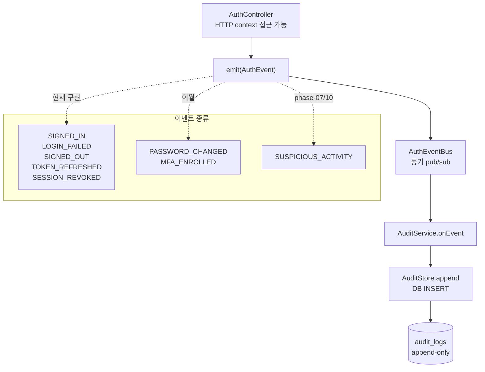

# AuthEventBus Pub/Sub + AuditService Append-Only 감사 로그

> **대상**: 인증 이벤트 추적 구조를 이해하려는 개발자
> **연관 문서**: [[reference/packages/backend-auth-audit]] · [[adr/0006-auth-strategy]]

## 왜 필요한가

인증 이벤트(로그인 성공·실패, 비밀번호 변경, MFA 등록 등)를 서비스 계층에 직접 로깅하면 HTTP context(IP, User-Agent) 에 접근하기 어렵고, 도메인 로직과 감사 로직이 뒤섞인다. `AuthEventBus` pub/sub 패턴은 **emit 위치(Controller)** 와 **저장 위치(AuditService)** 를 분리한다.

## 어떻게 동작하나



### 컴포넌트 책임

| 컴포넌트 | 위치 | 책임 |
|---|---|---|
| `AuthEventBus` | `@repo/backend-auth-audit` | 동기 pub/sub — `emit(event)` + `on(handler)` / `off(handler)` |
| `AuditService` | `@repo/backend-auth-audit` | 이벤트 수신 → `AuditStore.append` 호출 |
| `AuditStore` | interface + Drizzle 구현 | `audit_logs` 테이블에 append-only INSERT |
| `AuthController` | `apps/api` | HTTP request context + emit — 서비스는 순수 도메인 로직 유지 |

### emit-위치: Controller (서비스 아님)

```
WHY: 서비스 계층은 IP / User-Agent 를 모른다.
      컨트롤러는 req.ip / req.headers 에 직접 접근 가능.
```

> ⚠️ `PASSWORD_CHANGED` / `MFA_ENROLLED` emit 은 현재 이월 상태. 현재 controller 에서는 `SIGNED_IN`, `LOGIN_FAILED`, `SIGNED_OUT`, `TOKEN_REFRESHED`, `SESSION_REVOKED` 만 emit 된다. `AuthEventBus` 의 구독 API 는 `on(handler)` / `off(handler)` (`subscribe` 가 아님).

## 용어 정리

| 용어 | 설명 |
|---|---|
| Pub/Sub | 발행자(emit) 와 구독자(subscribe) 를 분리하는 패턴 |
| Append-Only | 기존 row 를 수정·삭제하지 않고 INSERT 만 허용하는 감사 테이블 설계 |
| `AuthEvent` | 타입 구분자(type) + userId + optional metadata 를 가진 이벤트 인터페이스 |

## 동작/테스트 방법

> 🧪 `pnpm --filter @repo/backend-auth-audit test` — `event-bus.test.ts` (4 tests) + `audit.service.test.ts` (3 tests). `@apps/api` 의 `auth.controller.test.ts` (10 tests) 에서 emit 검증 5개 포함.

## 마치며

pub/sub 분리 덕분에 `AuditService` 를 다른 subscriber 로 교체하거나, Kafka/outbox 패턴으로 확장해도 emit 위치 코드는 변경 없다. 현재 동기 구현이지만 인터페이스는 비동기 전환에 열려 있다.

## 연결된 개념

- [[cookie-strategy]] — SIGNED_IN / SIGNED_OUT emit 발생 지점
- [[auth-rate-limit-lockout]] — LOGIN_FAILED + SUSPICIOUS_ACTIVITY 연동
- [[session-rotation-chain]] — reuse_detected 시 SUSPICIOUS_ACTIVITY emit 후보
- [[mfa-totp-challenge]] — MFA_ENROLLED 이벤트 phase-07 이월

> 소스: spec-06-04 walkthrough · `packages/backend/auth-audit/src/`
