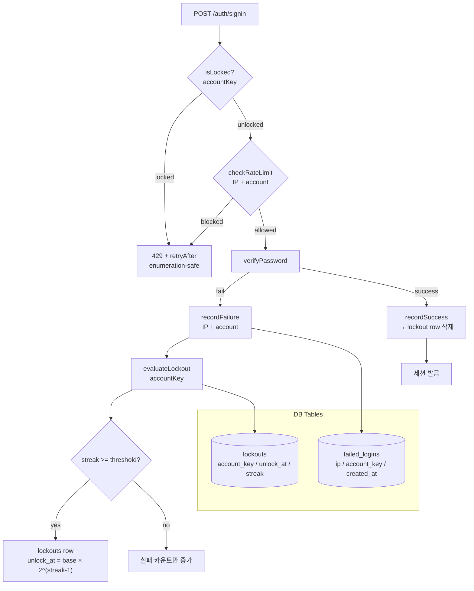

# IP·계정 Sliding Window Rate Limit & 단계별 Lockout

> **대상**: 인증 abuse 방어 구조를 이해하려는 백엔드 개발자
> **연관 문서**: [[reference/packages/backend-auth-rate-limit]] · [[adr/0014-auth-security-baseline]]

## 왜 필요한가

비밀번호 브루트포스 공격은 IP 차단만으로는 막기 어렵다. 계정별 잠금 없이는 분산 공격이 가능하고, CSRF 없이는 상태 변경 요청을 다른 사이트에서 위조할 수 있다. 세 방어 레이어(rate-limit / lockout / CSRF) 를 signin endpoint 에서 순서대로 적용하는 것이 ADR-0014 의 baseline 이다.

## 어떻게 동작하나



### Sliding Window 구현

`checkRateLimit` 는 `failed_logins` 에서 `created_at > now - window` 범위를 COUNT 한다. 매 요청마다 DB query 이지만 인덱스(`failed_logins_ip_at_idx`, `failed_logins_account_at_idx`) 로 P99 < 5ms 를 보장한다.

### Progressive Backoff

| streak | cooldown (`base=15min`) |
|---|---|
| 1 | 15분 |
| 2 | 30분 |
| 3 | 60분 |
| N | `15 × 2^(N-1)` (cap by max) |

cron 불필요 — read 시점에 `unlock_at < now` 를 평가해 자동 해제. lockout row 는 유지되어 다음 lockout 의 backoff base 로 사용된다.

### CSRF Double-Submit Cookie

```
signin 성공 → HMAC-SHA256(secret, sessionId) → csrf 쿠키 + 응답 body
상태 변경 요청 → X-Csrf-Token header + 쿠키 값 비교 → verifyCsrfToken
```

> ⚠️ `checkRateLimit` 와 `isLocked` 는 enumeration-safe 응답을 사용한다 — 실패 원인(IP/계정/잠금)을 구분해서 노출하지 않는다.

## 용어 정리

| 용어 | 설명 |
|---|---|
| Sliding Window | 고정 구간 대신 "최근 N분" 동적 범위로 attempt 를 집계 |
| Progressive Backoff | 잠금 횟수에 비례해 cooldown 을 지수적으로 증가 |
| Double-Submit Cookie | CSRF 방어 — cookie 값과 header 값이 일치하면 same-origin 요청으로 검증 |
| `evaluateLockout` | 실패 후 lockout 기준 도달 여부를 판단하고 DB 를 갱신하는 함수 |

## 동작/테스트 방법

> 🧪 `pnpm --filter @repo/backend-auth-rate-limit test` — `createFakeRateLimitStore()` (Map 기반) 로 DB 없이 rate-limit / lockout / CSRF 전체 경로 검증.

## 마치며

rate-limit + lockout + CSRF 세 영역은 모두 signin endpoint 에서 공통 호출되므로 하나의 패키지로 묶었다. Redis 기반 고성능 카운터와 absolute timeout 은 phase-10 이후 확장 예정이다.

## 연결된 개념

- [[password-hash-argon2id]] — rate-limit 통과 후 비밀번호 검증
- [[session-rotation-chain]] — 로그인 성공 후 세션 발급
- [[audit-event-bus]] — SUSPICIOUS_ACTIVITY 이벤트 발행 지점
- [[cookie-strategy]] — CSRF 토큰이 cookie + header 로 이중 전달되는 방식

> 소스: spec-05-05 walkthrough · `packages/backend/auth-rate-limit/src/`
