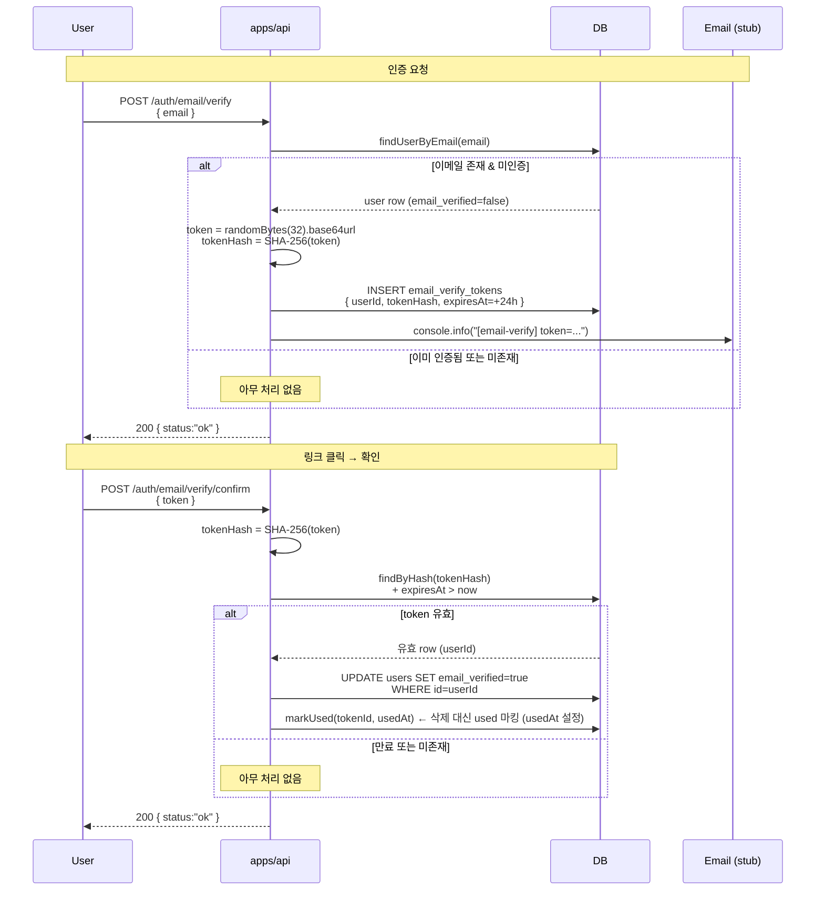

# 이메일 인증 흐름 (Token 발급 → Hash 저장 → Confirm)

> **대상**: 이메일 인증 메커니즘을 이해하려는 개발자
> **연관 문서**: [[reference/apps/api]] · [[adr/0014-auth-security-baseline]]

## 왜 필요한가

회원가입 시 이메일 소유를 검증하지 않으면, 타인 이메일로 계정을 생성하거나 알림 대상을 오염시킬 수 있다. 이메일 인증은 **발급된 토큰을 hash 로 저장** 하고, 사용자가 링크를 클릭하면 `email_verified` 컬럼을 업데이트하는 단방향 흐름이다.

## 어떻게 동작하나

### password-reset 과의 비교

| 항목 | password-reset | email-verify |
|---|---|---|
| TTL | 15분 (보안 민감) | 24시간 (사용자 메일함 확인 필요) |
| DB 테이블 | `password_reset_tokens` | `email_verify_tokens` |
| 완료 후 갱신 | `users.passwordHash` | `users.email_verified = true` |
| 패턴 | spec-05-06 | spec-05-06 답습 |

## 용어 정리

| 용어 | 설명 |
|---|---|
| `email_verified` | `users` 테이블 컬럼 — 이메일 소유 인증 완료 여부 |
| Enumeration-safe | 이메일 존재·인증 여부 무관 항상 `200` 반환 |
| TTL 24h | password-reset(15분) 대비 긴 유효기간 — 사용자 메일 확인 여유 |

## 동작/테스트 방법

> 🧪 `pnpm --filter @apps/api test` — `email-verify.service.test.ts` (3 tests) + `email-verify.confirm.service.test.ts` (4 tests) + E2E round-trip (실 PG). token 미존재·만료 경로도 200 반환 검증.

## 마치며

email-verify 는 password-reset 과 동일한 보안 패턴을 사용한다. `UserStore.updateEmailVerified()` 를 같은 Store 인터페이스에 추가해 두 흐름이 같은 users 테이블을 일관되게 조작한다.

## 연결된 개념

- [[password-reset-flow]] — 동일한 SHA-256 hash + always-200 패턴의 원형
- [[session-rotation-chain]] — 인증 완료 후 새 세션 발급 연결
- [[audit-event-bus]] — EMAIL_VERIFIED 이벤트 emit 후보

> 소스: spec-05-07 walkthrough · `apps/api/src/auth/`
