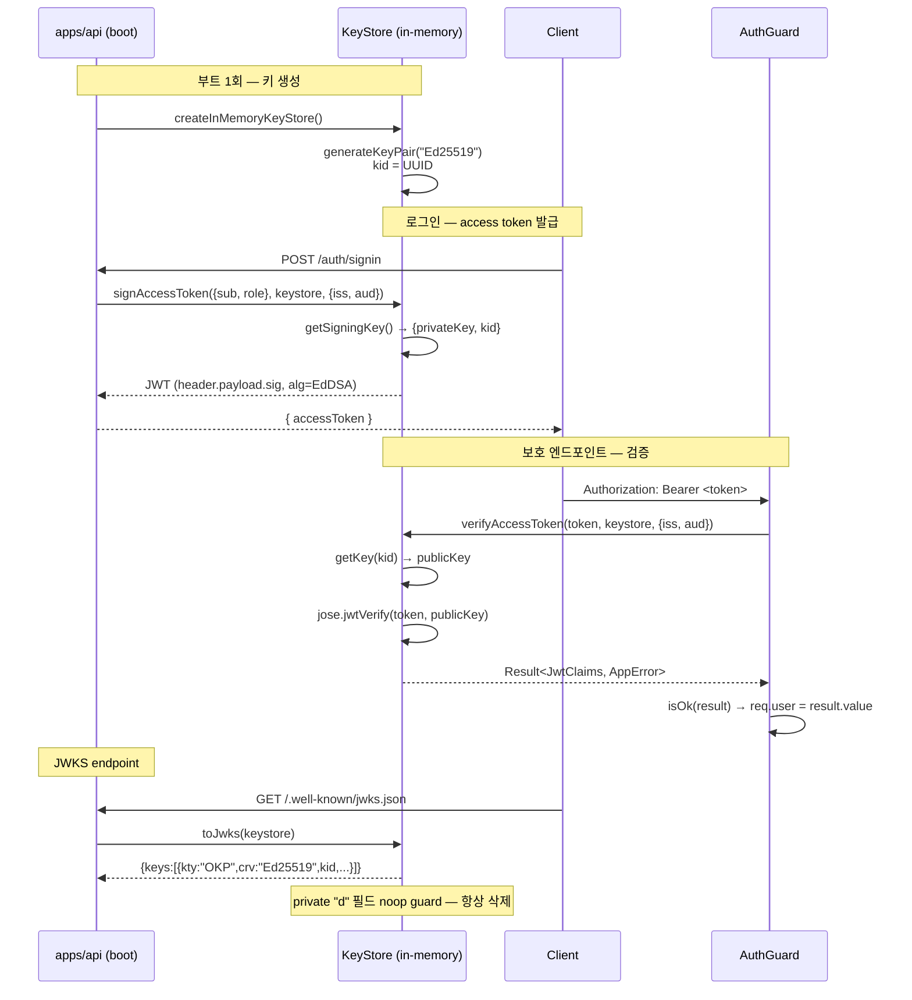

# EdDSA(Ed25519) JWT 발급·검증 흐름

> **대상**: JWT 내부 구조와 키 관리를 이해하려는 백엔드 개발자
> **연관 문서**: [[reference/packages/backend-auth-jwt]] · [[adr/0013-session-lifecycle]]

## 왜 필요한가

HMAC-HS256 은 서명 키가 노출되면 누구나 토큰을 위조할 수 있다. EdDSA(Ed25519) 비대칭 키는 **서명은 private key, 검증은 public key** 로 분리되어, JWKS endpoint 를 통해 검증 키만 공개해도 안전하다. jose v6 는 Web Crypto API 기반이므로 Node.js 와 Edge runtime(Cloudflare Workers 등) 양쪽에서 동작한다.

## 어떻게 동작하나

### 오류 분류

| `JwtErrorCode` | 원인 | HTTP |
|---|---|---|
| `TOKEN_EXPIRED` | `JWTExpired` | 401 → refresh 유도 |
| `TOKEN_INVALID` | 서명 위변조 / 형식 불량 | 401 |
| `TOKEN_KEY_NOT_FOUND` | JWKS rotation 후 kid 미존재 | 401 |
| `TOKEN_CLAIM_MISMATCH` | iss/aud 불일치 | 401 |

> ⚠️ `signAccessToken` 은 빈 `sub` 에 throw (프로그래밍 오류). `verifyAccessToken` 만 `Result` 반환.

## 용어 정리

| 용어 | 설명 |
|---|---|
| EdDSA | Edwards-curve Digital Signature Algorithm — Ed25519 곡선 사용 |
| `kid` | Key ID — JWT header 에 포함, 검증 시 키 lookup 에 사용 |
| JWKS | JSON Web Key Set — public key 목록을 RFC 7517 형식으로 공개 |
| `KeyStore` | `signAccessToken` / `verifyAccessToken` / `toJwks` 가 의존하는 interface |

## 동작/테스트 방법

> 🧪 `pnpm --filter @repo/backend-auth-jwt test` — 26 단위 테스트. `createFakeKeyStore` 로 crypto 비용 없이 interface 검증 + `createInMemoryKeyStore` 로 실제 Ed25519 round-trip 검증.

## 마치며

`KeyStore` interface 덕분에 향후 파일·KMS·Redis 기반 키스토어로 교체해도 도메인 함수는 변경 없다. JWKS endpoint 의 `d` 필드 guard 는 private key 노출 사고를 이중으로 방지한다.

## 연결된 개념

- [[session-rotation-chain]] — refresh token 과 access token 의 짝 관계
- [[cookie-strategy]] — access token 을 response body 로 전달하는 엔드포인트
- [[auth-guard-verified-claims]] — verifyAccessToken 결과를 guard 가 사용하는 방식
- [[oauth-pkce-flow]] — OAuth 완료 후 같은 signAccessToken 호출

> 소스: spec-05-03 walkthrough · `packages/backend/auth-jwt/src/`
