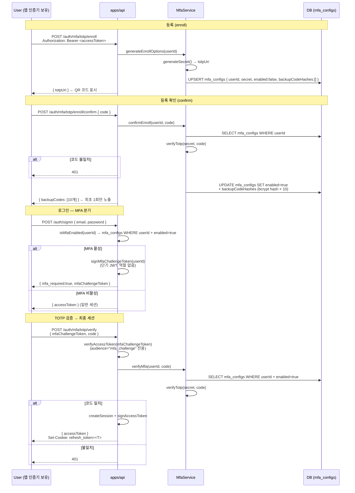

# MFA TOTP Enroll · Confirm · Challenge 흐름

> **대상**: 2단계 인증(TOTP) 구현 구조를 이해하려는 개발자
> **연관 문서**: [[reference/packages/backend-auth-mfa]] · [[adr/0013-session-lifecycle]]

## 왜 필요한가

비밀번호만으로는 크리덴셜 유출 시 계정이 즉시 장악된다. TOTP(Time-based One-Time Password) 는 **알고 있는 것(비밀번호) + 가지고 있는 것(인증 앱)** 을 결합해 2단계 방어를 제공한다. MFA 활성화 후 signin 은 **비밀번호 검증 → mfa_required 분기 → challenge token 발급 → TOTP 검증 → 세션 발급** 의 2단계 흐름으로 바뀐다.

## 어떻게 동작하나

### 백업 코드

등록 확인 시 10개의 단일 사용 백업 코드가 생성된다. 각 코드는 bcrypt 해싱 후 저장되며, 인증기 분실 시 대체 수단으로 사용 가능하다.

## 용어 정리

| 용어 | 설명 |
|---|---|
| TOTP | Time-based OTP — 30초 주기 6자리 코드, RFC 6238 |
| `mfaChallengeToken` | 비밀번호 검증 후 발급되는 단기 JWT (audience=`mfa_challenge`) — TOTP 검증 전까지만 유효 |
| `enabled:false` | enroll 시작 후 confirm 전 상태 — `confirmEnroll` 성공 시 `enabled:true` 로 전환 |
| Backup Code | 인증기 분실 대비 1회용 복구 코드 (bcrypt 저장) |

## 동작/테스트 방법

> 🧪 `pnpm --filter @apps/api test` — `auth.e2e.test.ts` 에서 MFA 수직 슬라이스 9 tests. enroll → confirm → signin(mfa_required) → verify(wrong/right) → disable 전체 흐름. `@repo/backend-auth-mfa` 단위 테스트 14 tests.

## 마치며

`mfaChallengeToken` 이라는 중간 단계 JWT 덕분에 MFA 미완료 상태에서 세션이 발급되지 않는다. `@Optional() MfaService` 패턴으로 MFA 모듈 없이도 기존 signin 테스트가 그대로 동작한다.

## 연결된 개념

- [[passkey-webauthn]] — TOTP 대신 하드웨어 인증기를 사용하는 대안
- [[session-rotation-chain]] — TOTP 검증 성공 후 세션 rotation chain 시작
- [[jwt-verify-edDSA]] — mfaChallengeToken 검증에 같은 verifyAccessToken 활용
- [[audit-event-bus]] — MFA_ENROLLED / MFA_FAILED 이벤트 emit 후보

> 소스: spec-07-02 walkthrough · `packages/backend/auth-mfa/src/`
