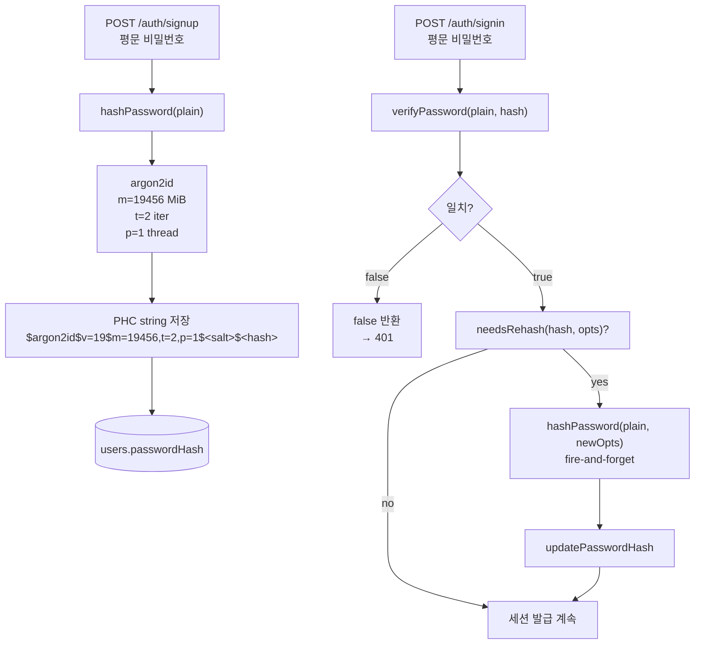

# Argon2id 패스워드 해싱 & 자동 업그레이드

> **대상**: 패스워드 저장 원칙을 이해하려는 모든 개발자
> **연관 문서**: [[reference/packages/backend-auth-password]] · [[adr/0014-auth-security-baseline]]

## 왜 필요한가

평문이나 bcrypt SHA-1 저장은 GPU 병렬 공격에 취약하다. OWASP 2023 / RFC 9106 은 **argon2id** 를 권장한다. argon2id 는 메모리 경직(argon2d) 과 타이밍 저항(argon2i) 을 결합해 side-channel 과 GPU 공격 모두를 방어한다.

`needsRehash` 함수는 **비용 매개변수가 바뀌면 다음 로그인 시 자동으로 재해싱** 하여 사용자 개입 없이 보안 정책을 업그레이드한다.

## 어떻게 동작하나

### OWASP 2023 기본 비용

| 파라미터 | 값 | 의미 |
|---|---|---|
| `memoryCost` | 19 456 KiB (≈19 MiB) | 해싱에 필요한 메모리 |
| `timeCost` | 2 | 반복 횟수 |
| `parallelism` | 1 | 병렬 스레드 |
| `hashLength` | 32 bytes | 출력 길이 |

> ⚠️ staging/prod 는 `memoryCost: 65536` (64 MiB) 으로 강화 권장. `needsRehash` 가 기존 hash 를 자동 식별한다.

### 오류 분류

| 코드 | 상황 | statusCode |
|---|---|---|
| `PASSWORD_EMPTY` | `hashPassword("")` | 400 |
| `PASSWORD_HASH_MALFORMED` | PHC 형식 아닌 hash 를 `verifyPassword` 에 전달 | 500 |

## 용어 정리

| 용어 | 설명 |
|---|---|
| PHC string | Password Hashing Competition 표준 포맷 — 알고리즘·비용·salt·hash 를 단일 문자열로 인코딩 |
| `needsRehash` | argon2 라이브러리 native API — PHC 파싱 후 현재 비용과 비교 |
| fire-and-forget | 재해싱을 응답 반환 후 비동기로 처리 — UX 영향 0 |

## 동작/테스트 방법

> 🧪 `pnpm --filter @repo/backend-auth-password test` — hashPassword / verifyPassword / needsRehash 단위 테스트. 실제 argon2id native binding 으로 PHC string 검증.

## 마치며

`verifyPassword` 가 `boolean` 을 반환하고 `needsRehash` 가 자동 업그레이드를 처리하므로, 호출자(apps/api) 는 비용 변경 시 코드 수정 없이 정책을 갱신할 수 있다.

## 연결된 개념

- [[auth-rate-limit-lockout]] — 비밀번호 검증 실패 시 rate-limit 와 lockout 연동
- [[password-reset-flow]] — 비밀번호 재설정 시 같은 hashPassword 사용
- [[session-rotation-chain]] — 로그인 성공 후 세션 발급 연결

> 소스: spec-05-04 walkthrough · `packages/backend/auth-password/src/`
