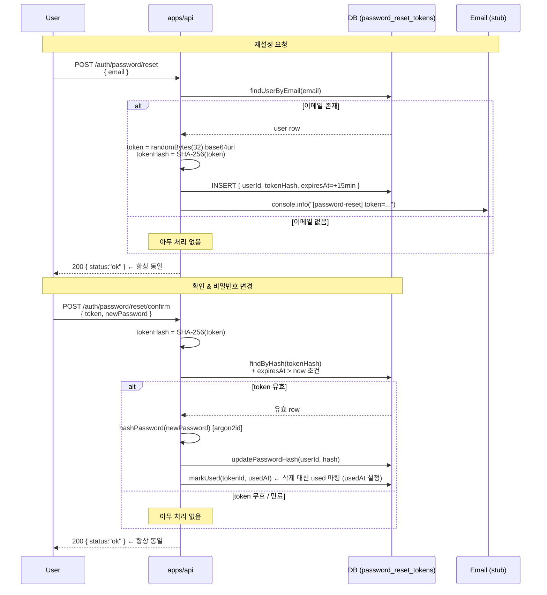

# 비밀번호 재설정 흐름 (Always-200 + SHA-256 Token)

> **대상**: 비밀번호 재설정 보안 원칙을 이해하려는 개발자
> **연관 문서**: [[reference/apps/api]] · [[adr/0014-auth-security-baseline]]

## 왜 필요한가

비밀번호 재설정은 두 가지 보안 위협에 노출된다. 첫째, 이메일 존재 여부를 응답으로 구분하면 계정 열거 공격(account enumeration) 이 가능하다. 둘째, 링크에 담긴 원본 token 을 DB 에 저장하면 DB 유출 시 즉시 악용된다. **Always-200** 과 **SHA-256 hash 저장** 으로 두 위협을 동시에 차단한다.

## 어떻게 동작하나

### 핵심 보안 원칙

| 원칙 | 구현 |
|---|---|
| Enumeration-safe | 이메일 존재 여부 무관 항상 `200 { status:"ok" }` 반환 |
| Token hash 저장 | `SHA-256(rawToken)` hex 만 DB 저장 — `auth-session` 패턴 동일 (ADR-0014) |
| 짧은 TTL | `expiresAt = now + 15min` — 보안 민감 작업 |
| 단일 사용 | confirm 성공 시 `markUsed(id, usedAt)` 로 재사용 차단 (삭제 대신 `usedAt` 마킹) |

## 용어 정리

| 용어 | 설명 |
|---|---|
| Always-200 | 성공/실패 무관 동일 응답 — 계정 존재 여부 노출 차단 |
| Enumeration Attack | 응답 차이를 이용해 유효 계정 목록을 수집하는 공격 |
| `generateRefreshToken` | `crypto.randomBytes(32).toString("base64url")` — 43자 URL-safe 토큰 |

## 동작/테스트 방법

> 🧪 `pnpm --filter @apps/api test` — `password-reset.service.test.ts` (3 tests) + `password-reset.confirm.service.test.ts` (7 tests) + e2e (실 PG). 이메일 미존재 경로도 200 반환 검증 포함.

## 마치며

raw token 은 이메일(링크)로만 전달되고 서버에는 hash 만 남는다. DB 유출이 일어나도 hash 만으로는 원본 token 을 역산할 수 없어 link 악용이 불가능하다.

## 연결된 개념

- [[email-verify-flow]] — 동일한 패턴(SHA-256 hash + always-200) 을 이메일 인증에 적용
- [[password-hash-argon2id]] — confirm 시 새 비밀번호를 argon2id 로 해싱
- [[session-rotation-chain]] — 비밀번호 변경 후 기존 세션 revoke 필요성
- [[auth-rate-limit-lockout]] — reset 요청에도 rate-limit 적용 가능

> 소스: spec-05-06 walkthrough · `apps/api/src/auth/`
