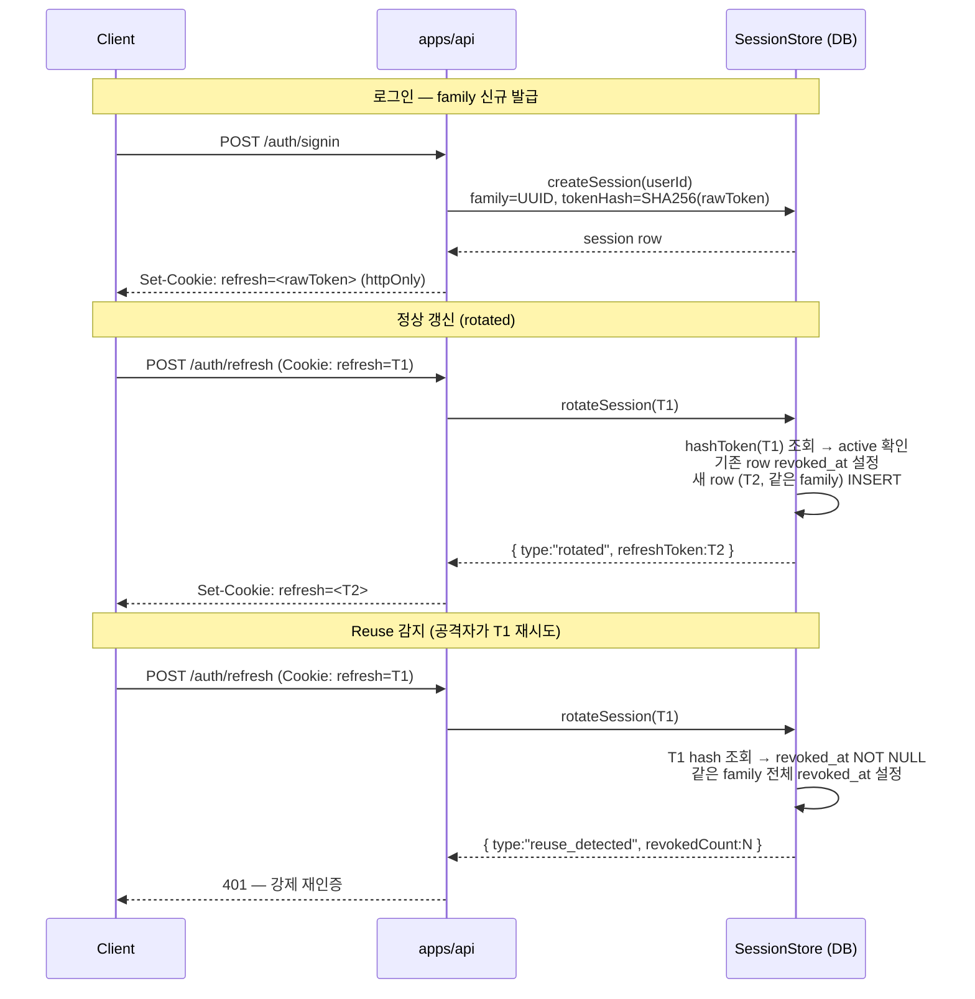

# Refresh Token Rotation Chain

> **대상**: 세션 보안 메커니즘을 이해하고 싶은 백엔드 개발자
> **연관 문서**: [[reference/packages/backend-auth-session]] · [[adr/0013-session-lifecycle]]

## 왜 필요한가

리프레시 토큰을 재사용 가능 상태로 두면, 공격자가 토큰을 탈취한 후 클라이언트보다 먼저 갱신해 세션을 장악할 수 있다. Rotation Chain 은 **매 갱신마다 토큰을 교체** 하고, 이전 토큰이 다시 제시되면 **family 전체를 즉시 revoke** 하여 탈취를 감지한다.

## 어떻게 동작하나

### 4-분기 상태 머신

| `rotateSession` 결과 | 조건 | 처리 |
|---|---|---|
| `rotated` | 정상 active token | 기존 revoke + 신규 발급 (같은 family) |
| `reuse_detected` | revoked token 재제시 | family 전체 revoke → 강제 재인증 |
| `expired` | `expiresAt < now` | 거부만 (revoke 없음) |
| `not_found` | 미존재 hash | 401 |

### 핵심 구현 상수

- 토큰 엔트로피: `crypto.randomBytes(32).toString("base64url")` → 256-bit
- DB 저장: `SHA-256 hex` (raw token 미저장)
- Family UUID: `createSession` 시 생성, 같은 chain 의 모든 row 공유
- TTL: Sliding — 매 rotation 시 `expiresAt` 재계산

## 용어 정리

| 용어 | 설명 |
|---|---|
| `refreshTokenFamily` | 같은 로그인에서 파생된 모든 rotation chain 의 공유 UUID |
| `hashToken` | `SHA-256(rawToken)` → hex — DB 에 저장되는 값 |
| Sliding TTL | rotation 성공 시마다 만료 시간이 연장되는 방식 |
| Reuse Detection | revoked token 재제시를 감지해 family 전체를 무효화하는 보안 메커니즘 |

## 동작/테스트 방법

> 🧪 `pnpm --filter @repo/backend-auth-session test` — `createFakeStore()` (Map 기반) 로 drizzle 없이 12개 unit test. reuse_detected / rotated / expired / not_found 모든 분기 커버.

## 마치며

Rotation Chain 은 "token 을 썼으면 즉시 교체" + "이미 쓴 token 이 다시 오면 경보" 두 원칙으로 동작한다. Family UUID 덕분에 멀티 디바이스도 디바이스별로 격리된 chain 을 갖는다. 정공법(절대 만료 / 동시 접속 제한 / device fingerprint 등)은 README 에 이월됐다.

## 연결된 개념

- [[jwt-verify-edDSA]] — access token 발급/검증 짝
- [[cookie-strategy]] — refresh token 을 httpOnly cookie 로 전달하는 방법
- [[audit-event-bus]] — SUSPICIOUS_ACTIVITY 이벤트 emit 지점
- [[auth-rate-limit-lockout]] — rotation 전 rate-limit 선행 처리

> 소스: spec-05-02 walkthrough · `packages/backend/auth-session/src/`
