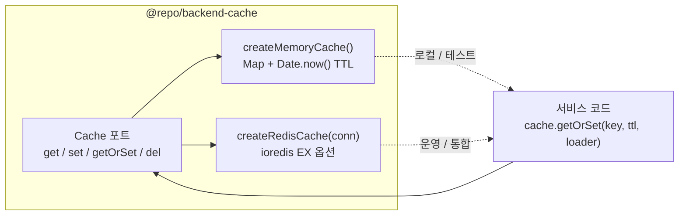

# Cache 포트와 cache-aside 패턴

> **대상**: Cache 추상화가 어떻게 동작하는지, fake timer 로 TTL 을 결정론적으로 테스트하는 방법을 이해하려는 개발자
> **연관 문서**: [[reference/packages/backend-cache]] · [[adr/0015-framework-adapter-naming-and-layout]]

## 왜 필요한가

캐싱 로직(cache-aside, TTL 만료)을 redis 없이 단위 테스트할 수 있어야 한다. 동시에 실제 운영에서는 redis 로 교체해야 한다. `Cache` 포트를 두면 in-memory 어댑터로 로직을 검증하고, redis 어댑터로 교체해도 호출 코드가 변하지 않는다.

## 어떻게 동작하나



### `getOrSet` 흐름 (cache-aside)

1. `cache.get(key)` — 캐시 히트이면 **loader 호출 없이** 반환
2. 미스이면 `loader()` 실행 → 결과를 `cache.set(key, value, ttlSeconds)` 저장
3. 이후 같은 키 요청은 TTL 내에 캐시에서 반환

> ⚠️ `null` 은 미스로 간주한다. 실제로 `null` 을 캐시해야 하는 경우 래퍼 객체를 쓸 것(문서화된 규약).

### TTL 만료 구현 (in-memory)

```ts
const expiry = (ttlSeconds?: number): number | null =>
  ttlSeconds && ttlSeconds > 0 ? Date.now() + ttlSeconds * 1000 : null;
```

`read()` 시 `Date.now() >= entry.expiresAt` 이면 항목을 삭제하고 `null` 반환한다. lazy expiration 방식이다.

### fake timer 테스트

Vitest 의 `vi.useFakeTimers()` + `vi.advanceTimersByTime(ms)` 로 `Date.now()` 를 조작해 TTL 만료를 시뮬레이션한다. real redis 없이도 TTL 동작을 결정론적으로 검증할 수 있다.

### redis 어댑터 (`createRedisCache`)

ioredis 의 `SET key value EX ttl` / `GET` / `DEL` 을 사용한다. JSON 직렬화/역직렬화는 어댑터 내부 처리다.

> ⚠️ `import Redis from "ioredis"` 가 `verbatimModuleSyntax` + NodeNext 환경에서 "no construct signatures" 에러를 낸다. `import { Redis } from "ioredis"` named import 를 사용해야 한다.

## 용어 정리

| 용어 | 설명 |
|---|---|
| cache-aside | 애플리케이션이 직접 캐시를 읽고 미스 시 DB 조회 후 저장하는 패턴 |
| TTL | Time-To-Live — 캐시 항목 유효 기간(초) |
| lazy expiration | 읽기 시점에 만료 여부를 확인해 삭제 (백그라운드 스캔 없음) |
| `getOrSet` | cache-aside 를 단일 메서드로 캡슐화 |
| fake timer | 테스트에서 `Date.now()` 를 수동으로 앞당겨 TTL 만료 시뮬레이션 |

## 동작/테스트 방법

> 🧪 **테스트**: `pnpm --filter @repo/backend-cache test` — set/get, 미스 null, getOrSet(미스→loader 1회/히트→미호출), del, TTL 만료(fake timer) = 5 tests. 통합: `bash packages/backend/cache/smoke-cache.sh` — docker Redis → set→get round-trip.

```ts
const cache = createMemoryCache();
await cache.set("key", "value", 60); // TTL 60s
const hit = await cache.get("key"); // "value"
const loaded = await cache.getOrSet("miss", 60, async () => "fresh"); // loader 호출
```

## 마치며

`Cache` 포트는 [[explainers/backend/idempotency-key-replay]] 의 멱등성 저장소로도 재사용된다. 동일 패턴 위에 두 기능이 쌓인다.

## 연결된 개념

- [[explainers/backend/idempotency-key-replay]] — Cache 포트 위에 멱등성 구현
- [[explainers/backend/transactional-outbox]] — outbox relay 와 cache 조합
- [[adr/0015-framework-adapter-naming-and-layout]] — 포트/어댑터 패키지 분리

> 소스: spec-12-03 walkthrough · `packages/backend/cache/src/port.ts` · `packages/backend/cache/src/memory.ts` · `packages/backend/cache/src/redis.ts`
