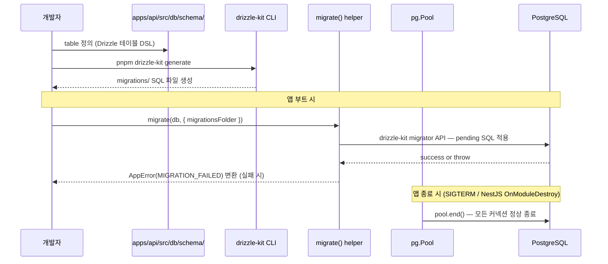

# Drizzle 마이그레이션 라이프사이클

> **대상**: Drizzle schema 정의부터 운영 DB 마이그레이션 적용, 그리고 앱 종료 시 Pool 정리까지 전체 흐름을 이해하려는 개발자
> **연관 문서**: [[reference/packages/backend-database]] · [[adr/0005-backend-framework-and-orm-strategy]]

## 왜 필요한가

애플리케이션 코드가 DB schema 변경을 안전하게 반영하려면 "코드 → SQL 파일 생성 → 적용 → 확인" 흐름이 재현 가능해야 한다. 동시에, 앱 종료 시 `pg.Pool` 이 닫히지 않으면 프로세스가 hang 되거나 커넥션 누수가 생긴다. `@repo/backend-database` 는 이 두 가지 책임을 단일 패키지로 처리한다.

## 어떻게 동작하나



`createDatabase<TSchema>(options)` 는 `pg.Pool` 을 생성하고 `drizzle(pool, { schema })` 로 감싼다. 스키마 정의는 **앱 레벨**(`apps/<app>/src/db/schema/`)에서 가지며, 패키지는 generic `TSchema` 인자로만 받는다. 이 덕분에 서비스별로 다른 schema 를 쓰면서 타입 안전 쿼리 API 를 유지할 수 있다.

`migrate(db, options)` 는 `drizzle-orm/node-postgres/migrator` 의 `migrate` 를 얇게 감싸 에러를 `AppError(MIGRATION_FAILED)` 로 변환한다. drizzle-kit 이 생성한 SQL 파일 디렉터리를 인자로 받아 pending 마이그레이션만 순서대로 적용한다.

**NestJS 배선**: `@repo/nestjs-database` 의 `DatabaseShutdownService` 가 `OnModuleDestroy` 를 구현해 `shutdown(pool)` 을 호출한다. `useFactory: () => new DatabaseShutdownService(database)` 패턴을 써야 하는 이유는 NestJS lifecycle hook 이 클래스 인스턴스에서만 동작하기 때문이다(`useValue` 객체에는 훅이 실행되지 않는다).

## 용어 정리

| 용어 | 설명 |
|---|---|
| `drizzle-kit generate` | schema TS 파일 → SQL migration 파일 생성 CLI 명령 |
| `migrationsFolder` | `migrate()` 가 읽는 SQL 파일 디렉터리 경로 |
| `pg.Pool` | node-postgres 커넥션 풀 (기본 max 10) |
| `OnModuleDestroy` | NestJS 앱 종료 시 provider 정리를 위한 lifecycle 인터페이스 |
| `AppError(MIGRATION_FAILED)` | 마이그레이션 실패를 표준 오류 객체로 변환 (cause 보존) |

## 동작/테스트 방법

> 🧪 **테스트**: `pnpm --filter @repo/backend-database test` — createDatabase(3) + shutdown(1) + migrate(2) + logger integration(2) = 8 tests. `vi.fn()` mock Pool 대신 `class PoolMock` 을 사용한다 (constructor mock 한계 우회).

```ts
// 최소 사용 패턴
const { db, pool } = createDatabase({ connectionUrl, schema, logQueries: true, logger });
await migrate(db, { migrationsFolder: "./migrations" });
// ... 앱 로직 ...
await shutdown(pool); // 직접 종료 시
```

## 마치며

본 패키지는 infra factory 역할만 수행한다. Repository 구현, query 로직, schema 정의는 모두 앱 레벨 책임이다. application/domain 레이어는 `DATABASE` symbol 을 직접 의존하지 않고 repository interface 만 의존해야 ORM 교체 시 infra 레이어만 변경된다.

## 연결된 개념

- [[adr/0005-backend-framework-and-orm-strategy]] — Drizzle 단일 ORM 채택 근거
- [[adr/0015-framework-adapter-naming-and-layout]] — pure/어댑터 패키지 분리 패턴
- [[explainers/backend/graceful-shutdown-lifecycle]] — shutdown 시퀀스 상세

> 소스: spec-03-05 walkthrough · `packages/backend/database/src/index.ts` · `packages/nestjs/database/src/`
