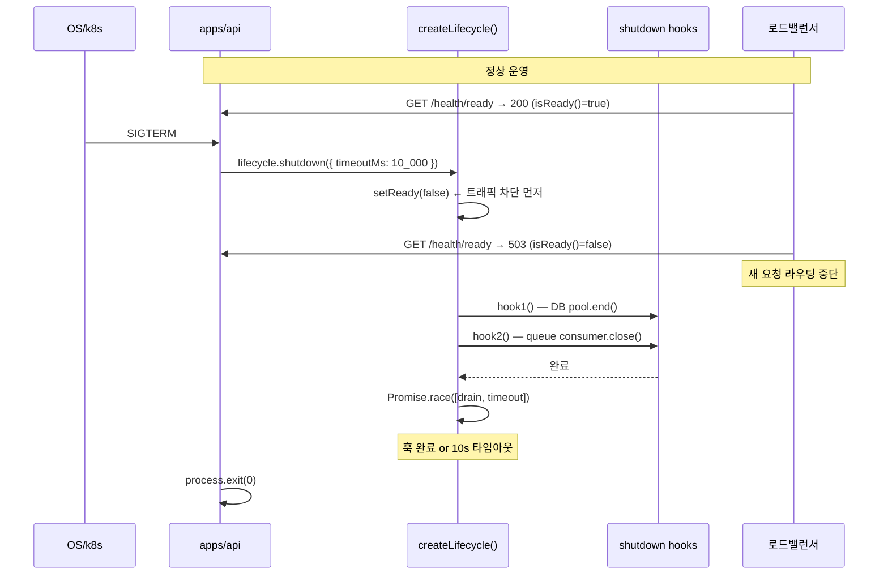

# Readiness 플래그와 graceful shutdown 시퀀스

> **대상**: k8s/LB 환경에서 SIGTERM 수신 후 트래픽을 차단하고 진행 중 요청을 완료시키는 메커니즘을 이해하려는 개발자
> **연관 문서**: [[reference/packages/backend-lifecycle]] · [[adr/0015-framework-adapter-naming-and-layout]]

## 왜 필요한가

k8s 가 pod 를 종료할 때 즉시 프로세스를 죽이면 진행 중인 요청이 유실된다. 로드밸런서는 readiness probe 가 실패하기 전까지 새 요청을 계속 라우팅한다. 올바른 종료 순서는:

1. **readiness=false** 먼저 → LB 가 트래픽 차단
2. **정리 훅 실행** → DB pool / queue consumer 정상 종료
3. **timeout 드레인** → 훅이 무한 hang 해도 프로세스 종료 보장

## 어떻게 동작하나



### `shutdown` 의 핵심 특성

- **idempotent**: 두 번 호출해도 훅이 중복 실행되지 않는다 (`shuttingDown` 프로미스 재사용)
- **readiness-first**: `setReady(false)` 가 `runHooks()` 보다 먼저 실행된다
- **best-effort drain**: 훅이 throw 해도 나머지 훅은 계속 실행된다
- **timeout 보호**: `timeoutMs` 로 최대 대기 시간을 제한해 무한 hang 방지

### health endpoint 분리

| 엔드포인트 | 의미 | 종료 중 상태 |
|---|---|---|
| `GET /health/live` | 프로세스 살아있음 | 항상 200 |
| `GET /health/ready` | 트래픽 받을 준비 | 503 |

liveness 와 readiness 를 분리해야 k8s 가 종료 중인 pod 를 재시작하지 않고 트래픽만 차단한다.

### 훅 등록

```ts
lifecycle.onShutdown(async () => { await pool.end(); });
lifecycle.onShutdown(async () => { await consumer.close(); });
```

훅은 등록 순서대로 순차 실행된다.

## 용어 정리

| 용어 | 설명 |
|---|---|
| readiness | 트래픽을 받을 준비 여부 — LB 연동 |
| liveness | 프로세스 생존 여부 — k8s restart 연동 |
| drain | 진행 중 요청/커넥션이 완료될 때까지 대기 |
| `Promise.race` | drain 완료 or timeoutMs 중 먼저 온 것으로 종료 |
| idempotent shutdown | 중복 호출 시 동일 프로미스 반환 |

## 동작/테스트 방법

> 🧪 **테스트**: `pnpm --filter @repo/backend-lifecycle test` — readiness toggle, onShutdown 실행, idempotent 재호출, **타임아웃 resolve(fake timer)** = 5 tests. `apps/api` health controller 테스트는 real lifecycle 인스턴스를 직접 주입해 모킹 불필요.

```ts
const lifecycle = createLifecycle();
lifecycle.onShutdown(async () => await pool.end());
// SIGTERM handler
process.on("SIGTERM", () => lifecycle.shutdown({ timeoutMs: 10_000 }));
```

## 마치며

`@repo/backend-lifecycle` 은 NestJS 없이도 동작하는 순수 코어다. NestJS 앱에서는 `OnModuleDestroy` 훅에서 `lifecycle.shutdown()` 을 호출하거나, SIGTERM 핸들러에서 직접 호출하면 된다.

## 연결된 개념

- [[explainers/backend/drizzle-migrations-lifecycle]] — pool.end() 연동
- [[explainers/backend/queue-worker-bullmq]] — consumer.close() 연동
- [[reference/packages/backend-lifecycle]] — 공개 API

> 소스: spec-12-04 walkthrough · `packages/backend/lifecycle/src/index.ts` · `apps/api/src/health/`
