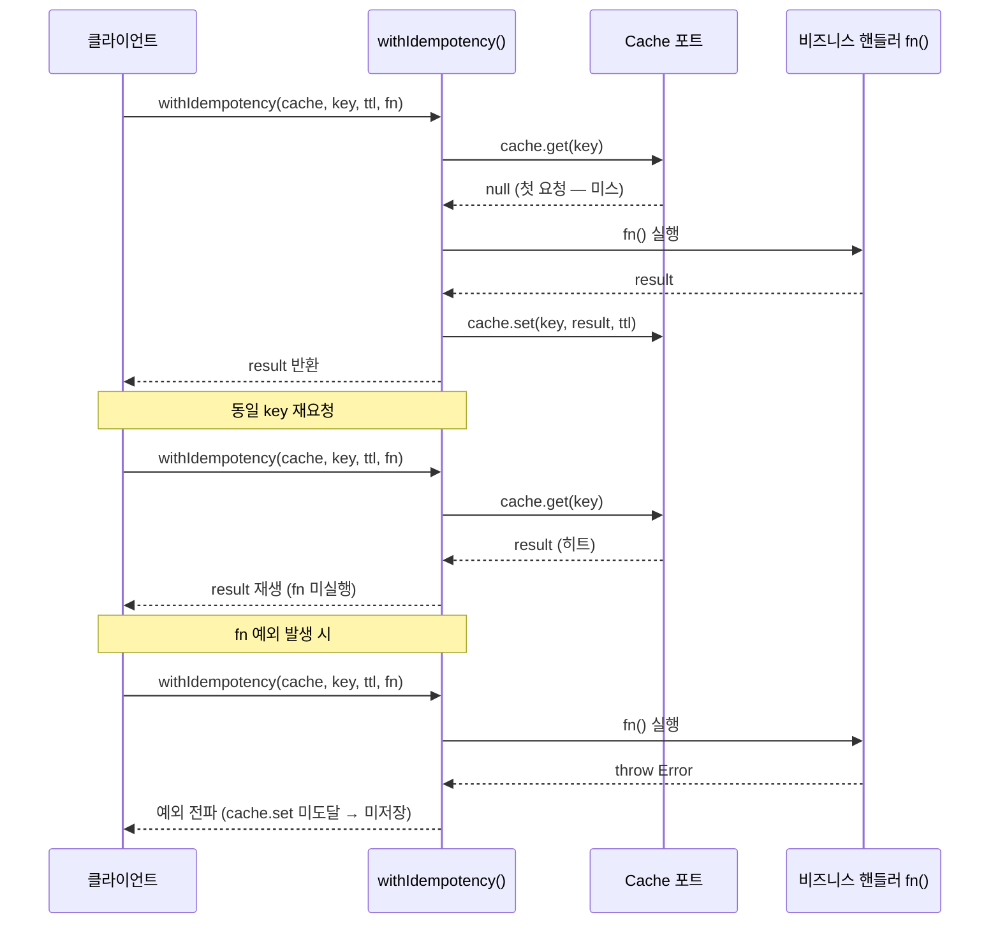

# Idempotency-Key별 첫 결과 캐시와 재생

> **대상**: 중복 요청(네트워크 재시도, 클라이언트 재전송)이 같은 작업을 두 번 실행하지 않도록 하는 메커니즘을 이해하려는 개발자
> **연관 문서**: [[reference/packages/backend-idempotency]] · [[reference/packages/backend-cache]] · [[adr/0009-app-error-design]]

## 왜 필요한가

결제, 이메일 발송, 계좌 이체처럼 부작용이 있는 작업은 네트워크 오류로 클라이언트가 같은 요청을 여러 번 보낼 수 있다. 매번 핸들러를 실행하면 중복 결제, 중복 이메일이 발생한다. `Idempotency-Key` 를 키로 첫 번째 결과를 캐시하고 이후 요청엔 저장값을 그대로 반환(재생)하면 이를 방지할 수 있다.

## 어떻게 동작하나



### 구현

```ts
export async function withIdempotency<T>(
  cache: Cache,
  key: string,
  ttlSeconds: number,
  fn: () => Promise<T>,
): Promise<T> {
  const cached = await cache.get<T>(key);
  if (cached !== null) return cached; // 히트 → 재생
  const result = await fn();          // fn 예외 시 전파, 아래 미도달
  await cache.set(key, result, ttlSeconds);
  return result;
}
```

`fn` 이 예외를 throw 하면 `cache.set` 에 도달하지 않으므로 실패는 재시도 가능하다. 성공한 결과만 캐시된다.

### Cache 포트와의 관계

`withIdempotency` 는 `Cache` 포트(`@repo/backend-cache`)를 직접 조합한다. 단명 멱등 키는 TTL 캐시에 적합하다. 인메모리로 로컬 테스트를 할 수 있고, redis 어댑터로 분산 환경을 지원한다.

## 용어 정리

| 용어 | 설명 |
|---|---|
| Idempotency-Key | 요청을 식별하는 클라이언트 제공 고유 키 |
| 재생(replay) | 핸들러 미실행, 저장된 첫 결과 반환 |
| TTL | 멱등성 유효 기간 (만료 후 새 요청으로 취급) |
| at-most-once | 동일 키로 fn 이 최대 1번 성공 실행됨을 보장 |

## 동작/테스트 방법

> 🧪 **테스트**: `pnpm --filter @repo/backend-idempotency test` — 첫 실행(fn 1회), 재생(fn 미실행), 다른 키 독립, fn 예외 시 미저장+재시도 = 4 tests. `createMemoryCache()` 를 직접 주입해 real redis 없이 검증한다.

```ts
const cache = createMemoryCache();
const fn = vi.fn(async () => ({ orderId: "42" }));

// 첫 요청
const r1 = await withIdempotency(cache, "key-abc", 300, fn);
// 재요청 — fn 미실행
const r2 = await withIdempotency(cache, "key-abc", 300, fn);
expect(fn).toHaveBeenCalledTimes(1);
expect(r1).toEqual(r2);
```

## 마치며

`withIdempotency` 는 단순한 get-or-set 패턴이지만 "fn 예외 시 미저장" 의 미묘한 규약이 올바른 재시도 의미론을 보장한다. HTTP 인터셉터(`Idempotency-Key` 헤더 → 응답 재생)와 in-flight 동시요청 락은 향후 확장 지점이다.

## 연결된 개념

- [[explainers/backend/cache-aside-port]] — Cache 포트 상세
- [[explainers/backend/transactional-outbox]] — at-least-once 발행 + 멱등 소비 조합
- [[reference/packages/backend-idempotency]] — 공개 API

> 소스: spec-13-02 walkthrough · `packages/backend/idempotency/src/index.ts`
