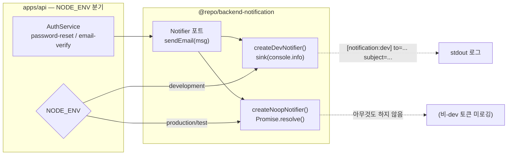

# Notifier 포트와 dev/noop 어댑터 교체

> **대상**: 이메일 전송 로직이 왜 직접 `console.info` 나 Resend SDK 를 호출하지 않고 포트를 통하는지 이해하려는 개발자
> **연관 문서**: [[reference/packages/backend-notification]] · [[adr/0015-framework-adapter-naming-and-layout]]

## 왜 필요한가

이전에는 비밀번호 재설정/이메일 인증 흐름에서 `console.info(token)` 으로 개발 확인을 했다. 비-dev 환경에서도 실수로 토큰이 로그에 노출되는 보안 결함이 있었다. 또한 실제 이메일 provider(Resend, SES 등)를 붙이려면 서비스 코드 전체를 수정해야 했다.

`Notifier` 포트를 두면 서비스 코드는 `notifier.sendEmail(message)` 한 줄만 호출한다. 어떤 구현체가 실행될지는 부트 시점에 결정된다.

## 어떻게 동작하나



### 포트 인터페이스

```ts
interface Notifier {
  sendEmail(message: EmailMessage): Promise<void>;
}
```

`EmailMessage` 는 `to / subject / body` 세 필드만 가진다. 서비스 코드는 `Notifier` 인터페이스만 알고, 구현체(`createDevNotifier` / `createNoopNotifier` / 향후 Resend)를 모른다.

### NODE_ENV 분기

`apps/api` 의 `NotificationModule` 프로바이더가 `process.env.NODE_ENV === "development"` 를 검사해 `createDevNotifier()` 또는 `createNoopNotifier()` 를 선택한다. 비-dev 환경에서는 토큰이 로그에 나타나지 않는다.

### dev sink 교체

`createDevNotifier(sink?)` 는 선택적 `sink` 인자를 받는다. 기본은 `console.info` 이지만 테스트에서 커스텀 함수를 주입해 호출 여부를 검증할 수 있다.

## 용어 정리

| 용어 | 설명 |
|---|---|
| 포트(Port) | 헥사고날 아키텍처의 추상 인터페이스 — 구현에 무관 |
| 어댑터(Adapter) | 포트 구현체 — dev(로그), noop(침묵), 향후 Resend/SES |
| noop | no-operation — `Promise.resolve()` 만 반환 |
| dev sink | 개발용 이메일 출력 함수 (기본 `console.info`) |

## 동작/테스트 방법

> 🧪 **테스트**: `pnpm --filter @repo/backend-notification test` — dev sink 호출 검증 + noop 무동작 검증 = 3 tests. `apps/api` auth 서비스 테스트에서 `notifier` mock 을 주입해 `sendEmail` 호출 횟수를 검증한다.

```ts
// dev 환경
const notifier = createDevNotifier();
await notifier.sendEmail({ to: "u@example.com", subject: "Reset", body: token });
// → [notification:dev] to=u@example.com subject=Reset

// test 환경 — spy sink
const spy = vi.fn();
const notifier = createDevNotifier(spy);
```

## 마치며

포트/어댑터 패턴 덕분에 실제 이메일 provider 연동은 새 어댑터 파일만 추가하면 된다. 서비스 코드와 테스트 코드는 건드리지 않아도 된다.

## 연결된 개념

- [[explainers/backend/queue-worker-bullmq]] — 이메일을 비동기 큐로 위임하는 패턴
- [[explainers/backend/secrets-provider-port]] — API 키를 SecretsProvider 로 주입
- [[adr/0015-framework-adapter-naming-and-layout]] — 포트/어댑터 패키지 분리 원칙

> 소스: spec-12-01 walkthrough · `packages/backend/notification/src/index.ts` · `apps/api/src/notification/`
