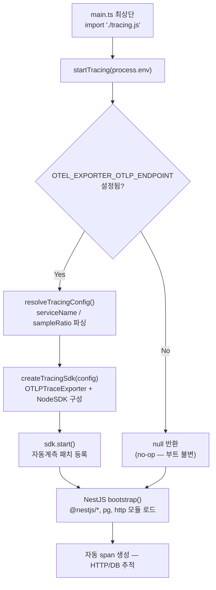

# OTEL NodeSDK 초기화 순서와 env-gated no-op

> **대상**: OpenTelemetry 자동계측이 왜 `main.ts` 최상단에 있어야 하는지, 그리고 OTLP endpoint 미설정 시 앱이 왜 부트에 영향을 받지 않는지 이해하려는 개발자
> **연관 문서**: [[reference/packages/backend-observability]] · [[adr/0015-framework-adapter-naming-and-layout]]

## 왜 필요한가

OTEL 자동계측(`@opentelemetry/auto-instrumentations-node`)은 `http`, `@nestjs/*`, `pg` 등의 모듈을 **패치**하여 span 을 자동 생성한다. 이 패치는 해당 모듈이 `require`/`import` 되기 **전**에 등록되어야 효과가 있다. NestJS 부트스트랩이 시작되면 이미 모듈들이 로드되므로, tracing SDK 초기화는 반드시 `main.ts` 의 첫 `import` 여야 한다.

미설정 환경(개발·테스트)에서 SDK 를 무조건 초기화하면 OTLP 연결 오류 로그가 발생하거나 부트 시간이 늘어날 수 있다. `resolveTracingConfig` 의 **opt-in** 설계로 이를 방지한다.

## 어떻게 동작하나



### `resolveTracingConfig` 의 역할

`resolveTracingConfig(env, defaults)` 는 순수 함수로 env 키 세 개만 읽는다.

| env 키 | 역할 | 기본값 |
|---|---|---|
| `OTEL_EXPORTER_OTLP_ENDPOINT` | 비어있으면 `enabled: false` | `""` |
| `OTEL_SERVICE_NAME` | 서비스 이름 | `"service-foundry"` |
| `OTEL_TRACES_SAMPLER_ARG` | 샘플비율 0~1 | `1` (전체 샘플) |

`enabled: false` 이면 `startTracing` 은 즉시 `null` 을 반환한다. SDK 객체도 생성되지 않으므로 OTLP 연결 시도 자체가 없다.

### 자동계측 범위

`getNodeAutoInstrumentations()` 는 `http`, Express, Fastify, `pg`, `ioredis`, `dns` 등 Node 표준 및 인기 라이브러리 span 을 자동 생성한다. 샘플링 비율은 OTEL 표준 env(`OTEL_TRACES_SAMPLER_ARG`) 로 NodeSDK 가 직접 처리한다.

## 용어 정리

| 용어 | 설명 |
|---|---|
| `NodeSDK.start()` | monkey-patch 로 모듈 require 을 인터셉트해 span 생성 코드를 주입 |
| OTLP exporter | OpenTelemetry Protocol HTTP/proto — Tempo/Jaeger/Grafana 등에 span 전송 |
| `sampleRatio` | 0=미샘플링, 1=전체 샘플링. `clamp(0,1)` 보정 |
| no-op | OTLP endpoint 미설정 시 SDK 자체를 초기화하지 않는 상태 |
| `getNodeAutoInstrumentations()` | 공식 패키지 — 수십 개 라이브러리 자동계측 플러그인 번들 |

## 동작/테스트 방법

> 🧪 **테스트**: `pnpm --filter @repo/backend-observability test` — `resolveTracingConfig` 5 test (no-op/endpoint/serviceName/sampleRatio/clamp) + tracing 2 test. 통합 검증: `bash packages/backend/observability/smoke-trace.sh` — docker Tempo 기동 후 span 방출 → traceId 재조회.

```ts
// apps/api/src/main.ts (첫 줄)
import "./tracing.js"; // startTracing(process.env) 호출 포함

// apps/api/src/tracing.ts
import { startTracing } from "@repo/backend-observability";
startTracing(process.env, { serviceName: "api" });
```

> ⚠️ `main.ts` 에서 `import "./tracing.js"` 보다 먼저 NestJS 모듈을 import 하면 자동계측 패치가 누락된다. import 순서가 계측 범위를 결정한다.

## 마치며

opt-in 설계로 인해 `OTEL_EXPORTER_OTLP_ENDPOINT` 환경 변수 없이는 tracing 이 완전히 비활성화된다. 이는 로컬·테스트 환경에서 부트 속도와 로그 노이즈 측면에서 유리하다.

## 연결된 개념

- [[explainers/backend/prom-metrics-auth-counters]] — 메트릭 스크레이핑 (동일 observability 패키지)
- [[explainers/backend/request-id-propagation]] — reqId 와 traceparent 공존
- [[reference/packages/backend-observability]] — 공개 API

> 소스: spec-11-02 walkthrough · `packages/backend/observability/src/tracing.ts` · `packages/backend/observability/src/config.ts`
