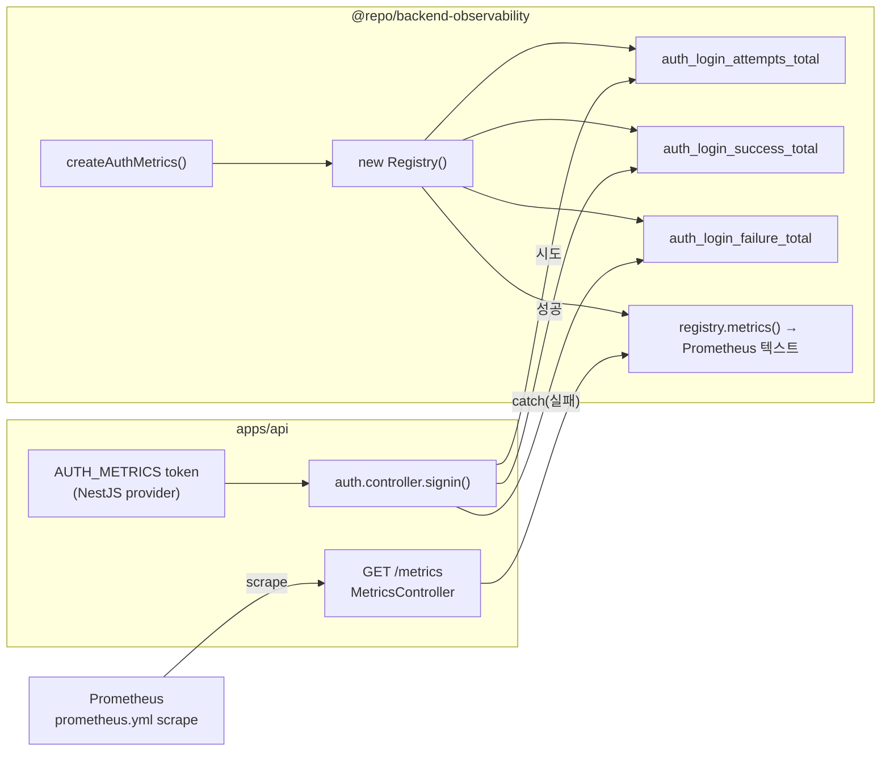

# prom-client 격리 레지스트리와 auth 카운터

> **대상**: prom-client 를 전역 레지스트리 없이 격리해서 사용하는 이유와 `/metrics` 스크레이핑 흐름을 이해하려는 개발자
> **연관 문서**: [[reference/packages/backend-observability]] · [[adr/0015-framework-adapter-naming-and-layout]]

## 왜 필요한가

prom-client 는 기본으로 전역 레지스트리(`globalRegistry`)를 쓴다. 테스트 격리 실패(카운터 누적 오염), 복수 인스턴스 충돌, 이름 중복 에러가 발생하기 쉽다. `new Registry()` 로 격리 인스턴스를 만들면 이 문제를 해결하면서도 `/metrics` 텍스트 렌더링(`registry.metrics()`)을 동일하게 사용할 수 있다.

로그인 브루트포스를 관측하려면 시도/성공/실패 카운터 세 개면 충분하다. Prometheus scrape + Grafana 대시보드가 이 세 카운터 위에 alert 를 설정할 수 있다.

## 어떻게 동작하나



### 카운터 배선 위치

카운터 증가는 `auth.controller.ts` 의 `signin` 메서드에서 이루어진다. `try` 블록 시작에서 `recordLoginAttempt()`, 성공 경로에서 `recordLoginSuccess()`, `catch` 에서 `recordLoginFailure()` 를 호출한다. 이 경계는 성공/실패 분기를 가장 명확하게 나눌 수 있는 지점이다.

### `AUTH_METRICS` 주입

`createAuthMetrics()` 의 반환값은 `AUTH_METRICS` symbol 토큰으로 NestJS provider 에 등록된다. `ObservabilityModule` 이 `@Global()` 이므로 `AuthModule` 포함 앱 전체에서 주입 가능하다.

### `/metrics` 응답 형식

```
# HELP auth_login_attempts_total 로그인 시도 총횟수
# TYPE auth_login_attempts_total counter
auth_login_attempts_total 42
auth_login_success_total 38
auth_login_failure_total 4
```

라벨이 없는 카운터는 값이 0 이어도 `registry.metrics()` 에 노출된다. Grafana 대시보드의 초기값 표시(no-data vs 0)를 방지한다.

## 용어 정리

| 용어 | 설명 |
|---|---|
| `new Registry()` | prom-client 격리 레지스트리 — 전역 오염 없음 |
| `Counter` | 단조 증가 메트릭. `inc()` 로 증가, reset 불가 |
| `registry.metrics()` | Prometheus exposition format 문자열 비동기 생성 |
| scrape | Prometheus 가 `/metrics` 를 주기적으로 GET 하는 행위 |
| `host.docker.internal` | docker compose 내 Prometheus → 호스트 apps/api 접근용 주소 |

## 동작/테스트 방법

> 🧪 **테스트**: `pnpm --filter @repo/backend-observability test` — metrics 3 test: `recordLoginAttempt/Success/Failure` 호출 후 `metricsText()` 에 값 반영 검증. `auth.controller.test` 에서는 `AUTH_METRICS` mock provider 를 TestingModule 에 추가해야 한다(신규 required 의존성).

```ts
const metrics = createAuthMetrics();
metrics.recordLoginAttempt();
metrics.recordLoginFailure();
const text = await metrics.metricsText();
// text 에 "auth_login_failure_total 1" 포함
```

## 마치며

격리 레지스트리 패턴은 동일한 서비스 안에 여러 메트릭 그룹을 독립적으로 관리할 수 있게 해준다. token/session/mfa 카운터 추가 시에도 같은 패턴으로 확장 가능하다.

## 연결된 개념

- [[explainers/backend/otel-tracing-init-order]] — 동일 observability 패키지의 OTEL 추적
- [[explainers/backend/graceful-shutdown-lifecycle]] — 앱 종료 시 metrics 드레인
- [[reference/packages/backend-observability]] — 공개 API

> 소스: spec-11-03 walkthrough · `packages/backend/observability/src/metrics.ts` · `apps/api/src/auth/auth.controller.ts`
