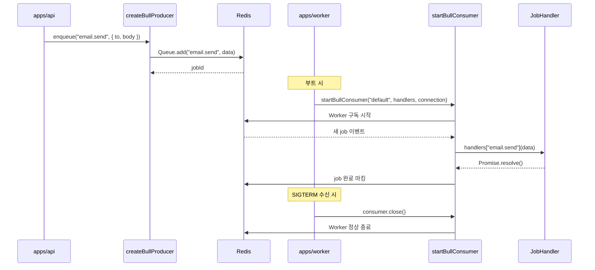

# Producer/Consumer 포트와 BullMQ redis 어댑터

> **대상**: Job Queue 추상화 구조와 `apps/worker` 가 어떻게 작업을 소비하는지 이해하려는 개발자
> **연관 문서**: [[reference/packages/backend-queue]] · [[adr/0015-framework-adapter-naming-and-layout]]

## 왜 필요한가

이메일 발송, 리포트 생성 같은 작업을 HTTP 요청 안에서 동기 처리하면 응답 시간이 길어지고 실패 재시도가 어렵다. Job Queue 를 두면 API 는 작업을 enqueue 하고 즉시 응답한다. 별도 worker 프로세스가 비동기로 작업을 소비하며, 실패 시 BullMQ 가 자동 재시도한다.

BullMQ 를 직접 의존하지 않고 `Producer`/`Consumer` 포트를 두면 향후 pg-boss 같은 다른 구현으로 교체할 수 있다.

## 어떻게 동작하나



### 포트 인터페이스

```ts
interface Producer {
  enqueue<T>(jobName: string, data: T): Promise<void>; // queueName 은 createBullProducer("default", conn) 생성 시 고정
  close(): Promise<void>;
}

interface Consumer {
  close(): Promise<void>;
}
```

`startBullConsumer` 는 `handlers: Record<string, JobHandler>` 를 받아 `job.name` 으로 핸들러를 라우팅한다. 핸들러가 없는 job 이름은 조용히 무시된다.

### `resolveQueueConfig`

`REDIS_URL` 이 있으면 그대로 파싱하고, 없으면 `REDIS_HOST`/`REDIS_PORT`(기본 localhost:6379) 를 조합한다. `connection` 객체는 `{ host, port }` 형태로 BullMQ 에 전달된다.

### `apps/worker` 부트

```ts
const { connection } = resolveQueueConfig(process.env);
const consumer = startBullConsumer("default", handlers, connection);
process.on("SIGTERM", async () => { await consumer.close(); process.exit(0); });
```

SIGTERM/SIGINT 를 받으면 `consumer.close()` 로 BullMQ Worker 를 정상 종료한다. 진행 중인 job 이 완료될 때까지 대기한다.

> ⚠️ `msgpackr-extract` 는 pnpm 11 승인 외 네이티브 빌드로 install 을 차단한다. `pnpm-workspace.yaml` 의 `allowBuilds: msgpackr-extract: false` 로 JS fallback 을 사용한다.

## 용어 정리

| 용어 | 설명 |
|---|---|
| BullMQ | Redis 기반 Node.js job queue 라이브러리 |
| `Queue.add` | producer 측 job 등록 API |
| `Worker` | consumer 측 — Redis 구독 + 핸들러 실행 |
| `JobHandler<T>` | `(data: T) => Promise<void>` — 단일 작업 처리 함수 |
| `QueueConnection` | `{ host, port }` — BullMQ/ioredis 커넥션 설정 |

## 동작/테스트 방법

> 🧪 **테스트**: `pnpm --filter @repo/backend-queue test` — `resolveQueueConfig` 5 test. 통합 검증: `bash packages/backend/queue/smoke-queue.sh` — docker Redis 기동 → producer.enqueue → consumer 핸들러 수신 round-trip 확인.

## 마치며

포트 덕분에 `apps/api` 와 `apps/worker` 는 `Producer`/`Consumer` 인터페이스만 알고 BullMQ 구현 세부사항을 모른다. pg-boss 나 다른 큐 구현체로 교체할 때는 `bull.ts` 어댑터 파일만 변경하면 된다.

## 연결된 개념

- [[explainers/backend/notification-port-adapter]] — 이메일을 큐로 위임하는 패턴
- [[explainers/backend/graceful-shutdown-lifecycle]] — worker 종료 시 drain 처리
- [[explainers/backend/transactional-outbox]] — outbox relay 가 queue 를 publish 대상으로 사용

> 소스: spec-12-02 walkthrough · `packages/backend/queue/src/port.ts` · `packages/backend/queue/src/bull.ts` · `apps/worker/src/main.ts`
