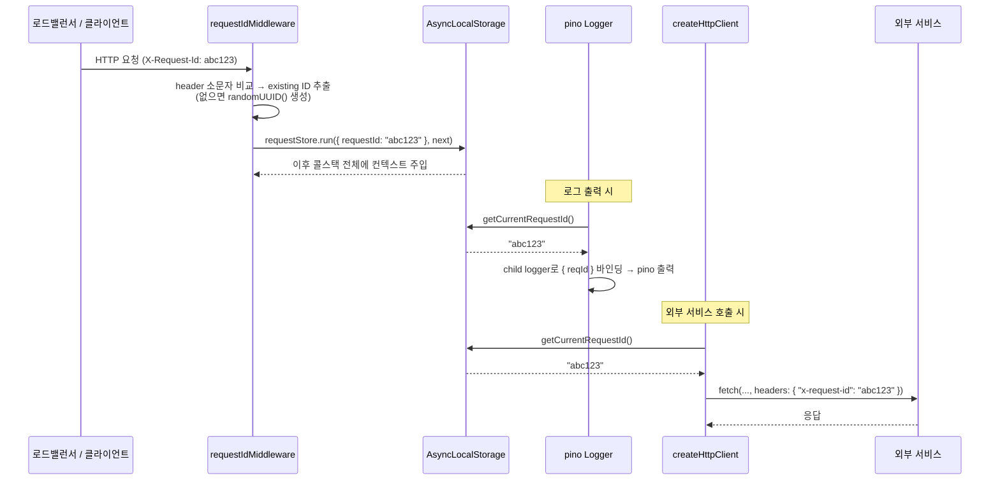

# Request-ID 전파 메커니즘

> **대상**: 분산 서비스 환경에서 요청 추적(tracing)이 어떻게 코드를 오염시키지 않고 동작하는지 이해하려는 개발자
> **연관 문서**: [[reference/packages/backend-logger]] · [[reference/packages/backend-http-client]] · [[adr/0002-monorepo-foundations]]

## 왜 필요한가

HTTP 요청 하나가 여러 서비스를 거칠 때 로그만 보고 흐름을 추적하려면 각 로그 라인에 동일한 ID 가 박혀 있어야 한다. 함수 인자로 `requestId` 를 넘기면 코드 침습이 심해진다. `AsyncLocalStorage` 는 Node.js 16+ 표준이며, 콜스택을 "염색"해 어디서든 현재 요청 컨텍스트에 접근할 수 있게 한다.

## 어떻게 동작하나



### 핵심 구조

`requestStore` 는 모듈 스코프 싱글턴 `AsyncLocalStorage<RequestContext>` 이다. `requestIdMiddleware` 가 Express/Fastify 의 `req.headers` 를 소문자 비교(`toLowerCase()`)로 읽어 기존 ID 를 재사용하거나 `randomUUID()` 로 신규 생성한다. 이후 `requestStore.run({ requestId }, next)` 호출이 해당 요청의 전체 비동기 체인을 한 "스토어" 안에 가둔다.

`@repo/backend-http-client` 의 `createHttpClient` 는 매 요청 시점에 `getCurrentRequestId()` 를 호출해 `x-request-id` 헤더를 outbound 요청에 자동으로 붙인다. ALS 컨텍스트가 없으면(헤더 없음) 전파를 건너뛴다.

### 인바운드 vs 아웃바운드

| 방향 | 위치 | 동작 |
|---|---|---|
| 인바운드 | `requestIdMiddleware` | 헤더 읽기 or UUID 생성 → ALS 저장 |
| 로그 바인딩 | `PinoLoggerService` | ALS → child logger `{ reqId }` |
| 아웃바운드 | `createHttpClient.request()` | ALS → `x-request-id` 헤더 삽입 |

## 용어 정리

| 용어 | 설명 |
|---|---|
| `AsyncLocalStorage` | Node 16+ 비동기 콘텍스트 저장소. CLS(Continuation Local Storage) 표준 구현 |
| `requestStore.run(ctx, fn)` | fn 과 그 하위 비동기 체인 전체에 ctx 바인딩 |
| `generateRequestId()` | `crypto.randomUUID()` — 외부 dep 없음 |
| `X-Request-Id` | 산업 표준 요청 추적 헤더 (Stripe / Heroku / Cloudflare 동일) |
| redaction | pino 14개 기본 경로 (password, token, authorization 등) 자동 마스킹 |

## 동작/테스트 방법

> 🧪 **테스트**: `pnpm --filter @repo/backend-logger test` — `runWithRequestId` 안팎, header 사용/미존재, HTTP client propagation. ALS 특성상 `runWithRequestId` 블록 안에서만 ID 가 보임을 검증한다.

```ts
// requestIdMiddleware 등록 (Express)
app.use(requestIdMiddleware({ header: "X-Request-Id" }));

// 어디서든 현재 reqId 접근
const id = getCurrentRequestId(); // "abc123" or undefined
```

## 마치며

`AsyncLocalStorage` 덕분에 핸들러/서비스/리포지터리 코드는 `requestId` 를 인자로 받을 필요가 없다. 미들웨어가 한 번 설정하면 pino 로그와 outbound HTTP 헤더에 자동 반영된다.

## 연결된 개념

- [[explainers/backend/otel-tracing-init-order]] — OTEL traceparent 와의 상호작용
- [[adr/0015-framework-adapter-naming-and-layout]] — pure logger / NestJS 어댑터 분리 근거
- [[reference/packages/backend-logger]] — 공개 API 전체 목록

> 소스: spec-03-02 walkthrough · spec-03-04 walkthrough · `packages/backend/logger/src/index.ts` · `packages/backend/http-client/src/index.ts`
