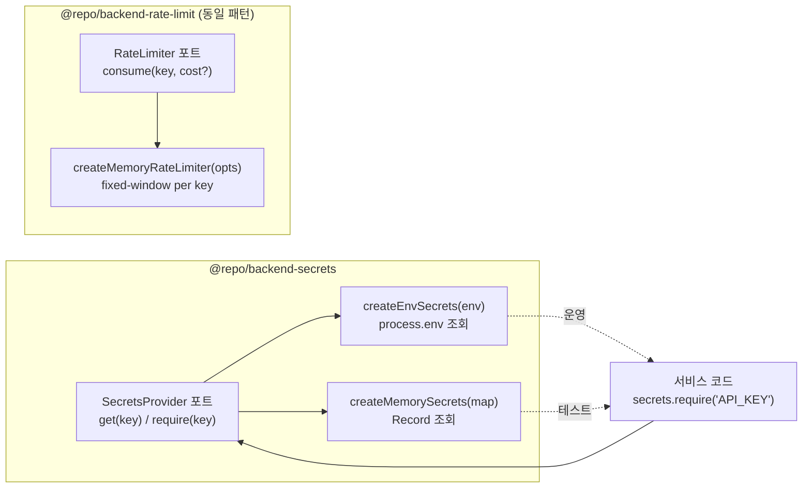

# SecretsProvider 포트와 env/memory 어댑터

> **대상**: `process.env` 직접 접근 대신 포트를 통해 시크릿을 주입하는 이유와 `RateLimiter` 포트 패턴을 함께 이해하려는 개발자
> **연관 문서**: [[reference/packages/backend-secrets]] · [[adr/0015-framework-adapter-naming-and-layout]] · [[adr/0020-error-handling-convention]]

## 왜 필요한가

서비스 코드가 `process.env.SENDGRID_API_KEY` 를 직접 읽으면 두 가지 문제가 생긴다.

1. **테스트 주입 불가**: 환경변수를 오염시켜야 테스트할 수 있다.
2. **vault 교체 불가**: AWS Secrets Manager, HashiCorp Vault 로 교체하려면 코드 전체를 수정해야 한다.

`SecretsProvider` 포트를 두면 테스트에서 in-memory 어댑터를 주입하고, 운영에서 env 또는 vault 어댑터를 쓸 수 있다. `require(key)` 는 키가 없으면 `AppError(INTERNAL)` 을 throw 해 구성 오류를 명시적으로 드러낸다.

## 어떻게 동작하나



### `get` vs `require`

| 메서드 | 반환 | 키 부재 시 |
|---|---|---|
| `get(key)` | `string \| null` | `null` 반환 |
| `require(key)` | `string` | `AppError(INTERNAL, 500)` throw |

`require` 는 빈 문자열(`""`)도 부재로 간주한다. 실수로 빈 값을 설정해도 구성 오류로 감지된다.

> ⚠️ ADR-0020(plain Error 금지) 에 따라 `throw new Error(...)` 대신 반드시 `AppError` 를 사용한다.

### RateLimiter 포트 (동일 패턴)

`@repo/backend-rate-limit` 도 동일한 포트/어댑터 패턴을 따른다. `createMemoryRateLimiter({ limit, windowMs, now? })` 는 fixed-window 알고리즘으로 동작한다. `now` 주입으로 테스트 결정성을 보장한다.

`consume(key, cost?)` 는 `{ allowed, remaining, retryAfterMs }` 를 반환한다. `allowed: false` 이면 `retryAfterMs` 후 재시도 가능하다.

## 용어 정리

| 용어 | 설명 |
|---|---|
| `SecretsProvider` | 시크릿 접근 추상 인터페이스 — env/vault/memory 구현체 교체 가능 |
| `require(key)` | 필수 시크릿 — 부재 시 `AppError(INTERNAL)` (구성 오류) |
| fixed-window | 시간 윈도우 단위로 요청 수를 카운트하는 rate limit 알고리즘 |
| `retryAfterMs` | 윈도우 리셋까지 남은 시간(ms) |

## 동작/테스트 방법

> 🧪 **테스트**: `pnpm --filter @repo/backend-secrets test` — env get(존재/null), require, require 부재→AppError(INTERNAL), memory = 4 tests. `pnpm --filter @repo/backend-rate-limit test` — 허용+remaining, 초과 차단(retryAfterMs), 윈도우 리셋, cost>1, 키 독립 = 5 tests.

```ts
// 운영
const secrets = createEnvSecrets(process.env);
const apiKey = await secrets.require("SENDGRID_API_KEY"); // 없으면 AppError

// 테스트
const secrets = createMemorySecrets({ SENDGRID_API_KEY: "test-key" });
const apiKey = await secrets.get("MISSING"); // null
```

```ts
// rate limit
const limiter = createMemoryRateLimiter({ limit: 5, windowMs: 60_000 });
const r = await limiter.consume("user:123");
// { allowed: true, remaining: 4, retryAfterMs: 0 }
```

## 마치며

`SecretsProvider` 와 `RateLimiter` 는 phase-14 보안 baseline 의 마지막 두 포트다. vault/redis 어댑터는 후속 spec 에서 구현된다.

## 연결된 개념

- [[explainers/backend/notification-port-adapter]] — SecretsProvider 로 API 키 주입 패턴
- [[adr/0020-error-handling-convention]] — AppError 강제 근거
- [[reference/packages/backend-secrets]] — 공개 API

> 소스: spec-14-05 walkthrough · `packages/backend/secrets/src/index.ts` · `packages/backend/rate-limit/src/index.ts`
