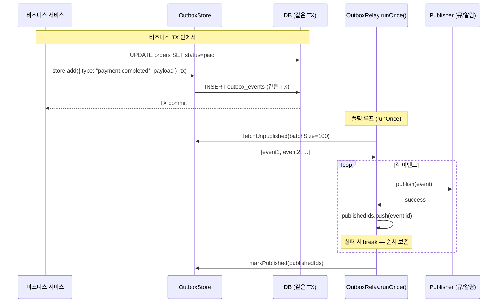

# Transactional Outbox — dual-write 유실 회피

> **대상**: 비즈니스 상태 저장과 이벤트 발행이 원자적으로 이루어지지 않을 때 발생하는 이벤트 유실 문제와 그 해법을 이해하려는 개발자
> **연관 문서**: [[reference/packages/backend-outbox]] · [[adr/0015-framework-adapter-naming-and-layout]]

## 왜 필요한가

`UPDATE orders SET status=paid` 후 `queue.enqueue("payment.completed", ...)` 를 별도로 호출하면, DB 커밋은 성공했는데 enqueue 가 실패하면 이벤트가 영구 유실된다. 반대 순서도 마찬가지 위험이 있다.

Transactional Outbox 패턴은 이벤트를 비즈니스 상태와 **같은 DB 트랜잭션**에 outbox 테이블에 적재한다. relay poller 가 주기적으로 미발행 행을 읽어 queue 에 발행하고, 성공 시 마킹한다. 이로써 at-least-once 발행을 보장한다.

## 어떻게 동작하나



### at-least-once 의미론

relay 는 발행 성공한 id 만 마킹한다. 발행 실패 시 `break` 로 중단해 **미마킹** — 다음 `runOnce` 에서 재시도한다. 마킹 전 프로세스가 죽어도 재시작 후 재시도한다. 소비자는 멱등성([[explainers/backend/idempotency-key-replay]])으로 중복을 처리한다.

### `add(event, tx?)` 의 확장점

`tx` 파라미터는 동일 트랜잭션 핸들을 받는 의도를 포트에 명시한다. in-memory 어댑터는 이를 무시하지만, drizzle-backed 어댑터가 구현할 때 `tx.insert(outboxTable, ...)` 로 채울 확장점이다.

### 현재 구현 범위

현재 `@repo/backend-outbox` 는 **포트 + in-memory 어댑터 + relay** 까지만 제공한다. drizzle-backed store(실제 트랜잭션 적재)는 후속 spec 에서 추가된다.

## 용어 정리

| 용어 | 설명 |
|---|---|
| Transactional Outbox | 이벤트를 비즈니스 TX 와 같은 TX 로 outbox 테이블에 저장하는 패턴 |
| relay / poller | 미발행 outbox 행을 주기적으로 읽어 발행하는 백그라운드 프로세스 |
| at-least-once | 최소 1회 발행 보장. 중복 발행 가능 (소비자 멱등 보완) |
| `markPublished` | 발행 완료 이벤트를 outbox 에서 "처리됨"으로 마킹 |
| `fetchUnpublished` | `publishedAt IS NULL` 행을 `createdAt` 오름차순, limit 개 조회 |

## 동작/테스트 방법

> 🧪 **테스트**: `pnpm --filter @repo/backend-outbox test` — store: add/fetchUnpublished/markPublished(3) + relay: 전부 발행+마킹/publish 실패 시 미마킹/batchSize(3) = 6 tests. `createMemoryOutboxStore({ now: () => fixedDate })` 로 createdAt 주입해 결정성 확보.

```ts
const store = createMemoryOutboxStore();
const relay = createOutboxRelay({ store, publish: queue.enqueue, batchSize: 50 });

// 비즈니스 코드
await store.add({ type: "payment.completed", payload: { orderId: 42 } });

// relay (별도 프로세스/스케줄)
const published = await relay.runOnce(); // 1 반환
```

## 마치며

Outbox 패턴은 분산 시스템의 "two generals problem" 에 대한 현실적 해법이다. exactly-once 를 보장하려면 소비자 멱등성([[explainers/backend/idempotency-key-replay]])과 함께 써야 한다.

## 연결된 개념

- [[explainers/backend/idempotency-key-replay]] — 소비자 멱등 처리 (중복 발행 보완)
- [[explainers/backend/queue-worker-bullmq]] — relay 의 publish 대상
- [[explainers/backend/cache-aside-port]] — outbox event id → cache 멱등 소비

> 소스: spec-13-04 walkthrough · `packages/backend/outbox/src/index.ts`
