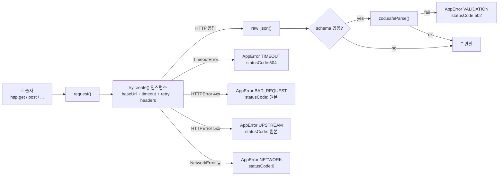

# frontend-http-client — ky factory + AppError 변환 + zod 바인딩

> **대상**: 프론트엔드에서 타입 안전 HTTP 호출이 필요한 개발자
> **연관 문서**: [[reference/packages/frontend-http-client]] · [[adr/0009-app-error-design]]

## 왜 필요한가

`globalThis.fetch`를 직접 쓰면 에러 처리(네트워크/타임아웃/HTTP 상태)를 매 호출마다 수동으로 해야 하고, 응답 타입 안전성도 보장되지 않는다. `@repo/frontend-http-client`는 `ky ^2.x`를 factory 패턴으로 감싸고 세 가지 문제를 한 번에 해결한다.

1. **일관된 에러 타입**: 모든 실패를 `AppError`(NETWORK/TIMEOUT/BAD_REQUEST/UPSTREAM/VALIDATION)로 변환
2. **zod schema 바인딩**: 응답 파싱 실패 시 즉시 VALIDATION 에러
3. **retry/timeout 기본값**: idempotent 메서드(GET/PUT/DELETE…)만 자동 재시도, POST/PATCH는 명시적 `retries` 옵션 시에만

## 어떻게 동작하나

### retry 정책

- `IDEMPOTENT_METHODS = [get, put, delete, head, options, trace]` 는 기본 retry (limit 3)
- POST/PATCH는 `opts.retries` 를 명시한 경우에만 retry 허용 (`allowedMethods`에 동적 추가)
- retry 대상 상태 코드: `[408, 413, 429, 500, 502, 503, 504]`
- 백오프 상한: `backoffLimit: 30_000ms`

### 계약 기반 클라이언트 (createApiClient)

`EndpointDef<Out>` 맵을 한 번 정의하면 `createApiClient(http, endpoints)` 가 각 키에 대응하는 타입+런타임 검증 메서드를 생성한다. `@repo/contracts`의 zod 스키마를 `response`로 그대로 사용해 drift를 방지한다.

## 용어 정리

| 용어 | 설명 |
|---|---|
| `createHttpClient(opts)` | factory 함수 — 설정된 ky 인스턴스를 감싼 `HttpClient` 반환 |
| `HttpClient` | request/get/post/put/delete/patch 메서드 인터페이스 |
| `toAppError(err)` | TimeoutError/HTTPError/기타를 `AppError`로 변환하는 내부 헬퍼 |
| `schema?: ZodType<T>` | 응답 런타임 검증 옵션 — `@repo/contracts` 스키마를 그대로 전달 |
| `credentials` | cross-origin cookie 전송 시 `"include"` 지정 (auth-sdk.ts에서 사용) |
| `EndpointDef` | method + path + response schema 를 묶는 엔드포인트 정의 |

## 동작/테스트 방법

> 🧪 **테스트**: `pnpm --filter frontend-http-client test` — `vi.stubGlobal('fetch', ...)` 로 9개 시나리오 검증 (200 성공/404 BAD_REQUEST/500 UPSTREAM/타임아웃/네트워크 에러/schema 실패/POST no-retry/POST with retries/헤더 override). ky 2.x는 fetch에 Request 객체를 전달하므로 mock에서 `request.url / .method / request.clone().text()`를 사용한다.

## 마치며

`createHttpClient`는 모노레포 내 Next Server/Client Component, Vite SPA, Edge runtime 어디서든 동일 인터페이스로 쓰인다(`globalThis.fetch` 기반). `backend-http-client`와 동일한 API surface를 유지해 학습 비용을 낮춘다.

## 연결된 개념

- [[http-auth-sdk-inline]] — `createHttpClient`를 기반으로 NestJS REST를 CoreAuthSDK로 래핑
- [[auth-react-provider-sdk-contract]] — http-client를 소비하는 auth SDK와 Provider 계약
- [[adr/0009-app-error-design]] — AppError 5 코드 설계 근거

> 소스: spec-04-02 walkthrough · `packages/frontend/http-client/src/index.ts`
