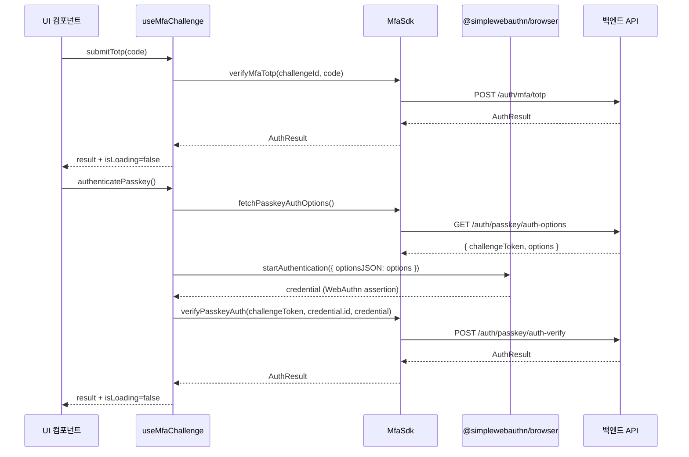
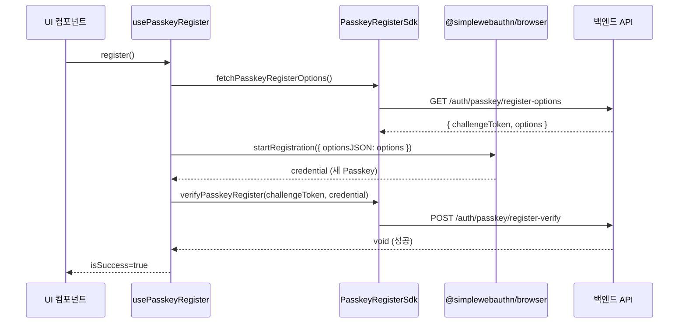

# MFA · Passkey React 훅 — useMfaChallenge + usePasskeyRegister

> **대상**: MFA TOTP/Passkey 인증 흐름을 프론트엔드에 연결하려는 개발자
> **연관 문서**: [[reference/packages/frontend-auth-react]] · [[adr/0006-auth-strategy]]

## 왜 필요한가

MFA/Passkey 처리는 WebAuthn ceremony처럼 브라우저 네이티브 API(`navigator.credentials`)와 외부 서버 왕복이 복잡하게 얽혀 있다. `useMfaChallenge`와 `usePasskeyRegister`는 이 복잡한 흐름을 훅 하나로 캡슐화하고, `isLoading/error` 상태를 자동으로 관리한다.

`AuthProvider`의 `sdk` prop은 `CoreAuthSDK`만 요구하므로(ADR-0017), MFA/Passkey 훅은 Context를 거치지 않고 직접 확장 SDK 파라미터를 받는다.

## 어떻게 동작하나



### usePasskeyRegister — 등록 ceremony



### 최소 SDK 인터페이스 (Pick 패턴)

훅 내부에서는 전체 `AuthSDK`가 아닌 필요한 메서드만 `Pick`한 로컬 타입을 사용한다. 테스트 mock이 단순해지고 훅의 의존 범위가 명확해진다.

```ts
type MfaSdk = {
  verifyMfaTotp(token: string, code: string): Promise<AuthResult>;
  fetchPasskeyAuthOptions(): Promise<{ challengeToken: string; options: object }>;
  verifyPasskeyAuth(token: string, id: string, credential: unknown): Promise<AuthResult>;
};
```

## 용어 정리

| 용어 | 설명 |
|---|---|
| `useMfaChallenge(challenge, sdk)` | TOTP 코드 제출 + Passkey 인증 ceremony를 처리하는 훅 |
| `usePasskeyRegister(sdk)` | Passkey 등록 ceremony를 처리하는 훅 |
| `MfaChallenge` | challengeId + method + expiresAt을 담는 계약 타입 |
| `startAuthentication` | `@simplewebauthn/browser`의 WebAuthn assertion 처리 함수 |
| `startRegistration` | `@simplewebauthn/browser`의 WebAuthn 등록 처리 함수 |
| ceremony | WebAuthn의 options fetch → 브라우저 처리 → verify 서버 검증 3단계 흐름 |

## 동작/테스트 방법

> 🧪 **테스트 전략**: `@simplewebauthn/browser` 전체를 `vi.mock`으로 교체해 브라우저 글로벌(`navigator.credentials`) 의존을 제거한다. React hook 로직(isLoading/error/결과 처리)만 검증한다.

> 🧪 **테스트 실행**: `pnpm --filter frontend-auth-react test` — `mfa.test.ts` 5개(TOTP 성공/실패/isLoading, Passkey 인증 성공/실패) + `passkey.test.ts` 4개(등록 성공/실패/isLoading/isSuccess).

> ⚠️ jsdom에 `navigator.credentials`가 없으므로 simplewebauthn 함수를 직접 mock하는 방식이 필수다.

## 마치며

훅이 WebAuthn ceremony 전체를 캡슐화하므로 `apps/web` 쪽에서는 `register()` / `submitTotp(code)` / `authenticatePasskey()` 호출만으로 MFA/Passkey 흐름을 완성할 수 있다. UI 컴포넌트(입력 폼, 버튼)는 이 훅 위에 덧붙이는 형태로 별도 구현한다.

## 연결된 개념

- [[auth-react-provider-sdk-contract]] — MFA 훅이 Context 대신 직접 SDK를 받는 이유
- [[auth-sdk-provider-adapters]] — AuthSDK 전체를 구현하는 Mock SDK
- [[adr/0006-auth-strategy]] — 자체 구축 Auth Platform + @simplewebauthn 채택 근거

> 소스: spec-07-04 walkthrough · `packages/frontend/auth-react/src/mfa.ts` · `packages/frontend/auth-react/src/passkey.ts`
