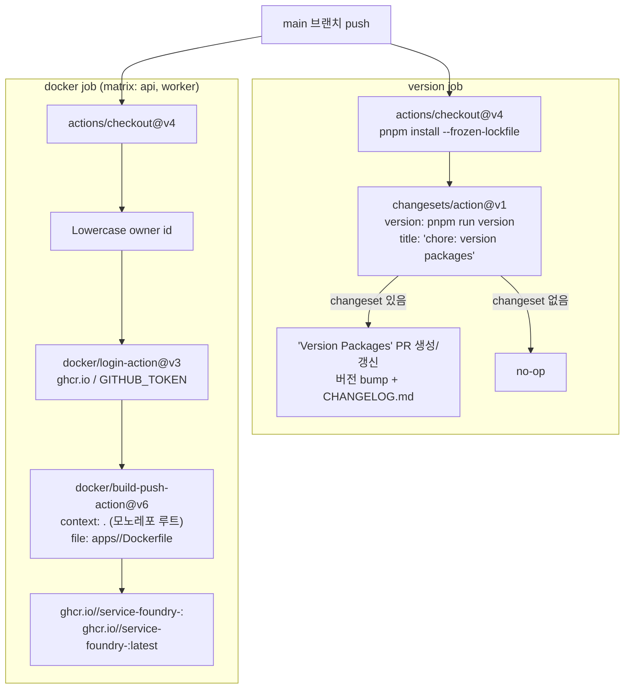

# CI 릴리스 — changesets version PR 자동화 + GHCR docker build/push

> **대상**: main 머지 이후 버전 관리와 docker 이미지 배포 흐름을 이해하려는 개발자
> **연관 문서**: [[ci-verify-gate]] · [[reference/architecture]]

## 왜 필요한가

모노레포에서 여러 패키지의 버전을 수동으로 올리면 changelog 누락과 버전 불일치가 발생한다. `changesets/action`은 changeset 파일을 읽어 "Version Packages" PR을 자동 생성하고 changelog를 관리한다. 동시에 apps/api · worker의 docker 이미지를 GHCR에 push해 배포 가능한 아티팩트를 항상 최신 상태로 유지한다.

## 어떻게 동작하나



### Dockerfile 구조 (api/worker 공통)

```dockerfile
FROM node:24-slim AS base
ENV PNPM_HOME=/pnpm
ENV PATH="$PNPM_HOME:$PATH"
ENV NODE_ENV=production
RUN corepack enable
WORKDIR /app

COPY . .
RUN pnpm install --frozen-lockfile   # devDep 포함 — tsx 런타임 필요

WORKDIR /app/apps/api
EXPOSE 3000
CMD ["pnpm", "run", "start:prod"]    # tsx src/main.ts (빌드 파이프라인 없음)
```

- base 이미지: `node:24-slim` — argon2/sharp 등 native prebuild(glibc) 호환
- `pnpm install --frozen-lockfile` devDep 포함: `tsx`로 직접 실행하므로 빌드 아티팩트가 없어 devDep이 필요
- `lefthook install || true`: `.git` 없는 docker context에서 prepare 스크립트 실패 방지
- 이미지 크기: ~1.61GB (전체 workspace + devDep 포함) — 최적화(멀티스테이지 prune)는 후속

### permissions

`contents: write` + `pull-requests: write` (Version PR 생성용) + `packages: write` (GHCR push용)을 명시한다.

### docker matrix

`strategy.matrix.service: [api, worker]`로 api와 worker를 병렬로 빌드한다. owner는 소문자로 변환해 GHCR 이미지명 규칙을 만족한다.

## 용어 정리

| 용어 | 설명 |
|---|---|
| changeset | `.changeset/` 에 저장되는 변경 설명 파일 — PR 단위로 작성 |
| `changesets/action` | main push 시 changeset을 읽어 Version PR을 자동 생성 |
| Version Packages PR | 버전 bump + CHANGELOG.md 갱신을 담은 자동 생성 PR |
| GHCR | GitHub Container Registry — `ghcr.io/<owner>/<image>` |
| `tsx` | TypeScript를 직접 실행하는 런타임 — 빌드 없이 프로덕션 실행 |
| `node:24-slim` | glibc 기반 slim 이미지 — native addon 호환 |

## 동작/테스트 방법

> 🧪 **로컬 docker build 검증**: `docker build -f apps/api/Dockerfile -t service-foundry-api .` — spec-14-06에서 api + worker 양쪽 빌드 성공 확인 (~1.61GB).

> 🧪 **YAML 유효성**: Node.js `yaml` 패키지로 release.yml 파싱 확인.

> 🧪 **릴리스 워크플로 자기검증**: main에 머지 후 GitHub Actions → release 워크플로 → version + docker job 실행 관측.

> ⚠️ npm publish는 비공개 보일러플레이트이므로 미포함. changesets는 버전/changelog 관리만 담당한다.

## 마치며

verify 게이트가 PR을 차단하고, release 워크플로가 main에서 버전 PR과 docker 이미지를 자동 생성한다. 두 워크플로가 분리되어 있으므로 매 PR의 verify 속도에 영향 없이 배포 아티팩트를 최신으로 유지한다.

## 연결된 개념

- [[ci-verify-gate]] — release 전 PR을 차단하는 검증 게이트
- [[docker-compose-local-infra]] — 로컬 개발 인프라 (prod Dockerfile과 별개)
- [[monorepo-build-turbo-tsup]] — Dockerfile이 설치하는 모노레포 패키지 구조

> 소스: spec-14-06 walkthrough · `.github/workflows/release.yml` · `apps/api/Dockerfile` · `apps/worker/Dockerfile`
