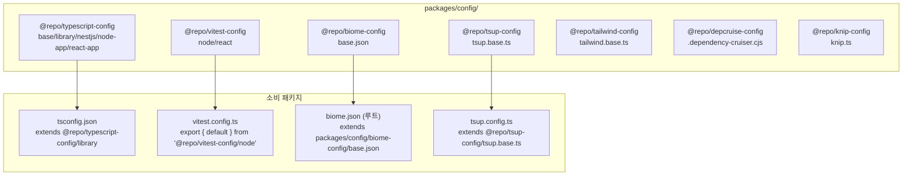

# 설정 패키지 프리셋 — @repo/{typescript,vitest,biome,tsup,tailwind,depcruise,knip}-config

> **대상**: 모노레포 설정이 어떻게 공유되는지 이해하려는 개발자
> **연관 문서**: [[reference/architecture]] · [[adr/0001-linting-formatting-strategy]] · [[adr/0003-package-layout-and-naming]]

## 왜 필요한가

패키지마다 TypeScript/vitest/biome 설정을 개별 관리하면 규칙이 달라지고 업데이트 시 전체를 돌아야 한다. `packages/config/` 아래의 설정 패키지들은 "한 곳만 바꾸면 전체에 전파"되는 SSOT를 제공한다. 각 패키지는 설정 파일을 extends해 프리셋을 상속한다.

## 어떻게 동작하나



### 카테고리별 프리셋

`@repo/typescript-config`는 5개 프리셋을 제공한다:
- `base` — 공통 strictness 베이스라인
- `library` — 패키지 라이브러리용 (모노레포 내부 소비)
- `nestjs` — NestJS 데코레이터 + emitDecoratorMetadata
- `node-app` — NestJS 앱 (apps/api 등)
- `react-app` — React/Next + Vite 프론트엔드

`@repo/vitest-config`는 2개 프리셋:
- `node` — Node 환경 (jsdom 없음), 대부분 패키지
- `react` — jsdom + @testing-library/react, 프론트엔드 패키지

### biome overrides

`packages/config/biome-config/base.json`은 단일 SSOT 비롯한 예외 규칙도 포함한다. 예를 들어 `packages/nestjs/**` 경로에 대해 `noStaticOnlyClass` 룰을 off로 오버라이드해 NestJS `@Module` 데코레이터 클래스의 린트 충돌을 해소한다(spec-03-06에서 도입).

### preset round-trip 검증

```ts
// packages/shared/utils/vitest.config.ts
export { default } from "@repo/vitest-config/node";
```

한 줄 export로 프리셋을 그대로 사용한다. 프리셋을 바꾸면 이 패키지의 vitest 동작이 즉시 반영된다.

## 용어 정리

| 용어 | 설명 |
|---|---|
| `*-config` suffix | ADR-0003의 config 패키지 명명 규칙 — 일반 패키지와 구분 |
| `extends` | tsconfig/biome/tailwind에서 부모 설정을 상속하는 메커니즘 |
| `depcruise-config` | 패키지 간 의존 경계 규칙 (`packages/**` → `apps/**` 단방향 등) |
| `knip-config` | 사용하지 않는 export/dependency 탐지 설정 |
| preset round-trip | 소비 패키지가 프리셋을 1줄 re-export로 적용하는 패턴 |

## 동작/테스트 방법

> 🧪 **preset 검증**: `pnpm lint` → 모든 패키지가 `packages/config/biome-config/base.json` 경유 biome 적용. 설정 변경 → 전 패키지에 전파 확인.

> 🧪 **depcruise 경계**: `pnpm depcruise` — `packages/**` 에서 `apps/**` 방향 의존이 없는지 검증.

> 🧪 **acceptance**: spec-01-02의 acceptance 7건 전수 통과 — `pnpm install` 무경고, `turbo run lint/test/build` 그린, depcruise 경계 준수.

## 마치며

설정 패키지를 프리셋화하면 새 패키지 추가 시 3줄(extends 선언)로 전체 린트/타입/테스트 규칙을 적용받는다. turbo gen 스캐폴딩도 이 프리셋을 자동으로 배선한다.

## 연결된 개념

- [[monorepo-build-turbo-tsup]] — 설정 패키지를 소비하는 turbo 파이프라인
- [[turbo-gen-scaffolding]] — 신규 패키지 생성 시 프리셋을 자동 배선하는 생성기
- [[nestjs-adapter-module-pattern]] — nestjs tsconfig 프리셋을 사용하는 어댑터 패키지
- [[adr/0001-linting-formatting-strategy]] — biome 단일 도구 선택 근거
- [[adr/0003-package-layout-and-naming]] — config 패키지 레이아웃 규칙

> 소스: spec-01-02 walkthrough · `packages/config/`
