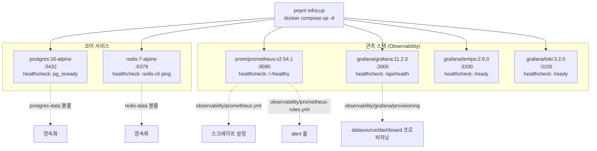

# 로컬 인프라 스택 — postgres+redis+관측 6종 healthcheck compose

> **대상**: 로컬 개발 환경에서 인프라를 구동하고 관측 스택을 이해하려는 개발자
> **연관 문서**: [[reference/architecture]] · [[grafana-prometheus-provisioning]]

## 왜 필요한가

앱 개발 시 postgres/redis는 항상 필요하고, prometheus/grafana/tempo/loki는 관측 기능을 로컬에서 검증하기 위해 필요하다. 6개 서비스를 하나의 compose 파일로 관리하면 "한 줄 부트"로 전체 인프라를 준비할 수 있다.

## 어떻게 동작하나

### 환경 변수 기본값

모든 서비스 설정은 환경 변수로 override 가능하고, 기본값은 `apps/api/.env`와 일치한다. 앱 코드를 변경하지 않고 `pnpm infra:up`만으로 연결된다.

| 변수 | 기본값 | 서비스 |
|---|---|---|
| `POSTGRES_USER` | `postgres` | postgres |
| `POSTGRES_PASSWORD` | `postgres` | postgres |
| `POSTGRES_DB` | `service_foundry_dev` | postgres |
| `POSTGRES_PORT` | `5432` | postgres |
| `REDIS_PORT` | `6379` | redis |
| `PROMETHEUS_PORT` | `9090` | prometheus |
| `GRAFANA_PORT` | `3000` | grafana |
| `GRAFANA_ADMIN_PASSWORD` | `admin` | grafana |

### healthcheck 정책

모든 서비스는 healthcheck를 정의한다:
- `interval: 5~10s`, `retries: 10`, `start_period: 5~15s`
- compose `depends_on: condition: service_healthy`로 의존 순서를 강제할 수 있다

> ⚠️ 로컬 포트 충돌: 타 프로젝트 컨테이너가 6379/9090/3100 등을 점유하면 발행 포트 override가 필요하다. `tooling/docker/env.example`(비-dotfile)을 복사해 `.env`로 사용한다.

> ⚠️ 시크릿 가드 오탐: `${POSTGRES_PASSWORD:-postgres}` 형태의 env 보간을 `check-secrets` 훅이 시크릿으로 오탐할 수 있다. 개발 기본값임을 확인 후 `HARNESS_HOOK_MODE_SECRETS=warn`으로 우회한다.

## 용어 정리

| 용어 | 설명 |
|---|---|
| `pnpm infra:up` | `docker compose -f tooling/docker/compose.yaml up -d` 단축 명령 |
| `pnpm infra:down` | compose 스택 중지 + 컨테이너/네트워크 정리 |
| healthcheck | 컨테이너 준비 상태를 주기적으로 확인하는 docker 내장 기능 |
| provisioning | Grafana datasource/dashboard를 파일로 자동 설정하는 기능 |
| `env.example` | dotenv 보호 회피를 위한 비-dotfile 환경 변수 템플릿 |

## 동작/테스트 방법

> 🧪 **구성 유효성**: `docker compose -f tooling/docker/compose.yaml config --quiet` — 6 services YAML 파싱 확인.

> 🧪 **스모크 테스트**: `bash tooling/docker/smoke-test.sh` — 6개 서비스 healthy + postgres pg_isready + redis PONG + prometheus/grafana/tempo/loki HTTP 헬스 엔드포인트 순차 확인.

## 마치며

관측 스택(prometheus/grafana/tempo/loki)은 spec-10-01에서 "healthy만" stub으로 구동되고, 실제 scrape target/dashboard/alert 설정은 spec-11-04에서 완성된다. 2단계 접근으로 인프라 기동과 관측 설정을 분리한다.

## 연결된 개념

- [[grafana-prometheus-provisioning]] — prometheus alert rule + grafana datasource/dashboard 프로비저닝
- [[ci-verify-gate]] — CI에서 postgres service container를 사용하는 패턴
- [[monorepo-build-turbo-tsup]] — infra 위에서 실행되는 e2e 테스트

> 소스: spec-10-01 walkthrough · `tooling/docker/compose.yaml` · `tooling/docker/observability/`
