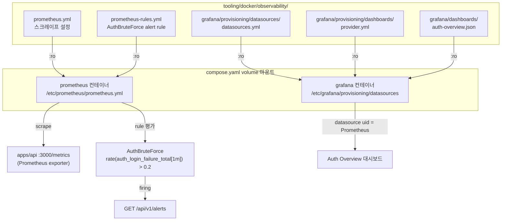

# Grafana/Prometheus 프로비저닝 — datasource/dashboard JSON + 브루트포스 alert rule

> **대상**: 로컬 관측 스택의 datasource/dashboard/alert 설정 방식을 이해하려는 개발자
> **연관 문서**: [[docker-compose-local-infra]] · [[reference/architecture]]

## 왜 필요한가

Grafana UI에서 수동으로 datasource와 dashboard를 설정하면 컨테이너 재생성 시 초기화된다. 프로비저닝(파일 기반 설정)은 컨테이너가 시작될 때 자동으로 datasource와 dashboard를 복원해 재현성을 보장한다. Prometheus alert rule도 파일로 정의해 `docker compose up` 만으로 alert 평가가 시작된다.

## 어떻게 동작하나



### Grafana datasource 프로비저닝

`datasources.yml`은 uid를 `"Prometheus"` 로 고정한다. dashboard JSON의 `datasource.uid`와 일치시키기 위해서다. uid를 지정하지 않으면 자동 생성되어 대시보드와 연결이 끊긴다.

```yaml
# datasources.yml (핵심)
datasources:
  - name: Prometheus
    uid: Prometheus
    type: prometheus
    url: http://prometheus:9090
    isDefault: true
```

### Prometheus alert rule — AuthBruteForce

alertmanager 없이 prometheus 자체가 rule을 로드/평가한다. 통지 라우팅은 후속이고, 현재는 `/api/v1/rules` · `/api/v1/alerts` API로 firing 상태를 확인한다.

```yaml
# prometheus-rules.yml
groups:
  - name: auth-alerts
    rules:
      - alert: AuthBruteForce
        expr: rate(auth_login_failure_total[1m]) > 0.2
        for: 1m
        labels:
          severity: warning
          area: auth
        annotations:
          summary: "로그인 실패율 급증 (brute force 의심)"
```

임계값 `0.2/s`(~12회/분)는 데모 기본값이다. `auth_login_failure_total`은 apps/api의 Prometheus exporter(spec-11-03)에서 제공한다.

### dashboard JSON provisioning

`grafana/provisioning/dashboards/provider.yml`이 대시보드 디렉토리를 지정하고, `grafana/dashboards/auth-overview.json`이 실제 패널 정의를 담는다. Grafana가 시작될 때 이 파일을 읽어 Auth Overview 대시보드를 자동 생성한다.

## 용어 정리

| 용어 | 설명 |
|---|---|
| provisioning | 파일 기반으로 Grafana datasource/dashboard를 자동 설정하는 기능 |
| datasource uid | Grafana 내 datasource 식별자 — dashboard와 연결 시 일치해야 함 |
| `rate(metric[1m])` | PromQL — 1분 윈도우의 초당 증가율 계산 |
| `for: 1m` | alert 조건이 1분간 지속되어야 firing으로 전환 |
| alertmanager | alert 수신 후 통지 라우팅하는 컴포넌트 — 현재 미포함 |

## 동작/테스트 방법

> 🧪 **통합 테스트**: `bash tooling/docker/observability/smoke-obs.sh` — prometheus + grafana healthy 확인 → grafana Prometheus datasource 프로비저닝 확인 → prometheus AuthBruteForce rule 로드 확인. 스택이 구동된 상태에서 실행.

> 🧪 **수동 확인**: `pnpm infra:up` → grafana(`:3000`, admin/admin) → Auth Overview 대시보드 → prometheus(`:9090/alerts`) → AuthBruteForce rule.

> 🧪 **alert 발화 확인**: apps/api에서 로그인 실패를 1분간 0.2/s 초과로 발생 → prometheus `/api/v1/alerts`에서 `AuthBruteForce` firing 상태 확인.

## 마치며

파일 기반 프로비저닝은 `docker compose down && up` 후에도 설정이 복원된다. alertmanager 없이 prometheus rule 평가까지만 구현하고, 통지 라우팅은 별도 스펙으로 분리했다.

## 연결된 개념

- [[docker-compose-local-infra]] — 관측 스택이 동작하는 compose 인프라
- [[ci-verify-gate]] — CI에서 apps/api e2e 테스트와 인프라 연동
- [[reference/architecture]] — 전체 관측 아키텍처

> 소스: spec-11-04 walkthrough · `tooling/docker/observability/`
