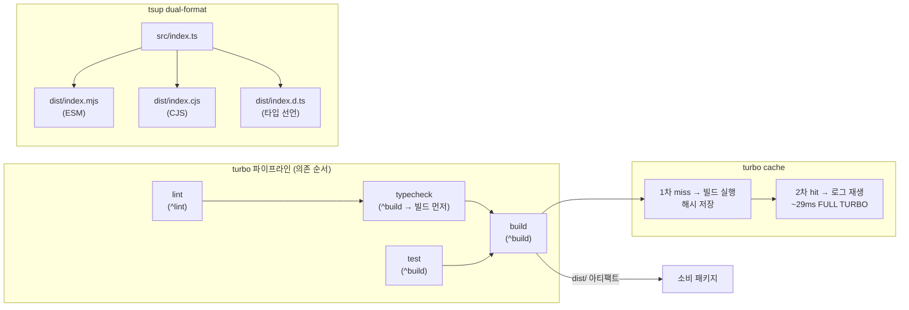

# 모노레포 빌드 — turbo 파이프라인 + tsup dual-format + 캐시 2차 히트

> **대상**: 모노레포 빌드 흐름과 로컬 캐시 최적화를 이해하려는 개발자
> **연관 문서**: [[reference/architecture]] · [[adr/0002-monorepo-foundations]] · [[adr/0004-typescript-and-compilation-strategy]]

## 왜 필요한가

패키지가 수십 개인 모노레포에서 변경이 없는 패키지를 매번 다시 빌드하면 CI/로컬 피드백이 느려진다. Turborepo는 task 그래프와 콘텐츠 해시 기반 캐시로 이 문제를 해결한다. tsup은 단일 설정으로 ESM + CJS 두 포맷을 동시에 출력해 소비처가 어떤 모듈 시스템을 사용하든 대응한다.

## 어떻게 동작하나

### turbo.json 핵심 설정

- `build`: `dependsOn: ["^build"]` — 의존 패키지 빌드가 먼저 완료된 뒤 실행. 출력 `dist/**`, `.next/**` 를 캐시한다.
- `typecheck`: `dependsOn: ["^build"]` — 소비할 패키지의 타입 선언(`dist/*.d.ts`)이 있어야 검사 가능.
- `test`: `dependsOn: ["^build"]` — 동일 이유.
- `lint`: `dependsOn: ["^lint"]` — biome 설정 변경이 하위 패키지 lint에 전파.
- `globalDependencies`: `pnpm-lock.yaml`, `.env.*local` — 이 파일이 바뀌면 전체 캐시 무효화.

### tsup preset (`@repo/tsup-config`)

모든 라이브러리 패키지는 `packages/config/tsup-config/tsup.base.ts`를 extends한다. entry는 `src/index.ts`, format은 `["esm", "cjs"]`, `dts: true`로 타입 선언을 함께 생성한다.

### 캐시 2차 히트

동일 소스(해시 불변)로 `pnpm turbo run test`를 두 번 실행하면 두 번째 실행은 `cache hit, replaying logs`로 약 29ms에 완료된다(spec-01-02 acceptance 4 실측). `--force` 플래그로 강제 재빌드도 가능하다.

## 용어 정리

| 용어 | 설명 |
|---|---|
| `^build` | "이 task 실행 전 모든 의존 패키지의 build를 먼저 실행"하는 turbo 의존 선언 |
| `FULL TURBO` | 캐시 완전 히트 — 모든 task가 캐시에서 재생됨 |
| dual-format | ESM(`.mjs`) + CJS(`.cjs`) 동시 출력 — `package.json exports` 필드로 환경별 선택 |
| `dts: true` | tsup이 TypeScript 타입 선언 파일(`.d.ts`)을 함께 생성 |
| `globalDependencies` | 변경 시 전체 캐시를 무효화하는 루트 파일 목록 |

## 동작/테스트 방법

> 🧪 **캐시 2차 히트 확인**: `pnpm turbo run test --force` (1차 clean) → `pnpm turbo run test` (2차 hit). 두 번째 실행에서 `FULL TURBO` + `Cached: N cached, N total` 확인.

> 🧪 **전체 파이프라인**: `pnpm turbo run lint typecheck test build` — spec-14-01 CI 게이트와 동일한 명령. 로컬에서 129 task 전수 통과 확인.

## 마치며

turbo의 콘텐츠 해시 캐시와 tsup의 dual-format 출력이 결합해 모노레포 개발 루프를 빠르게 유지한다. CI에서도 동일 명령을 frozen-lockfile 환경에서 실행해 로컬과의 일관성을 보장한다.

## 연결된 개념

- [[config-packages-presets]] — tsup/typescript/vitest 프리셋 패키지 구조
- [[ci-verify-gate]] — turbo 파이프라인을 CI 환경에서 실행하는 게이트
- [[adr/0002-monorepo-foundations]] — pnpm workspace + turborepo 채택 근거
- [[adr/0004-typescript-and-compilation-strategy]] — tsup + dual-format 선택 근거

> 소스: spec-01-01 / spec-01-02 walkthrough · `turbo.json` · `packages/config/tsup-config/`
