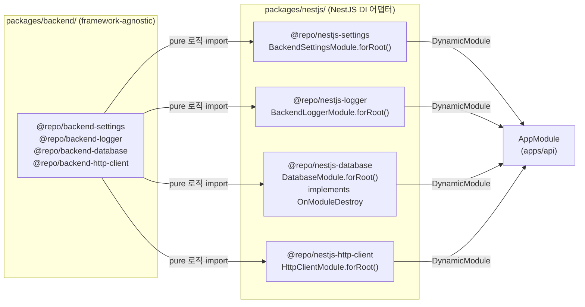

# NestJS 어댑터 모듈 패턴 — pure+adapter 2-pkg + 표준 @Module class

> **대상**: NestJS DI 컨테이너에 모노레포 패키지를 연결하는 방식을 이해하려는 개발자
> **연관 문서**: [[reference/architecture]] · [[adr/0015-framework-adapter-naming-and-layout]] · [[adr/0016-nestjs-adapter-standard-module-pattern]]

## 왜 필요한가

ADR-0015는 프레임워크에 독립적인 순수 패키지(`packages/backend/*`)와 NestJS DI 어댑터 패키지(`packages/nestjs/*`)를 분리한다. 이 분리 없이 `@nestjs/common`을 core 패키지에 넣으면 NestJS를 쓰지 않는 소비처(테스트, CLI 등)가 불필요한 프레임워크 의존성을 가지게 된다.

ADR-0016은 어댑터 패키지에서 객체 리터럴 DynamicModule 대신 `@Module({}) class ... { static forRoot() }` 패턴을 표준으로 정했다. NestJS가 클래스 기반 lifecycle hook(`OnModuleDestroy` 등)을 직접 지원하기 때문이다.

## 어떻게 동작하나



### @Module forRoot 패턴

```ts
// 예시: nestjs-settings
@Module({})
export class BackendSettingsModule {
  static forRoot<TSettings>(loader: ..., env = process.env): DynamicModule {
    const settings = loader(env);
    return {
      module: BackendSettingsModule,
      providers: [{ provide: BACKEND_SETTINGS, useValue: settings }],
      exports: [BACKEND_SETTINGS],
      global: true,
    };
  }
}
```

- `@Module({})` 데코레이터는 **빈 metadata**다. providers/exports는 `forRoot`가 동적으로 반환하므로 class-level에 넣지 않는다.
- `global: true` — settings/logger처럼 전역 주입이 필요한 경우에만 사용.

### DatabaseModule + OnModuleDestroy

`DatabaseModule`은 `implements OnModuleDestroy`를 class에 직접 박아 NestJS 앱 종료 시 pool을 정리한다. 과거에는 `DatabaseShutdownService` 우회 클래스를 별도로 만들었으나 ADR-0016에서 제거했다.

```ts
@Module({})
export class DatabaseModule implements OnModuleDestroy {
  private static currentDatabase: Database<...> | undefined;

  static forRoot<T extends Record<string, unknown>>(options: CreateDatabaseOptions<T>): DynamicModule {
    const database = createDatabase(options);
    DatabaseModule.currentDatabase = database as Database<Record<string, unknown>>;
    return { module: DatabaseModule, providers: [...], exports: [...], global: true };
  }

  async onModuleDestroy(): Promise<void> {
    if (DatabaseModule.currentDatabase) {
      await shutdown(DatabaseModule.currentDatabase.pool);
    }
  }
}
```

`currentDatabase`를 static field로 보유하는 이유: `forRoot`가 static 메서드이므로 같은 class context에서 instance lifecycle hook이 접근할 수 있어야 한다.

### biome noStaticOnlyClass 충돌

biome는 static 멤버만 있는 클래스를 경고한다. `@Module` 데코레이터가 있으면 inline `biome-ignore`가 데코레이터와 충돌하므로, `packages/config/biome-config/base.json` overrides에서 `packages/nestjs/**` 경로 한정으로 규칙을 off했다.

## 용어 정리

| 용어 | 설명 |
|---|---|
| `DynamicModule` | NestJS의 런타임 설정 가능 모듈 — `forRoot()` 반환 타입 |
| `@Module({})` | 빈 metadata 데코레이터 — providers는 forRoot가 동적 제공 |
| `global: true` | 모듈 export를 전역 DI 컨테이너에 등록 (imports 없이 주입 가능) |
| `OnModuleDestroy` | NestJS lifecycle hook — `onModuleDestroy()` 앱 종료 시 호출 |
| injection token | `Symbol("BACKEND_SETTINGS")` 등 — `@Inject(TOKEN)`으로 주입 |

## 동작/테스트 방법

> 🧪 **어댑터 단위 테스트**: `pnpm --filter @repo/nestjs-database test` — `Test.createTestingModule` + `vi.mock("@repo/backend-database")`로 NestJS 모듈 초기화 검증. `onModuleDestroy` 호출 시 `shutdown()` 실행 확인.

> 🧪 **전체 typecheck**: `pnpm -r typecheck` — 4개 어댑터 패키지 포함 39패키지 통과.

## 마치며

pure+adapter 2-pkg 분리로 core 패키지는 NestJS 없이 테스트·재사용 가능하고, NestJS 어댑터는 `forRoot()` 1 메서드로 DI 컨테이너와 연결한다. `@Module` class 패턴은 NestJS lifecycle hook과 자연스럽게 통합된다.

## 연결된 개념

- [[config-packages-presets]] — nestjs 카테고리가 사용하는 tsconfig/biome 프리셋
- [[monorepo-build-turbo-tsup]] — 어댑터 패키지가 참여하는 빌드 파이프라인
- [[adr/0015-framework-adapter-naming-and-layout]] — pure+adapter 분리 결정
- [[adr/0016-nestjs-adapter-standard-module-pattern]] — @Module class 표준화 결정

> 소스: spec-03-06 walkthrough · `packages/nestjs/`
