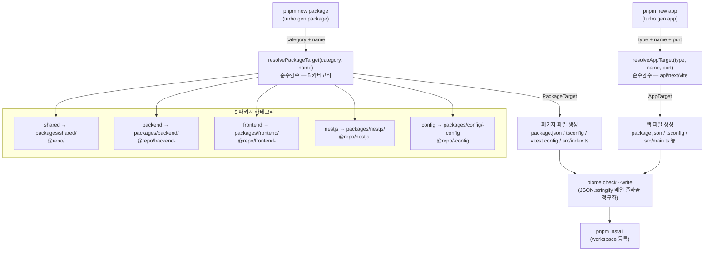

# turbo gen 스캐폴딩 — pnpm new package/app + resolvePackageTarget/resolveAppTarget 순수함수

> **대상**: 새 패키지나 앱을 추가하는 방법과 생성기 내부 구조를 이해하려는 개발자
> **연관 문서**: [[reference/architecture]] · [[config-packages-presets]] · [[adr/0003-package-layout-and-naming]]

## 왜 필요한가

신규 패키지마다 `package.json`, `tsconfig.json`, `vitest.config.ts`, `src/index.ts` 등을 수동으로 만들면 설정 불일치가 발생한다. turbo gen 기반 생성기는 ADR-0003/0015의 카테고리 규칙을 순수함수로 캡슐화하고, 생성 직후 biome 포맷을 적용해 lint-clean 아티팩트를 보장한다.

## 어떻게 동작하나



### resolvePackageTarget — 순수함수 설계

카테고리 → 디렉토리/패키지명/tsconfig 프리셋/vitest 프리셋 매핑을 단일 함수로 캡슐화한다. 이름은 `kebab-case` 소문자 패턴(`/^[a-z0-9]+(?:-[a-z0-9]+)*$/`)만 허용하고, 위반 시 즉시 에러를 던진다.

```ts
resolvePackageTarget("backend", "cache")
// → { dir: "packages/backend/cache", pkgName: "@repo/backend-cache",
//     tsconfigExtends: "@repo/typescript-config/base", vitestPreset: "node" }
```

### resolveAppTarget — 앱 타입별 매핑

`api` 타입은 NestJS(`@repo/typescript-config/nestjs`), `next`/`vite`는 React(`@repo/typescript-config/react-app`)를 사용한다. 포트는 prompt로 받아 기존 앱(2026~2028)과 충돌을 방지한다.

### biome 포맷 단계

`JSON.stringify(data, null, 2)`는 짧은 배열도 줄바꿈 처리하지만, biome는 짧은 배열을 한 줄로 포맷한다. 생성 직후 `biome check --write`를 실행해 lint 에러 없는 아티팩트를 보장한다(`writeAndFormat` 헬퍼).

## 용어 정리

| 용어 | 설명 |
|---|---|
| `turbo gen` | `@turbo/gen` — turbo 내장 코드 생성기 엔진 |
| `resolvePackageTarget` | 카테고리+이름 → 디렉토리/패키지명/프리셋 매핑 순수함수 |
| `resolveAppTarget` | 앱타입+이름+포트 → 디렉토리/패키지명/프리셋 매핑 순수함수 |
| `writeAndFormat` | 파일 쓰기 후 biome 포맷을 적용하는 공통 헬퍼 (package/app 생성기 공유) |
| `*-config` suffix | config 카테고리 패키지에 자동 부여되는 suffix (ADR-0003) |

## 동작/테스트 방법

> 🧪 **단위 테스트 (패키지)**: `pnpm exec vitest run turbo/generators/lib/resolve-target.test.ts` — 8개 (5 카테고리 매핑 + 잘못된 카테고리/빈 이름/config suffix 중복 방지).

> 🧪 **단위 테스트 (앱)**: `pnpm exec vitest run turbo/generators/lib/resolve-app-target.test.ts` — 7개 (api/next/vite 매핑 + 타입/이름/포트 throw).

> 🧪 **통합 스모크**: `bash turbo/generators/smoke-test.sh` — shared 카테고리 패키지 생성 → install → lint/typecheck/test 0 error → 정리.

> 🧪 **앱 스모크**: `bash turbo/generators/app-smoke-test.sh` — api 앱 생성 → install → lint/typecheck/test 0 error → 정리.

## 마치며

순수함수 설계로 카테고리 규칙의 단위 테스트가 가능하고, 생성기 자체의 신뢰도를 보장한다. `pnpm new package` 한 명령으로 ADR-0003/0015 규칙을 준수하는 패키지가 즉시 생성된다.

## 연결된 개념

- [[config-packages-presets]] — 생성기가 배선하는 tsconfig/vitest 프리셋
- [[monorepo-build-turbo-tsup]] — 생성된 패키지가 참여하는 빌드 파이프라인
- [[adr/0003-package-layout-and-naming]] — 카테고리 레이아웃 규칙
- [[adr/0015-framework-adapter-naming-and-layout]] — nestjs/frontend 카테고리 규칙

> 소스: spec-10-02 / spec-11-01 walkthrough · `turbo/generators/lib/`
