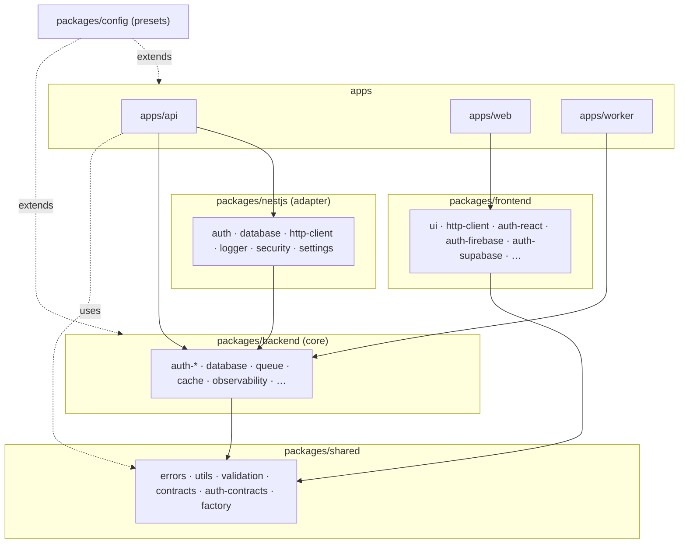
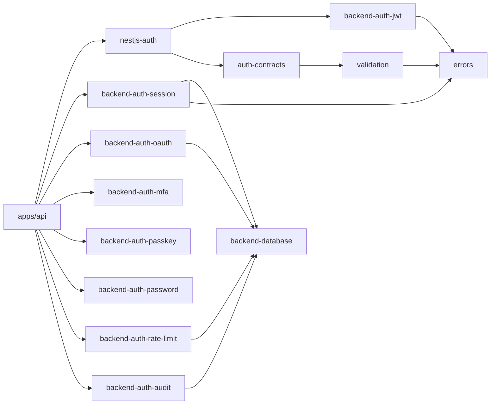

# Architecture — service-foundry 시스템 구조

> 💡 **한 줄 요약**: 운영 가능한 Node/TS 모노레포. **framework-agnostic core(`packages/backend`,`packages/shared`,`packages/frontend`)** 를 **framework adapter(`packages/nestjs`)** 가 감싸고, **apps(`api`/`web`/`worker`)** 가 조립한다.
> **상위 허브**: [[index]] · **결정 근거**: [[adr/0002-monorepo-foundations|ADR-0002]] · [[adr/0003-package-layout-and-naming|ADR-0003]] · [[adr/0015-framework-adapter-naming-and-layout|ADR-0015]]

## 1. 레이어 모델

이 레포의 핵심 규율은 **의존 방향이 한쪽으로만 흐른다**는 것이다 (depcruise 로 정적 강제 — [[adr/0001-linting-formatting-strategy|ADR-0001]]).

```
apps/            (api · web · worker)                  ← 조립·부트스트랩
  │  ▼ 의존
packages/nestjs/ (auth · database · http-client · …)        ← framework adapter (NestJS @Module)
  │  ▼ 의존
packages/backend/(auth-* · database · queue · cache · …)    ← framework-agnostic core (node 전용)
  │  ▼ 의존
packages/shared/ (errors · utils · validation · contracts)  ← FE/BE 공유 primitive
  ▲
packages/frontend/(ui · http-client · auth-react · …)  ─────┘ (shared 만 의존, backend 금지)
packages/config/ (typescript-config · vitest-config · …)    ← leaf preset (런타임 의존 0)
```

> ⚠️ **불변(invariant)**: `frontend → backend` import 금지, `backend core → nestjs adapter` 역참조 금지, `pure → adapter` 단방향 ([[adr/0015-framework-adapter-naming-and-layout|ADR-0015]]). 위반은 dependency-cruiser 가 CI/pre-commit 에서 차단.

## 2. 카테고리 의존 그래프



## 3. Auth 패키지 클러스터 (가장 큰 응집 영역)

Auth 는 "Auth Engine(외부 라이브러리: jose/argon2/otplib/@simplewebauthn) + Auth Platform(자체 구축)" 으로 나뉘는 **Consistent Wrapped SDK** 전략을 따른다 ([[adr/0006-auth-strategy|ADR-0006]], [[explainers/frontend/auth-sdk-provider-adapters]]).



세부 동작 원리는 explainers 참조:
[[explainers/auth/session-rotation-chain]] · [[explainers/auth/jwt-verify-edDSA]] · [[explainers/auth/oauth-pkce-flow]] · [[explainers/auth/mfa-totp-challenge]] · [[explainers/auth/passkey-webauthn]] · [[explainers/auth/cookie-strategy]]

## 4. 런타임 토폴로지 (apps)

| app | 역할 | 스택 | 진입 |
|---|---|---|---|
| `api` | 인증/도메인 REST 백엔드 | NestJS 11 + Drizzle + PostgreSQL | `GET /health`, auth endpoints, `/metrics` |
| `web` | SSR 웹 (메인) | Next.js 16 App Router + React 19 | `/`, `/login` |
| `worker` | 비동기 작업 소비자 | BullMQ consumer | 큐 소비 |

로컬 인프라(postgres·redis·prometheus·grafana·tempo·loki)는 `tooling/docker` compose 로 기동 ([[explainers/platform/docker-compose-local-infra]]).

## 5. 횡단 규약 (cross-cutting)

| 관심사 | 규약 | 출처 |
|---|---|---|
| 에러 | `Result<T,E>` 흐름제어 + `AppError` 데이터모델 | [[adr/0008-result-type|ADR-0008]] · [[adr/0009-app-error-design|ADR-0009]] · [[adr/0020-error-handling-convention|ADR-0020]] |
| 검증 | zod 4 + `parse → Result` | [[adr/0010-validation-zod-result-integration|ADR-0010]] |
| 관측성 | request-id 전파 + pino + OTel + prom-client | [[explainers/backend/request-id-propagation]] · [[explainers/backend/otel-tracing-init-order]] |
| 빌드 | turbo pipeline + tsup(backend)/JIT(shared·frontend) | [[adr/0004-typescript-and-compilation-strategy|ADR-0004]] · [[explainers/platform/monorepo-build-turbo-tsup]] |
| DB | Drizzle 마이그레이션 + pool lifecycle | [[explainers/backend/drizzle-migrations-lifecycle]] |
| 포트/어댑터 | Notifier·Cache·Queue·Storage·RateLimiter·SecretsProvider 포트 | [[explainers/backend/notification-port-adapter]] 외 |

## 6. 패키지 카테고리 요약

- **backend (22)** — node 전용 인프라/도메인 core. 전수: [[index]] §reference/packages.
- **nestjs (6)** — backend core 를 NestJS `@Module` 로 감싼 adapter ([[adr/0016-nestjs-adapter-standard-module-pattern|ADR-0016]], [[explainers/platform/nestjs-adapter-module-pattern]]).
- **frontend (7)** — UI + http-client + auth SDK 래퍼. ⚠️ `auth-http` 는 현재 스텁(package.json 미완).
- **shared (6)** — errors/utils/validation/contracts/auth-contracts/factory.
- **config (7)** — typescript/vitest/biome/tsup/tailwind/depcruise/knip preset (런타임 의존 0).

## 연결된 개념
- [[reference/stack]] — 의존성 도입 근거
- [[index]] — 전체 카탈로그
- [[explainers/platform/config-packages-presets]] — config preset 패턴

> 소스: 전체 spec(phase-01~14) walkthrough + `pnpm-workspace.yaml` + `docs/adr/*` + 의존성 마이닝(task-03)
