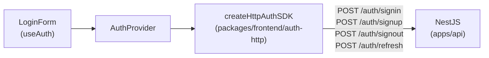

# spec-09-03: HTTP auth SDK (frontend-auth-http)

## 📋 메타

| 항목 | 값 |
|---|---|
| **Spec ID** | `spec-09-03` |
| **Phase** | `phase-09` |
| **Branch** | `spec-09-03-http-auth-sdk` |
| **상태** | Planning |
| **타입** | Feature |
| **Integration Test Required** | no |
| **작성일** | 2026-05-22 |
| **소유자** | dennis |

## 📋 배경 및 문제 정의

### 현재 상황

- `apps/web-next/src/lib/auth.ts`는 `createMockAuthSDK()`를 사용 중
- LoginForm이 구현되어 있지만 실제 NestJS 백엔드와 연결되지 않음
- NestJS `POST /auth/signin` 등 auth REST API가 phase-06에서 구현됨
- `CoreAuthSDK` 인터페이스 (5개 메서드)가 ADR-0006으로 정의됨

### 문제점

Mock SDK로는 실제 로그인 플로우 검증 불가. HTTP fetch 기반의 `CoreAuthSDK` 구현체가 없어 web-next가 NestJS 백엔드와 통신할 수 없음.

### 해결 방안 (요약)

`packages/frontend/auth-http` 신규 패키지를 만들어 `createHttpAuthSDK(baseUrl)` 함수를 제공한다. NestJS auth REST API를 fetch로 호출해 `CoreAuthSDK` 계약을 구현한다. web-next `src/lib/auth.ts`를 이 SDK로 교체한다.

## 📊 개념도

## 🎯 요구사항

### Functional Requirements

1. `packages/frontend/auth-http` 신규 패키지
   - `createHttpAuthSDK(baseUrl: string): CoreAuthSDK` export
   - 5개 메서드 구현:
     - `signIn({ email, password })` → `POST {baseUrl}/auth/signin` → `AuthResult`
     - `signUp({ email, password })` → `POST {baseUrl}/auth/signup` → `AuthResult`
     - `signOut()` → `POST {baseUrl}/auth/signout`
     - `getCurrentUser()` → in-memory 저장된 user 반환 (초기: null)
     - `refresh()` → `POST {baseUrl}/auth/refresh` → `Session | null`
   - signIn/signUp/refresh 성공 시 user를 in-memory에 저장
   - signOut 시 in-memory 초기화
   - HTTP 4xx/5xx → 적절한 `AuthResult` failure 반환

2. `apps/web-next/src/lib/auth.ts` 교체
   - `createMockAuthSDK()` → `createHttpAuthSDK("http://localhost:3001")`

### Non-Functional Requirements

1. `pnpm --filter @repo/frontend-auth-http test` PASS (단위 테스트 포함)
2. `pnpm -r typecheck` PASS (39+ packages)

## 🚫 Out of Scope

- refresh token 저장/관리 (httpOnly cookie — 서버가 처리)
- MFA / Passkey 엔드포인트
- 토큰 자동 갱신 (인터셉터)
- GET /auth/me 네트워크 호출 (in-memory user로 충분)

## 📑 ADR 후보

- [ ] 없음

## ✅ Definition of Done

- [ ] `pnpm --filter @repo/frontend-auth-http test` PASS
- [ ] `pnpm -r typecheck` PASS
- [ ] `apps/web-next/src/lib/auth.ts` → `createHttpAuthSDK` 사용
- [ ] `walkthrough.md` 와 `pr_description.md` 작성 및 ship commit
- [ ] `spec-09-03-http-auth-sdk` 브랜치 push 완료
- [ ] 사용자 검토 요청 알림 완료
